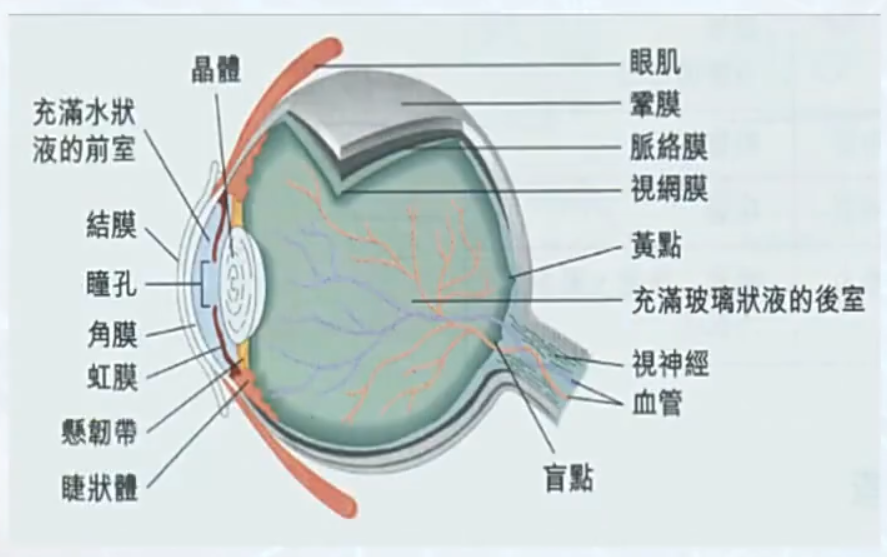

# 神经科学基础与疾病

## L1 神经科学导论

- **神经生物学** ~ 神经科学：
	- 生物学分支 ⟶ 交叉学科
	- 研究动物和人类行为的神经基础

- **脑科学的发展历史**
	- 希波克拉底（托勒密王朝）：人的解剖
	- **盖伦**（古罗马）：300部著作；羊、牛、猪**脑解剖**；活体解剖；自然、活力、精气；发现**脑室**（中空且充满液体）
	- 维萨里（1543）：《人体构造》
	- 笛卡尔：二元论（心理与生理）；机械论；选择性增强某些通道 ⟶ **记忆**
	- **维勒斯**：《大脑解剖》
	- 18世纪对神经系统功能认识
		- 脑损伤可以引起感觉、运动和思维的丧失，甚至导致死亡
		- 脑通过神经与躯体相连
		- 脑具有可以明确划分的一些部分，这些不同部分很可能执行不同功能
	- **19世纪对脑认识的重大进展**
		- **Nerve**s as **wire**s.	神经如电缆。
		- **Localization** of specific functions in different parts of the brain.
			- **Gall: phrenology**  颅相说
			- **Broca**
		- The **neuron**（神经元）: the basic function unit of the brain.
		- **Remon Cajal:** nerve system as a network of discrete neurons, neuron doctrine
		- The **evolution** of nervous systems.
			- **Charles Darwin**
			- *因为存在这样的生物进化继承性，所以在动物上的神经科学研究成果部分可以延拓到人类（枪乌贼神经传导、大鼠成瘾实验等）*

- **脑研究的不同层次**
	- 分子神经科学 ⟶ 细胞神经科学 ⟶ 系统神经科学 ⟶ 行为神经科学 ⟶ 认知神经科学
	- **分子神经科学**
		- 多种分子作用，复杂机制
		- *messengers 信使；sentries 卫兵；conductors 向导；archivists 档案管理者...*
	- **细胞神经科学：**
		- **key:** how all those **molecules work together** to give the neuro its special properties?
		- 解决问题：多少种类神经元？功能差异？如何相互影响？胚胎发育时如何联系成网络？如何行使计算功能？
	- **系统神经科学：**神经环路网络如何分析感觉信息，形成感知，做出决定，执行运动？
	- **行为神经科学：**神经系统如何一起工作产生协调？重点研究不同部位对人体的调控作用。
	- **认知神经科学**：思维、意识、语言、想象等精神活动是如何产生的？

- **神经科学的基本研究方法：**观察、**重复**、解释、验证

## L2 神经元和神经胶质细胞

- **神经元：**信号的产生、传递和处理
    - **Cajal：**神经元之间存在接触（**突触**），*区别于解剖上连接在一起（Camillo Golgi）*
    - 神经元有**极性**：树突（接收）和轴突（发送）
    - 神经元可以利用**突触**发送神经信号（**动作电位**）
        - 突触传递：**电**传递学说/**化学**传递学说（*Loewi 蛙心灌流实验证明存在化学物质传递过程；Katz 囊泡释放学说*）

- **胶质细胞：**支持和营养作用
    - 提出：Rudolph Virchow
        - Camillo Golgi：营养学说
        - Stephen Kuffer：发现胶质细胞膜电位负值更大（只有钾离子通道，缺少钠离子和钙离子）
    - **CNS 中枢：**星形胶质细胞（Astrocytes）；少突胶质细胞（Oligodendrites）；小胶质细胞（Microglia）
        - 星形胶质细胞
            - 对神经递质的摄取和再循环；将兴奋性物质谷氨酸从外界低浓度处摄入，并转化为非兴奋性物质谷氨酰胺排出（**胶质细胞执行耗能过程**，神经元细胞将谷氨酰胺转化为谷氨酸的过程不耗能）
            - **信号传递：钙波**（速度缓慢，意义暂时未知）
        - 少突胶质细胞和小胶质细胞
            - 提出：Pio de Rio-Hortega
            - 组成并维持中枢神经髓鞘的功能
            - 小胶质细胞不同于其他胶质细胞，是来源于中胚层的具有迁移和吞噬特性的细胞
            - 小胶质细胞可以从非活性的分枝状转变为具有吞噬性的类阿米巴状活性状态，具有巨噬细胞那样的运动和吞噬功能
    - **PNS 外周：**雪旺氏细胞（Schwann cell）
    - 胶质细胞**病理状态**研究
        - 阿尔兹海默症：阿米巴样变化的胶质细胞失去了正常时对神经元的支持作用
        - 中枢神经修复再生阻碍的决定因素：需要克服胶质细胞的不利条件
    - 胶质细胞在脑内比例随生物进化升高而增长（*进化程度高，胶质细胞占比大*）

## L3 膜电位和动作电位
> 《工程生理学》已学，此处略过，可查阅该课程笔记

## L4 突触传递

- **神经元（神经细胞）的基本结构：**神经系统的基本功能单位，分为三大部分
	- **胞体（Soma）**：含细胞核，负责代谢和整合信息。
	- **树突（Dendrite）**：短而分支多的突起，**接收其他神经元传来的信号**（输入区）。
	- **轴突（Axon）**：细长的突起，**将信号从胞体传向其他神经元**（输出区）。轴突末端分叉形成**突触末梢（轴突终末）**。
  
- **突触（Synapse）：**是神经元之间传递信息的结构，由三部分组成
	
	- 突触前膜：属于上一个神经元的突触末梢（轴突末端），内含神经递质小泡。
	- 突触间隙：细胞外间隙，神经递质在此扩散。
	- 突触后膜：下一个神经元的接收部位（通常是树突或胞体的细胞膜），上有受体。
	
- **突触种类**
    - 电突触
    - 化学突触（缝隙链接，6个连接蛋白 connexin 形成一个通道，称为连接子）
    
-  **电突触**（普遍存在于无脊椎动物中，存在于脊椎动物的神经系统特定位置）
    - **特征**（无脊椎）
        - 双向等效通过
        - 电紧张耦合
        - 低电阻、快速；大突触从不出错；突触前神经元（发）动作电位几乎会同时产生一个突触后神经元（收）的动作电位
    - **特征**（有脊椎）
        - 中枢神经系统各部分均有
        - 电耦合神经元间，突触前动作电位可以引起一个小离子流，跨过 gap junction channels 流入另一个神经元，产生突触后电位PSP
        - 哺乳动物**单个**电突触产生的 PSP 峰值约 1mV 或更小，不足以触发突触后电位
        - 主要分布于需要**高度同步化活动**的神经元之间

- **化学突触**（人类突触主要类型）

    - CNS快速传递的兴奋性突触

        - 中枢神经系统**不同类型**的化学突触：轴-树，轴-胞，轴-轴，树-树

    - PNS突触可见不少致密核心囊泡（DCV）

      - | 囊泡形态                          | 内容物           |
        | --------------------------------- | ---------------- |
        | 小而中心清亮                      | 氨基酸或乙酰胆碱 |
        | 小而致密核心                      | 儿茶酚胺类       |
        | 大而致密核心（DCV，又称分泌颗粒） | 神经肽类         |

      - 周围神经系统的轴突连接

        - 自主神经系统的轴突**非定向传递**，投射到腺体、平滑肌和心脏
        - 神经肌肉接头突触传递快速可靠（*神经肌接头突触前轴突多分支，有许多活性带，突触后形成褶皱增大表面积，有丰富的递质受体*），与CNS有许多共同特征
    
    - **神经递质**
    
        - 介导化学突触信息传递的化学物质
        - 有的神经元还可以释放小分子递质和神经肽
        - **CNS 快速传递**主要靠氨基酸类递质介导（**谷氨酸 ⟶ 兴奋性**；**甘氨酸 ⟶ 抑制性**；神经肌接头快突触传递由**乙酰胆碱**介导）
    
    - **突触传递的基本过程**
        - { width = "80%"}
    
    - **突触传递的基本原理**（过程迅速，使之能介导感觉、认知与运动控制）
    
        - 神经递质**合成与储存**
    
            - **乙酰胆碱**、**氨基酸**、**胺类神经**递质
                - 合成酶转运至突触末梢，在胞质内将前体分子转化为神经递质分子
                - 转运体（位于突触囊泡的跨膜蛋白），将此类神经递质摄入并浓缩储存于突触囊泡
            - **多肽类**神经递质
                - 前体肽（序列较长的多肽）合成于细胞体的粗面内质网
                - 在高尔基体内裂解并产生具有活性的递质
                - 含有神经肽的分泌囊泡（DCV）从高尔基体出芽分出
                - 分泌颗粒沿轴浆运输至末梢并储存于此
    
        - 神经递质**释放**
    
            - **乙酰胆碱**、**氨基酸**、**胺类神经**递质
                - **动作电位**传递至轴突末梢 ⟶ 末梢质膜**去极化** ⟶ 活性带的电压依赖**钙通道**开放 ⟶ 突触囊泡**释放**（出胞胞吐  exocytosis） ⟶ 内容物神经递质**释出**到突触间隙
                - 介导囊泡融合的**核心蛋白质**：**SNARE **和 SM
            - **多肽类**神经递质
                - 储存于分泌颗粒（**DCV**）
                - 也是通过**胞吐**释放
                - **钙**依赖
                - 典型并**不**分布于活性带
                - 需要**高频成串**的刺激
                - 过程**缓慢**，需 50+ msec
    
        - **与突触后受体作用**产生效应
    
            - 与**特异**受体蛋白结合
    
            - 已知有 **100** 多种，分为两大类
    
                - **神经递质门控离子通道**（离子型受体）
                    - 受体激活 ⟶ 电导改变 ⟶ 突触后电流 ⟶ 突触后电位
                    - **结构：**多亚基组成离子通道，每个亚基有数个跨膜区，按结构分 3 个家族
                        - { width = "80%"}
                    - 多亚基通道中央有一个**亲水性孔道**，在有神经递质和受体胞外区特异性位点**结合后**，亚基**轻微扭曲**可以使通道构象发生改变，在 ms 时间内**打开**（本质是通道对离子的选择性）
                - **G-蛋白偶联受体**（**GPCR**，代谢型受体）
                    - 受体激活 G-蛋白 ⟶ 第二信使 ⟶ 信号级联 ⟶ 效应蛋白功能变化
                    - 受体激活 G-蛋白 ⟶ 胞内门控离子通道 ⟶ 膜兴奋性
                    - **结构：**均为含有 7 个跨膜区的膜蛋白，N 基朝胞外，C 基朝胞内
                      - { width = "80%"}
                    - 受体激活 G-蛋白，后者沿突触后膜细胞内表面自由移动；活化的 G-蛋白激活下游的效应器蛋白
                    - **G-蛋白激活后的效应**
                        - 直接门控的离子通道
                        - 合成第二信使酶（激活其它酶，调节离子通道功能或改变细胞代谢状况）
            - { width = "80%"}
        
        - 神经**递质**从突触间隙**清除**和**再利用**
            - **3 种方式**
                - **简单扩散：**大多数氨基酸和单胺类神经递质
        
                - **重摄取：**通过位于突触前膜和周围星形胶质细胞膜上的特殊转运体蛋白完成，一旦进入突触前细胞内则由酶降解或重新装入囊泡
        
                - 突触间隙的**酶降解**
        
        - 突触**囊泡**的**内化**和**再循环**
            - **2 种方式**
                - **kiss-and-run：**短暂融合后进行少量膜蛋白和脂质交换，很快重新形成
                - **clathrin-mediated endocytosis（网格蛋白介导的内化）：**完全融合，重新回收

- **突触输入整合**
    - 定义：中枢神经系统的神经元**接受突触输入**，输入信息激活突触后不同受体产生各同的效应；突触后神经元需要**整合这些复杂的离子和化学信号**，然后给出简单形式的**输出**（*动作电位*）
    - **树突**是精致的信号整合装置，将许多突触传入**转换成一个简单的神经输出**（*动作电位*），包含了复杂的神经计算
        - **兴奋性输入整合**
            - 树突接受兴奋性输入会产生 EPSP，但只有信号传导到神经元的**轴突起始段**，产生的去极化超过**阈值**才会触发动作电位（1 个突触产生的单个 EPSP 去极化程度**不够**，无法发放动作电位）
            - **两种整合方式**
                - **空间整合：**在树突**不同空间**分布的突触，如果几乎被同时激活，EPSP 沿途向胞体方向传播的时候会**相加**
                - **时间整合：**在**很短时间窗**内同一突触连续被激活，产生 EPSP 会**相加**变成一个更大的 EPSP
            - 树突膜的**电主动性**（*以上讨论均以树突细胞膜的电被动性作为前提*）
                - 实际上哺乳动物 CNS 神经元上也分布有**离子通道**，具有电主动性
                - 产生**电压依赖的电导**，会放大 EPSP 信号，甚至树突锋电位（**spike**），可在整条树突传播，类似动作电位
        - **抑制性**和**调制性**神经元接受输入
    - 突触分布的亚细胞特定部位的分布
        - **兴奋性**突触分布于树突树各分支**树突棘**上
            - 一般只接受来自**一个**兴奋性神经元末梢的突触输入
            - 树突棘狭窄的颈部为每个突触创造一个**电学 - 化学空间**，可独立调节
            - 高度独立的区间使神经元能对突触信息进行**个体化编码**，根据以往经历单独调制与不同神经元的连接强度 ⟶ **记忆**
        - **抑制性**突触广泛分布于突触后神经元的**树突干**、**树突棘**、**胞体**及**轴突起始段**
            - 在战略性位点产生 **IPSP** 以抵消路过的 EPSP
        - 突触分布等共同作用于**神经元输出的模式**，即**动作电位发放的频率和时序**

- **轴突末梢神经递质释放的调制**

    - **自身受体**的负反馈抑制
    - **其他神经元**与轴突末梢形成的突触连接（轴 - 轴突触）：**易化**和**抑制**
    - 突触后**下游信号**的逆向调控（如强直刺激后导致突触后大量钙离子内流，释放内源脂溶性物质起负反馈抑制释放作用）

- **突触传递关键机制**

    - **突触可塑性**

        - 效能受多种方式调节，衡量指标依据**突触后对突触前刺激相应的大小**，改变效能的能力即可塑性
        - 易化 facilitation & 抑制 depression
        - **短时程**突触可塑性（ms ~ min）& **长时程**突触可塑性（h ~ d, even lifetime）
        - 机制可来自于突触前或突触后
        - **神经环路装配**和**功能调节**的基础，与学习记忆密切相关

    - **NMDA 受体和 AMPA 受体**

        - 均为**配体门控离子通道**，离子型谷氨酸受体

            - 谷氨酸是**中枢神经系统最主要的兴奋性神经递质**，约90%的突触传递由其介导
            - 谷氨酸由突触前神经元释放，作用于突触后膜的**离子型受体（NMDA、AMPA、KA受体）和代谢型受体（mGluRs）**

        - 激活后导致阳离子（Na⁺、K⁺、Ca²⁺）内流，引发突触后膜去极化（兴奋性突触后电位，EPSP）

        - | **特性**       | **AMPA 受体**                      | **NMDA 受体**                                            |
            | :------------- | :--------------------------------- | :------------------------------------------------------- |
            | **激活条件**   | 仅需谷氨酸结合                     | 需谷氨酸+**甘氨酸（共激动剂）**+膜去极化（解除Mg²⁺阻塞） |
            | **离子通透性** | 主要通透 Na⁺、K⁺（少量 Ca²⁺）      | 通透 Na⁺、K⁺、**Ca²⁺（关键！）**                         |
            | **动力学**     | 快速激活和失活（毫秒级）           | 慢激活，持续开放（数十毫秒）                             |
            | **Mg²⁺ 阻滞**  | 无                                 | **静息电位时被 Mg²⁺ 阻塞**，需去极化解除                 |
            | **功能**       | 介导快速兴奋性突触传递（快速通道） | 介导突触可塑性（如 LTP、LTD）和学习记忆                  |

        - **突触传递中的协同作用**
			-  **AMPA 受体先响应：**谷氨酸释放后，首先激活 AMPA 受体，引起Na⁺内流→突触后膜快速去极化
          -  **NMDA 受体后激活：**突触后膜去极化后，**解除 Mg²⁺ 对 NMDA 受体的阻塞**，此时 NMDA 受体开放，Ca²⁺ 内流
          -  **Ca²⁺ 的信号作用：**Ca²⁺ 作为第二信使，触发下游信号通路（如钙调蛋白激酶II、PKC），导致**突触强度长期增强（LTP）或减弱（LTD）**，这是学习记忆的细胞基础

    - **谷氨酸突触后的组构**

        - postsynaptic organization
    
        - 高度有序的结构，涉及受体、支架蛋白、信号分子和细胞骨架的精密排布，直接影响突触传递的效率和可塑性
    
    - **突触活动与新的基因表达**
    
        - 神经递质在生理状态下触发长时间的突触后改变，过程以来新基因的表达
        - 神经活动能迅速诱导突触后神经元即早基因 IEGs 的表达（*如FOs*）；有的 IEG 能编码直接调节神经元通讯的蛋白
        - 神经活性依赖的转录在发育过程中突触和神经环路成熟及成年动物经验依赖的调制中起到显著作用
    
- **突触信号入核的机制**

    - 突触活动触发的信号传递至细胞核（**突触到核的信号传导，Synapse-to-Nucleus Signaling**）是神经元将短暂电活动转化为长期基因表达变化的核心过程

    - | **信号分子** | **激活方式**           | **入核机制**   | **靶基因**             | **功能**           |
        | :----------- | :--------------------- | :------------- | :--------------------- | :----------------- |
        | **CaMKIV**   | Ca²⁺/钙调素            | 易位至核       | BDNF, c-Fos            | 突触可塑性、记忆   |
        | **ERK**      | Ras-MAPK级联           | 磷酸化后入核   | Arc, Egr1              | 突触强化、长时记忆 |
        | **NF-κB**    | IKK磷酸化（降解IκB）   | 释放后入核     | TNF-α, Bcl-2           | 神经保护、突触稳态 |
        | **CRTC1**    | Calcineurin去磷酸化    | 从胞质转位至核 | CREB依赖基因（如BDNF） | 长期记忆形成       |
        | **Jacob**    | NMDA受体激活→ERK磷酸化 | 沿微管运输至核 | 核内CaMKII靶基因       | 突触-核通讯        |

## L5 功能性脑解剖

- **“我即我脑”**：大脑决定个性、潜能和局限性，决定一个人的属性
  
    - 运动（直觉、行为）、激素、思想（意识）
    - **大脑形成：**Encephalization，添加**脑功能柱**；意识就是那些**额外的脑组织**的活动，与其他因素动态相互作用
    - 意识是**客观**的，**物质**的（是神经元的电活动）
    
- **脑的基本信息**
    - 1500g
    - $10 \times 10^{10}$ 神经元
    - 每个神经元有 1000 - 100,000 连接
    - 100,100 km 连接纤维

- **脑与神经系统**
    - 中枢神经系统：脑与脊髓
        - **大脑**
        
            - **端脑：**大脑半球，运动、感觉、高级脑功能
                - **皮质：**覆在端脑表面的**灰质**，由**神经元**和**胞体**构成
                - **髓质：**位于皮质的深部，由**神经纤维**形成（**白质**）
                - **基底核：**髓质中的灰质团块，**纹状体**是其中的主要部分
        
            - **间脑：**丘脑和下丘脑构成
                - **丘脑**
                    - 与大脑皮质、脑干、小脑、脊髓等**联络**，负责**感觉**的中继，控制运动等
                    - 最重要的**感觉传导接替站**，除嗅觉外全身各种感觉传导通路**均在丘脑更换神经元**，然后投射到大脑皮层
                    - 对于大脑皮层不发达的动物是感觉最高级中枢
                - **下丘脑**
                    - 保持身体恒常性（内稳态平衡）
                    - 控制自主神经系统
                    - 调节情感，将极端的情感转化为身体的反应
        
            - **左脑与右脑**
        
              - | 左脑功能特征         | 右脑功能特征         |
                |----------------------|----------------------|
                | Sequential（顺序的） | Simultaneous（同时的） |
                | Analytical（分析的） | Holistic（整体性）     |
                | Verbal（词语）       | Imagistic（想象性）    |
                | Logical（逻辑）      | Intuitive（直觉）      |
                | 线性算法处理         | 整体算法处理           |
                | 数学：计数/测量的感知 | 数学：对形状/运动的感知 |
                | present and past（过去和现在） | present and future（现在和未来） |
                | 语言：语法/单词，模式感知，原义 | 语言：语调/强调，韵律，实用，上下文 |
                | 对右脑行动的**翻译、解释** | **行动、执行** |
        
              - **胼胝体：**连接左右两侧大脑的横行神经纤维束，大脑半球最大的连和纤维（属于大脑**髓质**）
        
                  - 胼胝体受损可引起**异手综合征**
        
            - **大脑的四个脑叶**
        
                - **额叶 Frontal：运动**、表达**语言**，更**高层次**的认知过程以及对人、地方、时间和情况的取向
                    - 额叶（尤其前额叶）对人的性格、道德感有很大影响
                - **顶叶 Parietal：**处理**触觉**、**压力觉**、**温度觉**和**痛觉**
                - **枕叶 Occipital：视觉**信息的解释
                - **颞叶 Temporal：听觉**、**接受（理解）语言**以及**记忆**和**情感**（含 Wernicke），*与宗教信仰有关*
                - { width = "80%"}
        
            - **皮下重要脑结构**
        
                - **边缘系统：**（人为定义）情感表达，尤其是行为、记忆和动机的**情绪成分**
                    - { width = "80%"}
        
                    - **海马：记忆**，信息从短期转化为长期的重要结构
        
                    - **杏仁核：**位于海马前端，给信息添加**情感意**义，并介导防御和攻击性行为
                        - 是间脑中最大的卵圆形灰质核团，位于第三脑室的两侧，**左、右丘脑**借助灰质团块（中间快）相连
        
                        - **脑死亡**标准：大脑皮层；丘脑；连接丘脑和大脑皮层的纤维
        
        - **小脑 Cerebellum：**平衡、平稳运动、姿势维持
        
            - 位于大脑半球后方，覆盖于脑桥和延髓上，横跨中脑和延髓之间
            - 通过大脑、脑干和脊髓之间丰富的传入和传出联系，参与躯体**平衡**、肌肉张力**调节**，随意运动的**协调**
            - **内隐记忆：**基底神经节、小脑、右侧脑叶等脑结构中涉及该任务
        
        - **脑干网状上行激动系统**
        
            - 触觉、痛觉、压力觉等在此上行时会发出**侧枝**，多次**交换神经元**，经多突触联系形成上行系统
            - 在**丘脑**换元后通过非特异性投射，弥散**投射到大脑皮层**广泛区域
        
        - **脊髓**
        
            - **脑干 Brainstem：**参与维持生命的功能
                - **延髓 Medulla Oblongata：**控制**心跳**、**呼吸**、**血压**、**消化**（*生命的中枢*）
                - **网状激活系统 Reticular Activating System：**涉及**唤醒**和**注意力**，睡眠和清醒以及反射控制
                - **脑桥 Pons：**调节**觉醒状态**，包括睡觉和做梦
                    - 位于脑干中段，向上通过网状激活系统 RAS 把信号送到大脑皮层，向下与脊髓、小脑相连
                    - 调节觉醒——“让大脑醒或睡”
                        - **醒**着：脑桥里的“桥脚被盖核（PPT）”等胆碱能神经元兴奋，向丘脑、皮层发送高频冲动 → 皮层兴奋 → 保持清醒
                        - **睡**着：脑桥同时又能启动“睡眠中枢”，抑制上行激活系统 → 皮层兴奋度下降 → 进入睡眠
                    - 调节做梦：在**快速眼动睡眠**（REM）阶段，脑桥里的特殊神经元爆发式放电
                        - 激活视觉、情绪、运动皮层 → 产生梦境画面
                        - 同时通过抑制性通路“关掉”脊髓运动神经元 → 身体肌肉张力几乎为零（*防止把梦境动作真的做出来*）
        
    - **外周神经系统：**受中枢控制

## L6 神经系统发育

- 从两方面了解
    - 宏观：**神经系统**的形成
    - 微观：**神经细胞**的产生、迁移、突起生长、突触形成、神经环路

- **神经系统的形成**

    - 来自于**外胚层**的神经板（原肠胚阶段）

    - **神经板折叠形成神经管**（可发育为中枢神经系统）

        - { width = "33%"}

        - 神经管发育异常导致胎儿畸形（*前端不闭合导致无脑畸形，后端不闭合导致脊柱裂，补充叶酸可以降低畸形发生概率*）
        - 发育过程：3 囊泡阶段 ⟶ 5 囊泡阶段（发育成中枢神经系统的不同部位）

    - **部分神经板形成神经嵴**（成为外周神经系统）

    - **神经诱导**（*外胚层中有些部分没有成为神经细胞，这是为什么？*）

        - 特定细胞被引导分化成为神经组织，从而形成神经系统
        - 由胚胎的某些区域（如脊索和原始结）释放的信号分子启动，这些信号分子**抑制**其他信号通路，确保细胞发育成神经元或神经胶质细胞（外胚层前体细胞**默认发育模式**是向神经细胞发育，外胚层中存在**抑制**这一发育模式的机制）

    - **Wnt 信号梯度：**浓度高低直接决定细胞最终成为“大脑哪一段”

        - 从神经管由前到后浓度提升

        - | Wnt 浓度 | 激活/抑制哪些转录因子 | 对应的脑区身份                        |
            | -------- | --------------------- | ------------------------------------- |
            | 极低     | Otx2↑，Wnt 靶基因↓    | 前脑 (Forebrain)                      |
            | 中低     | Otx2 + Engrailed      | 中脑 (Midbrain)                       |
            | 中       | Gbx2↑，Otx2↓          | 后脑前段 (MHB, Isthmic organizer)     |
            | 高       | 高 Wnt/高 Cdx         | 后脑 (Hindbrain) + 脊髓 (Spinal cord) |

    - **形成背腹侧复杂结构差异**由多重因素决定

- **神经细胞的生存**

    - **神经干细胞**（自我更新能力和多重分化潜能）
    - **分裂增殖：**对称和非对称分裂
        - P: 神经祖细胞 progenitor; N: 神经元 neuron; G: 胶质细胞 glia
        - { width = "50%"}

    - **Notch 被激发/抑制会导致分化为神经元或胶质细胞**
    - 成年脑区也有神经干细胞存在（侧脑室下区 SVZ 和海马齿状回颗粒下区 SGZ），*成年脑区是否有新的神经元产生目前存在争议*
    - 神经元的**存活**取决于营养因子，神经元间存在竞争，如无营养因子会凋亡（营养因子通过抑制细胞死亡达到使其存活的目的）

- **神经元的迁移**
    - 中枢神经系统**兴奋性**神经元通过**放射状**迁移（借助支架）
    - 中枢神经系统**抑制性**神经元通过**切向**迁移（借助支架）
    - **神经嵴**细胞**自由**迁移

- **轴突生长与调控**
    - **道路选择**
    - **目标选择**
    - **具体部位选择**
    - **连接后续修正**
    - { width = "70%"}
    - **生长锥** Growth Cone 起到**诱导**轴突的作用，调控轴突生长方向
- **突触的形成**
    - 生长的轴突**靠近其靶细胞**，距离足够近时停止生长，开始识别并接触靶细胞膜表面特定的黏附分子与信号分子
    - 轴突与靶细胞相互诱导，在接触部位发生一系列分子级联反应，使**轴突末端膨大并分化成突触前结构**，**靶细胞膜则相应特化形成突触后结构**
    - 突触前膜内的突触囊泡、活性区蛋白，以及突触后膜上的受体与支架蛋白被**精确招募与排列**，完成突触连接并具备传递神经信号的功能

- **突触的修剪**

    - 在神经系统发育早期，一个肌纤维往往同时接受多条轴突的支配，形成**多神经支配**的突触
    - 肌肉逐渐释放**神经营养因子**并在突触间展开“竞争”：**传递效率高**、**活动同步性好**的突触得到更多营养与稳定性信号；效率低或活动不同步的突触则触发逆向信号，吸引小胶质细胞或施万细胞吞噬，最终被消除
    - 成熟后，每个肌纤维通常只剩**一条轴突**维持单一突触，实现精准、高效的神经肌肉控制

    - 突触具有**可塑性**

## L7 视觉的信息处理

> 《工程生理学》已学，可查阅该课程笔记，此处简略记录

- **眼的切面**
    - { width = "60%"}
- **视网膜的基本结构**
    - 光穿过**几个细胞层**（透明，图像基本不失真）到达视网膜后端的光感受器
    - **光感受器**是视网膜中的光敏感细胞
    - **神经节细胞**是视网膜**唯一**的输出
    - 视觉通路：**感受器 → 双极细胞 → 神经节细胞**
    
- **光感受器的适应**

    - { width = "50%"}

    - *视杆细胞所在的区域敏感度较高*

- **视网膜外层网的信息传递**
    - 视网膜在暗环境中一直在释放**谷氨酸**
    - 光感受器的递质是**谷氨酸**，并且与外层网的水平细胞和双极细胞都形成突触连接

- **双极细胞的信息传递**
    - 双极细胞的**感受野**
        - 给予光刺激能改变细胞膜电位的区域
        - 分为：感受野中心（提供**直接光感受器输入**的圆形区域）；感受野周边（通过**水平细胞**提供输入的环形区域）

!!! tip "中心-周边感受野拮抗"
	双极细胞的对光反应在中心和周围是相反的：如果中心光使细胞去极化，周边就是超极化反映；如果中心光照使细胞超极化，那么周边就是去极化。

- **双极细胞的 On 型和 Off 型**

    - **On 型：中心给光型**，给光时（**更少的谷氨酸**）产生去极化反应
    - **Off 型：中心撤光型**，撤光时（**更多的谷氨酸**）产生去极化反应

    - 增强机制：**视网膜的突触联系和侧向抑制**
        - { width = "60%"}
        - 通过三联突触 ⟶ 水平细胞的传输，可以加强“中心-周边感受野拮抗”效应，增强 On 和 Off 的对比度

- **神经节细胞**
    - 感受野：与双极细胞一样，有中心-周边感受野
    - 给光中心（对中心小光点去极化）和撤光中心（对中心小暗点去极化）神经节细胞接受**同一类型**的双极细胞输入
    - 对于中心刺激的反应都可以被周边反应抵消
    
    - **颜色对立型神经节细胞**（对于颜色敏感的神经元）
        - 细胞的感受野中心对一种波长的反应可以被周边区域的另一种波长的光抵消

- **神经节细胞的类型**（M / P / 非 M - 非 P 型）
    - M 细胞有较大的感受野
    - M 细胞对于中心刺激反应是瞬间动作电位的发放；P 细胞是持续放电
    - M 细胞对于移动监测重要；P 细胞对于形状和细微之处更敏感

- **视交叉和视束**

    - { width = "70%"}

    - **外侧膝状体的视觉纤维投射**

        - LGN 分为双侧 135 / 246 层投射，支持信息的**平行**处理结构

        - { width = "70%"}

        - | 眼睛     | 视网膜输出神经节细胞类型 | LGN 细胞类型 | 细胞层 |
            | -------- | ------------------------ | ------------ | ------ |
            | **对侧** | P 型                     | 小细胞       | 6      |
            | **对侧** | 非 M-非 P 型             | 颗粒细胞     | 6      |
            | **同侧** | P 型                     | 小细胞       | 5      |
            | **同侧** | 非 M-非 P 型             | 颗粒细胞     | 5      |
            | **对侧** | P 型                     | 小细胞       | 4      |
            | **对侧** | 非 M-非 P 型             | 颗粒细胞     | 4      |
            | **同侧** | P 型                     | 小细胞       | 3      |
            | **同侧** | 非 M-非 P 型             | 颗粒细胞     | 3      |
            | **同侧** | M 型                     | 大细胞       | 2      |
            | **同侧** | 非 M-非 P 型             | 颗粒细胞     | 2      |
            | **对侧** | M 型                     | 大细胞       | 1      |
            | **对侧** | 非 M-非 P 型             | 颗粒细胞     | 1      |

        - **M 型全部投射到大细胞层；P 型全部投射到小细胞层；非 M - 非 P 型投射到颗粒细胞层**

- **初级视皮层**（Brodmann 17 区、V1 区、纹状皮层）
  
  
    - { width = "60%"}
    - M 型神经节细胞 ⟶ LGN 的大细胞层 ⟶ 纹状皮层的 IV-C-α 层
    - P 型神经节细胞 ⟶ LGN 的小细胞层 ⟶ 纹状皮层的 IV-C-β 层 ⟶ 纹状皮 III 层的斑块和斑块间区
    - 非 M - 非 P 型神经节细胞 ⟶ LGN 的颗粒细胞层 ⟶ 纹状皮 III 层的斑块区
    

!!! warning "注意"
	在初级视皮层第 IV-C 层，两眼的视觉信息依然是分离的，只有在初级视皮层第 IV-B 和 III 层才开始整合。
