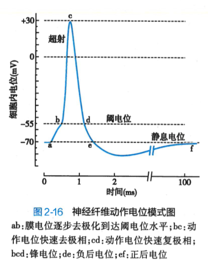
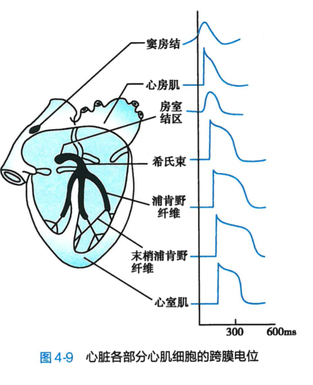
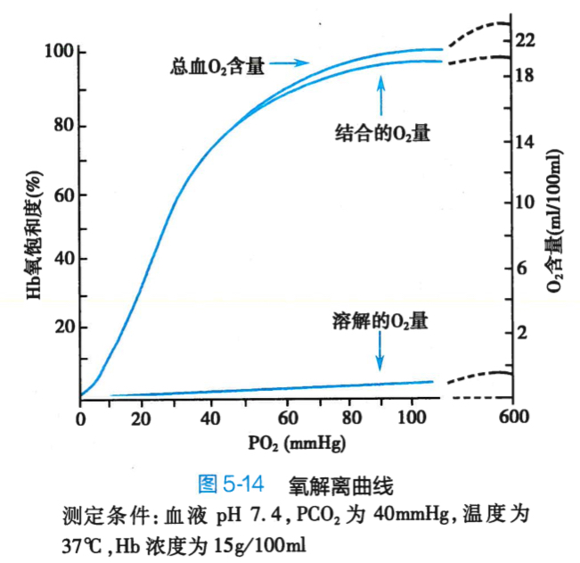
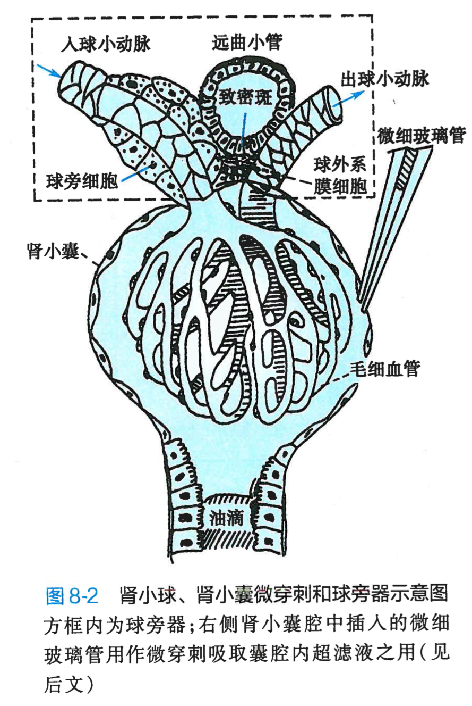
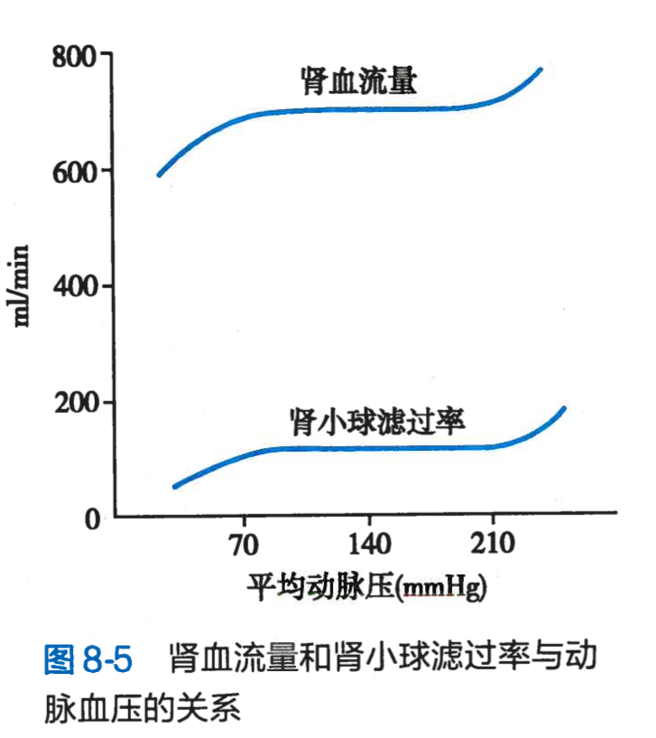
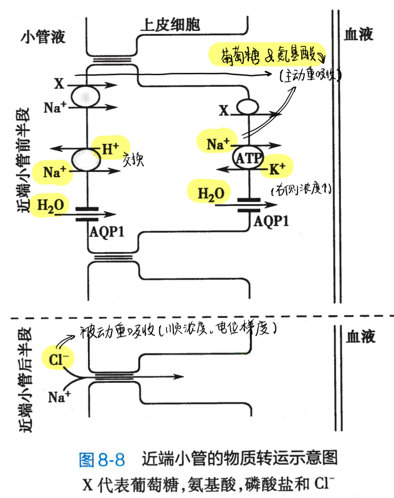
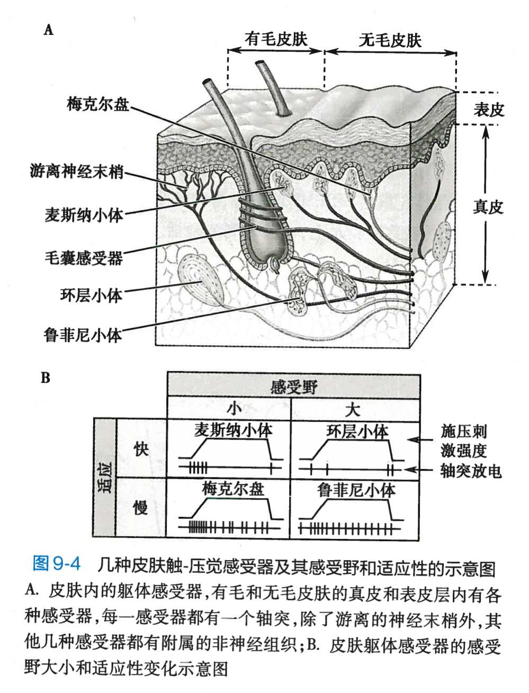

# 工程生理学

> By *Samuel Wang*

## 第一章 绪论

### 1.3 生命活动的基本特征

- **新陈代谢**：最基本的生理特征
- **兴奋性**：对内、外环境变化反应
- **适应性**
    - 生理性适应：高原地区人血红蛋白含量高
    - 行为性适应：天冷添衣
- **生殖**
- **衰老**

### 1.4 机体的内环境、稳态和生物节律

- **人体液体**
    - 体重的 60% 为体液，体液是人体内液体的总称
        - 2/3 的体液是细胞内液
        - 1/3 的体液是**细胞外液 ← → 内环境**
            - 血浆、组织液、淋巴液、脑脊液
            - 作用：提供物质；接受排出物；稳态，为细胞活动提供条件
        - 注意：消化道、汗腺管、尿道、膀胱内的液体与外环境直接相连，不是内环境
- **内环境**
    - 定义：体内各种组织细胞**直接接触**并**赖以生存**的环境
    - 内环境的稳态：内环境的理化性质的相对恒定状态
- **生物节律**
    - 定义：各种功能活动按一定的时间顺序发生的周期性变化

### 1.5 机体生理功能的调节

- **神经调节**
    - 基础结构：反射弧
        - 感受器、传入神经、中枢、传出神经和效应器
    - 特征：反应迅速、持续时间短、调节精确
    - 分类：条件反射、非条件反射
- **体液调节**
    - 定义：体内产生的某些特殊的化学物质，通过体液途径到达并作用于靶细胞而影响其生理活动的一种调节方式
        - 激素：甲状腺激素、胰岛素…
        - 特殊化学物质：白细胞介素、生长因子、趋化因子、组胺
        - 代谢产物：CO₂ 等
    - **远距分泌**：通过血液循环运输
    - **旁分泌** / 局部性体液调节：直接进入周围的组织液，经扩散作用到达临近的细胞发挥特定的生理作用
    - **自分泌**：在局部扩散，又反馈作用于该细胞本身
    - **神经分泌**：下丘脑一些神经细胞合成激素，随神经轴突的轴浆流至末梢，释放入血，如血管升压素
- 自身调节
    - 定义：某些细胞或组织器官凭借本身内在特性，而不依赖神经和体液调节，对内环境变化产生特定适应性反应的过程
    - 例如：肾血流、脑血流保持相对稳定

### 1.6 人体内自动控制系统

- **非控制系统**：指令、开环
- **反馈控制系统**：自控、闭环
    - **负反馈控制系统**
        - 与变化趋势相反方向调节，使趋于稳定
        - 体温稳定等大部分生理活动
    - **正反馈控制系统**
        - 相同方向继续调节，打破原先平衡状态，使某一活动趋于完成
        - 例如排尿、分娩
        - ！可能会造成危险，如大动脉出血
- **前馈控制系统**：提前准备
    - 避免负反馈调节时的矫枉过正产生的波动和反应的滞后现象
        - 如冬泳提前开始产热运动

## 第二章 细胞的基本功能

### 2.1 细胞膜的物质转运功能

- **细胞膜**
    - **液态镶嵌模型**
        - **胆固醇↑，长而饱和，脂肪酸↑，蛋白质含量↑→ 流动性↓**
    - 脂质
        - 分子数远多于蛋白质
        - 细胞膜的基本构架
        - 磷脂、胆固醇、少量糖脂（7:3:1）
    - 蛋白质
        - **表面膜蛋白**
            - 20%～30%
            - 细胞膜内表面，膜骨架蛋白 & 锚定蛋白
        - **整合膜蛋白**
            - 70% ～ 80%
            - 肽链一次或反复多次穿越膜脂质双层
            - **转运**功能、**受体**功能；黏附分子
    - 糖类
        - 寡糖 & 多糖链 + 共价键 → 糖蛋白（大多数整合蛋白） & 糖脂（1/10 的膜脂质）
- **跨膜物质转运**
    - **被动**转运
        - **单纯扩散 /  简单扩散**
            - 定义：物质从质膜的高浓度一侧通过脂质分子间隙向低浓度一侧进行跨膜扩散
            - **转运物质**
                - 脂溶、不带电、小分子
                - 氧气、二氧化碳、氮气、一氧化氮、氨气（快）、尿素、乙醚、乙醇、甘油、类固醇激素、水
            - **转运方式**：顺浓度差
            - **参与部分**：无
            - **耗能**：无需 ATP
        - **易化扩散**
            - 定义：非脂溶性小分子物质或带电离子在**跨膜蛋白**帮助下，顺浓度梯度和/或电位梯度进行跨膜转运
            - **转运方式**：顺浓度/梯度差
            - **耗能**：无需 ATP
                - 经**通道**的易化扩散
                    - **转运物质**
                        - 各种**带电离子**
                        - 钠离子，钾离子等
                    - **参与部分**：离子通道
                        - **离子选择性**：钾通道通透钾离子，乙酰胆碱能受体阳离子通道不通过氯离子
                        - **门控特性**
                            - **电压**门控通道：神经细胞轴突膜等电压门控钠通道
                            - **化学**门控通道：骨骼肌终板膜的N₂型乙酰胆碱能受体
                            - **机械**门控通道：耳蜗基底毛细胞上的机械门控通道、动脉血管平滑肌上的机械门控钙通道
                - 经**载体**的易化扩散
                    - **转运物质**
                        - **水溶性**小分子物质
                        - 葡萄糖、氨基酸
                    - **参与部分**：载体/转运体
                        - **结构特异性**：右旋葡萄糖转运量超过左旋葡萄糖
                        - **饱和现象**：最大扩散速率 Vmax 能反应载体蛋白构想转换的最大速率；扩散速度达到 Vmax 的 1/2 时的底物浓度成为米氏常数 Km
                        - **竞争性抑制**：浓度较低/Km 较大的溶质更容易收到抑制
                    - ！比通道慢
                    - **流程**：结合 → 构相变化 → 解离
    - **主动**转运
        - **原发性**主动转运
            - 定义：细胞**直接利用**代谢产生的能量将物质**逆**浓度梯度和/或电位梯度转运的过程
            - **转运方式**：**逆**浓度/电位梯度
            - **耗能**：**直接**利用 ATP
            - **参与部分**：**离子泵**（膜蛋白/载体），本质为 ATP 酶
                - **钠-钾泵**
                    - 核心：维持细胞**内高钾**离子浓度，细胞**外高钠**离子浓度
                    - 操作：α 亚甲基_3Na⁺ + 2K⁺ +1ATP
                    - 目的
                        - 维持细胞内高钾离子浓度，保障代谢反应
                        - 维持细胞内渗透压和细胞容积，防止水肿
                        - 钠钾的跨膜浓度梯度时细胞发生电活动（静息电位/动作电位）基础
                        - 钠泵生电效应使膜内电位负值增大，直接参与静息电位形成
                        - 为继发性主动转运供能
                        { width="67%" }
                    
                - **钙泵**
                    - 核心：维持胞内**钙**离子浓度远**低**于胞外
                    - PMCA_1Ca²⁺ + 1ATP，SERCA_2Ca²⁺ + 1ATP
                - 质子泵
                    - 胃腺壁细胞和肾脏集合管闰细胞顶端膜上的**氢-钾泵**：逆浓度将氢离子分泌到外液（胃液、尿液等）；药物奥美拉挫即为质子泵抑制剂，阻止胃酸分泌
                    - 细胞器膜**氢泵**：将氢离子由胞质转运至溶酶体、内涵体、高尔基体等细胞器，以保持胞质中性和细胞器的酸性
        - **继发性**主动转运
            - 定义：利用原发性主动转运机制建立起的钠离子或氢离子浓度梯度，在钠离子或氢离子顺浓度梯度扩散的同时**使其他物质逆浓度梯度和/或电位梯度**跨膜转运
            - **转运方式**：**逆**浓度/电位梯度
            - **耗能**：不直接利用 ATP
            - **参与部分**：同向转运体/反向交换体
            - **同向**转运
                - 两者向同一方向运动
                - 钠-葡萄糖**同向转运体** → 葡萄糖在小肠黏膜上皮的吸收 & 近端肾小管上皮的重吸收
            - **反向**转运
                - 两者相反运动，进行交换
                - 钠-钙**交换体** → 细胞质膜结构
                - 钠-氢交换体 → 肾小管近端小管上皮细胞
    - **膜泡**运输
        - **转运物质**：大分子和颗粒物质
        - 参与部分：能量 + 蛋白质 +细胞膜面积改变
        - **出胞**
            - 粗面内质网（蛋白质）→ 高尔基体 →质膜 → 排出
        - **入胞**
            - 吞噬：固态进入，细菌、死亡细胞或组织碎片
            - 吞饮：液态进入，大分子物质

### 2.3 细胞的电活动

- **极化**
    - **极化**：静息时细胞膜两侧存在的**内负外正**不均匀的电荷分布状态
    - **超极化**：与静息电位相比，膜电位**负值增大**，极化状态增强
    - **去极化**：与静息电位相比，膜电位**负值减小**
    - **反极化**：**去极化**到一定程度，电位值**翻转**，变成**内正外负**的极性倒置状态
    - **复极化**：去极化后再向静息电位**恢复**的过程
    - { width="40%" }
- **静息电位**
    - 定义：静息状态下存在于细胞膜内外两侧的电位差
    - 范围：-10～-100mV，均为**负值**
    - 存在于骨骼肌细胞（-90mV）、神经细胞（-70mV）、平滑肌细胞（-55mV）、红细胞（-10mV）；某些中枢神经元和具有自律性的心肌、平滑肌细胞**无**静息电位。
    - 产生机制
        - 静息电位本质：细胞在静息状态即存在的**带电离子的跨膜转运**
        - **（1）**细胞膜两侧离子的**浓度差与平衡电位**（**直接动力**）
            - **核心：电位差与浓度差之间的平衡**
            - **平衡电位**：离子净扩散量为 0 时跨膜电位差。由能斯特方程，**平衡电位只与浓度差相关**
            - **K⁺**的扩散电位：细胞内液钾离子浓度高，在细胞膜通透性的作用下向细胞外扩散，细胞膜内侧聚集大量无法透过的阴离子（蛋白质阴离子、磷酸氢根、硫酸根等），而钾离子附着在膜的外表面，形成**内负外正**的电位差
            - **Na⁺**的扩散电位：由于钠离子膜外浓度远高于膜内，故形成**内正外负**的电位差
        - **（2）**静息时细胞膜**对离子的通透性**
            - 静息状态下细胞膜对**K⁺**的通透性最高，因此静息电位最接近 Ek（**静息电位主要是由静息时细胞内钾离子向细胞外扩散形成的**）
            - 静息电位实测值**略小于** Ek 是因为少量 Na⁺的参与
        - **（3）**钠泵的**生电作用**
            - 钠泵**主动转运**维持细胞膜内外钠离子和钾离子的浓度差（3Na⁺出 ～ 2K⁺入），使**膜电位负值增大**（即发生**超极化**）
            - 贡献约 5%
- **动作电位**
    - 动作电位的定义：细胞在**静息电位基础上**接受有效刺激后产生的一个**快速并向远处传播的膜电位波动**
    - *c 点锋电位是动作电位的主要部分，被视为动作电位的标志*
    - { width="60%" }
    - 动作电位**特点**：**“全或无”**（达到阈值即产生）；**不衰减传递**（幅度和波形保持不变）；**脉冲式发放**（呈现多个分离的脉冲）
    - 动作电位**产生机制**（2 点因素）
        - **电化学驱动力及其变化**
            - 在某离子的平衡状态下，电化学驱动力为 0
            - 符号表示方式：**正号表示外向电流**（正离子外流或负离子内流）；**负号表示内向电流**（正离子内流或负离子外流）
            - Na⁺的平衡电位 E1 = +60mV，K⁺的平衡电位 E2 = -90mV，又静息电位 Vm = -70mV，故：钠离子和钾离子的电化学驱动力分别为-130mV（*钠离子希望内流*）和+20mV（*钾离子希望外流*）
            - 伴随着**膜电位**的改变，两者的**电化学驱动力**也在不断发生变化，影响两离子的进出
        - **动作电位期间膜离子通透性的变化**
            - 以上分析得知：
                - 在**静息状态**下，**钠离子有很强的内向驱动力**，**钾离子有很强的外向驱动力**
                - 若此时对两种离子有较大的通透性，会使得**钠离子内流产生膜的快速去极化**或**钾离子外流产生膜的快速复极化**
                - 因此，对于一次动作电位，产生步骤是
                    - （1）**Gna 首先增大**，**钠离子**在较大的电化学驱动力下**内流**，产生**去极化**
                    - （2）**去极化**达到阈值，启动去极化与 Gna 的**正反馈**，膜电位**快速上升**，形成动作电位升支，直至接近钠离子的平衡电位
                    - （3）去极化达到**峰值**后， **Gna 失活**（主要因素），**Gk 逐渐增大**，**钾离子**在强大的外向驱动力**快速外流**，形成动作电位降支
    - 动作电位的**触发**
        - **阈刺激**（阈强度 = 阈值、阈上/下刺激）
        - **阈电位**：膜电位水平，影响细胞**兴奋性**（如钠通道密度大，只需要较小的膜去极化就可以形成大 Na⁺ 电流，故阈电位水平较低，更接近静息电位，膜兴奋性高）
    - 动作电位的**传播**
        - 动作电位在**细胞内**的传播：**局部电流学说**
            - 兴奋区存在**内正外负的反极化**，相邻的未兴奋区存在**内负外正的极化状态**。两者之间存在电位差，产生**局部电流** 
            - *神经纤维或肌纤维上传导的动作电位又被称为冲动*
            - 局部电流的刺激强度远大于细胞兴奋所需的阈值，因此其生理传导是**安全**的
            - 髓神经纤维传导利用**郎飞结**
                - **髓鞘**区域**无钠通道无法形成动作电位**；**郎飞结**处**钠通道非常密集，可以产生动作电位**
                - 形成**郎飞结**间的**跳跃式传导**
                - 传导过程离子跨膜进出大大减少，**减少能耗**
        - 动作电位在**细胞间**的传播
            - **缝隙连接**（神经系统又名**突触**）
    - 动作电位的兴奋性及其变化
       - **兴奋性**：组织或细胞受刺激发生反应的能力或特性，是生命活动的基本特征之一；**首先出现**的**共同反应是动作电位**；能产生动作电位的细胞称为**可兴奋细胞**
       - 兴奋性的变化
           - **绝对不应期**：动作电位的**锋电位**
               - 这段时间，无论施加多强的刺激也**不能使细胞再次兴奋**
               - 产生原因：引起动作电位的电压门控钠（钙）通道**已经激活或进入失活**状态，无法重新开放
               - 使细胞单位时间产生**动作电位的时间是有限的**
           - **相对不应期**
               - 绝对不应期之后一段时间，给予**足够强的阈上刺激**才可以引起新的动作电位
                   - 本质：细胞兴奋性**从零开始恢复到接近正常**的时期
           - { width="67%" }
           - *兴奋性本质上就是用来衡量目前电位达到阈电位的难易，所以**反应的就是电位和阈电位的“差值”***
- **细胞膜和细胞质的被动电学特性**
    - 膜电容（约 1uF/cm^2）
    - 膜电阻（约 10^3 欧）
    - 轴向电阻：研究直径较小、轴向延伸较长的细胞（神经轴突）时考虑
- **电紧张电位**
    - 定义：由膜的**被动电学特性**决定其**空间分布**（随 d 增加而减小）和**时间变化**的膜电位
    - 传播范围和生成速度
        - **空间常数 λ**：膜电位衰减至 37% 时所扩步的空间范围；**膜电阻**越**大**，**轴向电阻**越**小**，可以使**空间常数**更**大**，**影响范围**更**大**
        - **时间常数 τ**：充电上升到最大值大 63% 或放电秩最大值大 37% 所需的时间；**膜电阻**越**小**，**膜电容**越**小**，可以使**时间常数**更**小**，**电紧张电位**生成越**快**
        - ***空间常数大，时间常数小**，可以使动作电位传导速度**更快***
    - 电紧张电位的**极性**
        - **去极化电紧张电位**：等效于细胞内注射**正电荷**，产生于**负电极下方的细胞膜**（胞质内的正电荷会流向负电极的下方，*效果类似于钠离子内流*）
        - **超极化电紧张电位**：等效于细胞内注射**负电荷**，产生于**正电极下方的细胞膜**（胞质内的负电荷会流向正电极的下方）
        - 因此，只有在**负电极**下方才可以产生**动作电位**
        - *此处也可以理解为**外面的负电极会使外侧电位下降**，从而**使内侧电位等价上升***
    - 电紧张电位的**特征**
        - **等极性电位**：电位幅度和刺激正相关
        - **衰减性传导**：电位幅度随传导距离指数级下降
        - **没有不应期，电位可总和**：多个电紧张电位可叠加
- **局部电位**
    - 定义：细胞受到刺激后，由**膜的主动特性**参与的，即**部分离子通道开放**形成的、**不能向远距离传播**的膜电位改变
    - 可以由**去极化电紧张电位**刺激产生，如*激活少量钠通道，促进去极化*
    - 局部电位的**特征和意义**（*同 电紧张电位*）
        - **等极性电位**
        - **衰减性传导**
        - **没有不应期，电位可总和**
    - *骨骼肌终板膜上的终板电位时去极化局部电位*

### 2.4 肌细胞的收缩

- **肌肉的构成**（*随意：随意志控制*）
    - **横纹肌**（明暗交替的横纹）：骨骼肌（随意肌，受运动神经系统支配）、心肌（非随意肌，受自主神经支配）
    - **平滑肌**：如 消化系统肌肉（非随意肌）
- **骨骼肌神经肌肉接头处的兴奋传递**
    - 结构特征：接头前膜、接头后膜、接头间隙
    - 兴奋**传递过程**：**电→化学→电**
        - { width="50%" }
        - *兴奋传递过程有神经递质参与，因此产生使用性增强现象，受药物和病理因素的影响*
- **横纹肌细胞的结构特征**
    - **肌原纤维和肌节**：肌原纤维由**粗肌丝**（暗带）和**细肌丝**（明带）规则排布构成，最小重复单元为**肌节**（相邻 Z 线间）
    - **肌管系统**：横管 T（垂直肌原纤维走向的膜性管道），纵管 L（平行肌原纤维走向的肌质网）
    - { width="60%" }
- **横纹肌细胞的收缩机制**：肌丝滑行学说
    - 肌丝分子结构
        - **粗肌丝**（*中间豆芽状组合*）：6 条肽链（其中 2 条重链）；横桥（*豆芽头*）被激活后可向 M 线方向扭动（肌丝滑行动力来源）
        - **细肌丝**（*上下 4 个长链*）：相关位点可以和**横桥**结合，产生肌丝滑行而收缩
        - { width="60%" }
    - **肌丝滑行的过程**
        - （1）终池膜**钙通道**开放，钙离子进入肌浆
        - （2）钙离子与肌钙蛋白结合，使**肌钙蛋白变构**
        - （3）**原肌球蛋白位移**，暴露细肌丝上结合**位点**
        - （4）**横桥**与结合位点结合，分解 **ATP **释放能量
        - （5）**横桥摆动**，牵拉**细肌丝**滑行
        - （6）**肌节缩短**，肌细胞收缩
- **横纹肌细胞的兴奋-收缩耦连**
    - （1）T 管（横管）膜的动作电位传导
    - （2）JSR 内钙离子的释放
    - （3）钙离子触发肌丝滑行
    - （4）JSR 回摄钙离子
- **影响横纹肌收缩效能的因素**
    - **前负荷**：肌肉在收缩前所承受的负荷；最适初长度对应肌节长度 2.0～2.2um（*此时横桥与细肌丝重叠比例最大，且肌丝的相互关系最适合横桥的活动*）
    - **后负荷**：肌肉在收缩后承受的负荷；**缩短速度**和**负荷**（张力）成**反比**关系（图中两个“极值点”称为**最大收缩速度**和**最大收缩张力**）
    - 肌肉用力，发力过程**始终是“等长→等张”**，先是**拉力增大到后负荷**，在这一阶段肌节长度不变，为**等长收缩**；在后负荷之后，横桥就开始滑行，肌肉才能缩短，拉动负载，进入真正的**等张收缩**
        - { width="45%" }
        - ***后负荷增大时，等长阶段更久**。因为后负荷越大，肌纤维要花更长时间把张力“攒”到能克服它的水平，所以等长阶段持续时间更长。*
    - **肌肉收缩能力**（收缩性）：与负荷无关又能影响肌肉收缩效能的肌肉内在特性
    - **收缩综合**：肌细胞收缩的叠加特性（*空间综合为多纤维组合，时间综合为频率组合*）

## 第三章 血液

### 3.1 血液生理描述

- **血液**
    - 构成：血浆（细胞外液） + 血细胞
        - 可以用离心方式分层，上方血浆、中间中心粒细胞和血小板、下层红细胞和少量白细胞
        - **血浆**
            - 组成：**水、**非蛋白质有机物、电解质、气体、**蛋白质**【白蛋白（血液内营养物质，量多）、球蛋白（免疫）、纤维蛋白原：形成血液胶体渗透压】
            - 电解质含量分布组织液相近
            - 血浆内阳离子主要为 Na⁺，阴离子主要为 Cl⁻；血浆有蛋白质但是组织液没有（无法透过血管壁）
        - **血细胞**
            - 组成：红细胞（男性、新生儿的红细胞更多）、血小板、白细胞（含淋巴细胞、单核细胞、中性粒细胞、嗜酸性粒细胞、嗜碱性粒细胞）
    - 功能
        - 运输
        - 缓冲酸碱（碳酸根、磷酸根）pH = 7.36
        - 维持体温稳定
        - **生理止血**（血小板）和**机体防御**（白细胞）
- **血液的理化性质**
    - 血液的比重
        - 全血比重为 1.050～1.060，**红细胞**数量越多，全血比重越大
        - 血浆的比重为 1.025～1.030，**血浆蛋白**的含量越高，血浆比重越大
        - 红细胞的比重为 1.090～1.092，红细胞内**血红蛋白**含量越高，红细胞比重越大
	- 血浆**粘滞度**
		- 全血为水的 4～5 倍，血浆为水的 1.6～2.4 倍
	- 血浆**渗透压**
		- **晶体**渗透压
           - 组成：无机盐、糖等，主要为 NaCl
           - 渗透压大
           - 作用：维持细胞内外的水分交换，保持 RBC 正常形态和功能 
		- **胶体**渗透压（引起改变的主要原因）
           - 组成：血浆蛋白等胶体物质，主要为蛋白质
           - 渗透压：小
           - 作用：调节毛细血管内外水分的交换和维持血浆容量
		- 注意！ **等渗溶液 != 等张溶液**
			- **等渗溶液**指溶液的**起始渗透压**与参照体（如血浆或细胞内液）相等，但不考虑溶质是否能透过细胞膜；**等张溶液**指溶液在与细胞或红细胞接触时，不引起水分进出细胞，即**细胞体积保持不变**（不发生胀缩）
    - 血浆 pH 7.35～7.45
        - 血浆缓冲物质，构成缓冲盐溶液（考虑阴离子浓度，同时也需要保证阳离子的种类与浓度）
        - 酸/碱中毒

### 3.2 血细胞生理

- **血细胞的生成**
	- 造血干细胞：自我更新、多向分化、大多处于 G0 期
	- 定向祖细胞：定向分化
	- 前体细胞
- **红细胞**生理
    - 概述
        - 形态：无细胞核，双凹圆碟形
        - 数量：男性多于女性
        - 意义：缺少导致贫血
        - 功能：携带氧气（98.5%）、二氧化碳（少量，7%）、营养物质
    - 红细胞的**特性**
        - **可塑变形性**
            - 定义：在外力作用下具有变形的能力
            - 使红细胞能穿过小的毛细血管（毛细血管直径小于红细胞，便于物质的交换）
        - **悬浮稳定性**
            - 定义：尽管红细胞的比重大于血浆，但正常时红细胞下沉缓慢
            - 红细胞沉降率 ESR 衡量沉降速度
        - **渗透脆性**
            - 定义：红细胞在低渗盐溶液中发生膨胀破裂的特性
                - 红细胞对低渗盐溶液具有一定的抵抗力
            - 影响因素：红细胞的表面积和体积之比
        - **红细胞的生成**
            - 原料：铁（必须，缺铁贫血），叶酸和维生素 B12（巨幼细胞性贫血）
            - 生成调节
                - 器官：**肾**（调节作用90%～95%）、肝
                - 促进： EPO （肾）、雄激素，甲状腺激素，肾上腺皮质激素、生长激素
                - 抑制
    - **红细胞的破坏**
        - 寿命：120 天，衰老红细胞变形能力减弱
        - 器官：**脾**和肝
            - 血管内破坏
            - 血管外破坏（主要 90%，大多在脾脏进行 RBC） 
- **白细胞**生理
    - 白细胞的分类与数量：淋巴细胞、单核细胞、中性粒细胞、嗜酸性粒细胞（吞酸性染色体）、嗜碱性粒细胞（吞噬碱性染色体）
    - **白细胞的生理特性**
        - 渗出：可以在细胞膜伸出伪足作变形运动，可以穿过毛细血管壁（区别红细胞可塑变形性）
        - 趋化：白细胞朝向某些化学物质（趋化因子）运动的特性
        - 吞噬：吞噬细胞
        - 分泌
    - **白细胞的生理功能**
        - 中性粒细胞和巨噬细胞时体内的重要吞噬细胞
            - 中性粒细胞：快速响应，但是吞噬能力有限；强吞噬性（细菌、衰老红细胞、抗原-抗体复合物、坏死细胞）
            - 巨噬细胞：由单核细胞发育，受中性粒细胞发出的信号募集，可吞噬更大的颗粒，迁移速度慢（针对长时间炎症）
       - 嗜碱/酸性粒细胞 → 变态反应的发生与调节（如哮喘、花粉过敏），吞噬能力较弱
       - 淋巴细胞 
    - 白细胞的生成与破坏
        - 造血干细胞生成
        - 寿命约 100～300 天
        - 死亡形成脓液
- **血小板**生理
    - 特征
        - 形态：小，**无细胞核**，双面微**凸**的圆盘状
        - 功能
            - 维持血管壁的完整性（不完整会形成皮肤紫斑）
            - 释放内皮屏障，参与生理性**凝血**
        - 血小板的生理特性
            - **血小板黏附**
                - 在血管发生轻微破裂的时候（内皮屏障破坏），下方**胶原纤维**暴露时，会被血小板大量结合位点形成锚定，形成血小板黏附
           - **血小板释放**
               - 血小板受刺激后释放致密体等物质，募集新的血小板
               - 合成释放血栓烷 TXA2（聚集血小板和缩血管）
                   - 阿司匹林可以抑制它的合成 
            - **血小板聚集**
                - 血小板和血小板之间相互黏着
                - 聚集影响因素
                    - 激活剂：肾上腺素等
                    - 抑制剂：一氧化氮等
                -  **ADP** 会使血小板分阶聚集（聚集到第一阶段后由血小板自身再释放 ADP 使其浓度再次上升继续凝血）；**胶原**会使血小板直接大量聚集
            - 血小板收缩
                - 包裹血块，析出血清
            - 血小板吸附
                - 血小板表面吸附血浆中多种凝血因子

### 3.3 生理性止血

- { width="50%" }

- **生理性止血的基本过程**
    - 一期止血：血小板止血栓形成
    - 二期止血：纤维蛋白-血凝块的形成
- **血液凝固**
    - **实质**：血浆中的可溶性**纤维蛋白原酶解**转变为不溶性的**纤维蛋白**的过程
    - 凝血因子：血浆与组织中直接参与血液凝固的物质
        - 除 FIV 是 Ca²⁺，其余均为蛋白质
        - 除 FIII 外，都存在于新鲜血液
   - **凝血过程**：凝血酶原酶复合物（用于将凝血酶原转化为凝血酶）的形成 → 凝血酶的激活 → 纤维蛋白的生成，是一个级联放大的过程
       - { width="40%" }

        - **Step 1: 凝血酶原酶复合物的形成**
            - **内源性**凝血途径（**慢**）：参与的**凝血因子全部来自于血液**，因血液和带负电的**异物**表面（玻璃、白陶土等）接触而启动，如**杀鸡接鸡血**
            - **外源性**凝血途径（**重要**，**快**）：参与的**凝血因子来自组织和血中**，来自于血液之外的**组织因子**暴露于血液而启动的凝血过程，最为重要的是组织释放的**凝血因子 FIII**
            - *外源性凝血被激活可以有两条路径* 
            - { width= 50%" }
            - ！注意概念辨析：接触的是组织还是异物？
            - 血友病：甲（缺乏 FVIII），乙（缺乏 FIX），丙（缺乏 FXI）；由上图可以分析，缺乏 **FXI 的丙类**血友病症状最轻
        - **Step 2: 凝血酶原的激活**
        - **Step 3: 纤维蛋白的生成**
        - { width="60%" }
- **血液凝固的负向调节**
    - **血管内皮的抗凝过程**（避免正常情况下凝血）
        - 正常血管内皮的屏障功能：防止凝血因子、血小板与内皮下成分接触
        - 抗血小板功能；释放前列环素和 NO（速效救心丸）
        - 血管内皮抗凝功能：硫酸乙酰肝素蛋白多糖；合成和分泌组织因子抑制物（TFPI）和抗凝血酶；表达凝血酶调节蛋白
        - 溶解纤维蛋白
    - **纤维蛋白的吸附、血流的稀释和单核-巨噬细胞的吞噬作用**
        - 纤维蛋白和凝血酶有高度的亲和力，加速局部凝血并避免凝血酶向周围扩散
        - 血流稀释 + 单核-巨噬细胞吞噬作用防止凝血酶扩散
    - **生理性抗凝物质**
        - **丝氨酸蛋白酶抑制物**和**肝素**
            - 丝氨酸蛋白酶抑制物含抗凝血酶
            - 肝素促进抗凝血酶和凝血酶结合
        - 蛋白质 C 系统
    - **组织因子途径抑制物**
    - **促凝和抗凝**
        - 促凝：粗糙表面；温热环境；局部使用凝血酶
        - 抗凝：除去血浆中钙离子（柠檬酸钠、草酸盐）；维生素 K 拮抗剂（华法令）；肝素
- **纤维蛋白的溶解**
    - 意义：维持血液**流体状态**；**溶解血栓**使血液通畅
    - 纤溶酶原的激活
    - 纤维蛋白与纤维蛋白原的降解
    - 纤溶抑制物
- **凝血、抗凝、纤溶的动态平衡**
- { width="60%" }

### 3.4 血型和输血原则

- **血型**：**红细胞膜**上特异性抗原的类型
    - 红细胞凝聚反应：红细胞上的抗原（凝集原）与相应抗体（凝集素）结合；本质是**抗原-抗体**反应
    - 抗原：来自寡糖链的组成与连接顺序，由 A、B、O 三个等位基因决定
    - 抗体：**天然抗体 IgM**（分子量**大**，不通过胎盘，8～10 高峰）& **免疫性抗体 IgG**（分子量**小**，能通过**胎盘**，新生儿血浆中**可能**存在来自于母体的 IgG 型抗 A 或抗 B 抗体，先天无法制造获得，后天免疫获得）
- **血型鉴定**
    - 正向鉴定（**新生儿**无抗体只可以用正向方式）：用抗 A 与抗 B 抗体检测来检查红细胞有无 A 或 B 抗原
    - 反向鉴定：用已知红细胞检测血清中有无抗 A 或抗 B 抗体
- **Rh 阴性血**（**Rh**esus monkey 恒河猴）
    - 与 ABO 是两个血型体系
    - 本质对应：D 抗原阳性/阴性
    - Rh 血型体系特征：
        - 人的血清不存在抗 Rh 的天然抗体
        - Rh 抗原只存在于红细胞表面，出生时已发育成熟
        - 抗体为**IgG**：可过胎盘，**Rh 阴性孕妇**易形成**新生儿溶血病**，第二胎（尤其是怀孕中后期）由于第一胎产生的免疫抗体 IgG，病症会更加严重；
          因为：第一胎 **Rh 阴 母 + Rh 阳 子 会导致 母体内产生 IgG**；第二胎如果仍为 Rh 阳 子，**IgG会透过胎盘进入子**，对其**攻击**（对基本母无影响）
- **输血原则**
    - **血量**
        - 全身血液总量，7%～8%
        - 分为：**循环血量**（心血管）；**储存血量**（肝、肺、腹腔静脉、皮下静脉）
    - 输血的相关原则
        - 坚持**同型输血**
        - 必须**交叉配血**
        - 提倡**成分输血**
        - 谨慎**异型输血**

## 第四章 血液循环

### 4.1 心脏的泵血功能

- **循环**：体液不断流动和相互交换的过程（心血管系 & 淋巴管系）
    - **血液循环：体循环 & 肺循环**
       - 体循环：**动脉血**从**左心室**沿着主动脉及其分支到毛细血管，由各级静脉和上、下腔静脉及冠状窦回到**右心房**
      - 肺循环：**静脉血**从**右心室**经肺动脉及其分支到肺泡毛细血管，再由肺静脉返回**左心房**。
- **心动周期**
   - 定义：心脏一次**收缩和舒张的机械活动周期**
   - 心动周期特点：长短和**心率**有关（心动周期 0.8s：心房收缩 0.1s，舒张 0.7s；心室收缩 0.3s，舒张 0.5s；收缩先房后室，全心舒张期 0.4s）；**舒张期远长于收缩期**
- **泵血过程**
    - **心室收缩期**：1 **等容收缩期**（从房室瓣关闭到主动脉瓣开启）+ **射血期**（2 快速射血期 + 3 减慢射血期）
    - **心室舒张期**：4 **等容舒张期**（从半月瓣关闭到房室瓣开启）+ **心室充盈期**（5 快速充盈期 + 6 减慢充盈期 + 7 心房收缩期）
    - { width="60%" }
    - { width="75%" }
- **心房在心脏泵血的作用**
    - 心房具有初级泵作用
    - 心房内压在心动周期内的变化（左心房压力曲线依次出现 **a、c、v** 三个较小的正向波：a 来自心房收缩波，c 来自左心室作用房室瓣引起，v 来自血液进出心房过程）
- **心音**
    - 一个心动周期一般听到两个心音（第一、第二心音）
    - 总共有 **4** 个心音
        - 第一：心室收缩期开始
        - 第二：心室舒张期开始
- **心输出量**
    - **每搏输出量**：一侧心室每次搏出的血量（70ml）
        - =心室舒张末容积 - 收缩末期容积 = 125 - 55
    - **射血分数**：每搏输出量 / 心舒张末期容积（每一次泵血输出血量的**比例**）
    - **每分输出量**：每分钟输出血量（单侧心室），4.5 - 6 L/min
    - **心指数**：每**平方米体表面积**的心输出量，3.0 - 3.5 L/min
        - 静息心指数：安静、空腹时的心指数
- **心搏泵血功能的储备**
    - **搏出量储备**：心脏在需要时（如运动、应激、失血）**通过增强收缩或调节容积等手段，使搏出量增加的能力和范围**
    - **心率储备**：心率提升可以使心输出量增加至静息时的 2 - 2.5 倍
- **心输出量的影响因素**
    - 心室肌的**前负荷**：心室舒张末期容积（即**粗肌丝和细肌丝的重合程度**，即肌节长度；反映为心脏当时大小）与压力
        - **前负荷效应**：前负荷**增加**，重合量**增加**，心肌初长度**增加**，肌缩力**增加**
        - 在心肌细胞上有一个特殊的**“连接蛋白”**，不可以无限拉伸！
        - { width="67%" }
        - 心肌**异长的自身调节**：一个闭环反馈
            - **回心血量少，肌丝初长度短，肌缩力小，搏出量少**：保护心室肌
            - **心室功能曲线**
                - **左侧陡**：未达到最适前负荷
                - **中段平**：前负荷-初长度达到上限，但对搏出量影响不大
                - **后段平坦略降**：说明心肌有**抵抗过度延伸特性**，保持搏功基本不变
                - { width="60%" }

        - 影响前负荷的因素
            - **静脉血（V 血）回流速度**：大 V 压大于房压 → 回流速度和回流量上升
            - **剩余血量**：心缩力下降 → 剩余量上升
            - **充盈过程**：心率下降 → 舒张期增长 → 充盈量上升
            - **心室顺应性**（弹性）：心肌肥厚 → 顺应性下降 → 充盈量下降
    - 心室肌的**后负荷**：**大动脉血压**是心室收缩时遇到的后负荷
        - **主动脉压（A 压）越高**，等容收缩期越长，射血期延迟并缩短，心肌缩短程度和速度降低，射血速度减慢，**搏出量减少**
    - 心肌**收缩能力**
        - **钙离子内流**促进心肌**收缩**（*？动作电位*）
        - **横桥活动**各步骤速率
        - 活化**横桥数目**
        - **ATP 酶活性**
    - **心率**：一定范围内心率增加可提升心输出量
    - { width="75%" }

### 4.2 心脏的电生理学及生理特性

- **心脏细胞的类型**
    - 按照组织学和电生理学
        - **工作细胞**：心房肌、心室肌 → 有收缩性，无自律性（自律性 指**可自发放电**，刺激工作细胞工作）
        - **自律细胞**：窦房结、房室交界、房室束、浦肯野纤维（位于心室）→ 无收缩性，有自律性；
    - 按照心肌细胞 AP（动作电位）**去极相速度和机制**
        - 快反应细胞：心房肌、心室肌、浦肯野 C
        - 满反应细胞：窦房结 P 细胞、房室结细胞
- **心肌细胞的跨膜电位**
    - *根据上升速度（去极相）判断是 快反应 / 满反应细胞*{ width="40%" }

    - **工作细胞的跨膜电位**及其机制
        - 静息电位：电位值 -80 ～ -90，比神经细胞数值绝对值更大
        - 机制：类似静息电位生成过程（钾向外扩散、*内向整流钾通道*，少量钠通道、钠泵）
        - **动作电位**分为 5 期
            - 注意：*存在很长的 2 期平台期*

            - { width="35%" }
            
            - **0 期**：钠离子通道开放，大量**钠离子内流**形成**去极化**（*可用河豚毒素阻止，但对心肌细胞作用有限*）
            - **复极 1 期**：由整流型钾通道形成的 Ito 激活主导，**钾离子外流**形成**复极化**初始阶段
            - **复极 2 期**：缓慢增强的**钾离子外流**和缓慢的 L 型**钙离子内流**，二者达到动态平衡，形成**平台期**；随时间推移，外向电流逐渐超过内向电流，导致缓慢复极化（**钙离子内流促进心肌收缩！**）
            - **复极 3 期**：钙离子内流停止，**钾离子外流**（Ik、Ik1）逐渐增多，迅速**复极化**，直至复极化完成
            - **复极 4 期**：膜电位趋于稳定，**钠钾泵**将钠离子排至胞外，将钾离子泵入胞内；**钠钙泵**和**钙泵**使钙离子离开细胞（**排出 Na⁺、Ca²⁺，吸收 K⁺**）
    - **自律细胞的跨膜电位**及其机制
        - **特点**：**4 期**膜电位不稳定，能自动产生**缓慢的去极化**，即**4 期自动去极化**（*4 期位于最前面，循环释放电信号？*）
        - *上方为工作细胞，下方为自律细胞*
    
        - { width="40%" }
        
        - **窦房结**Ｐ细胞和房室结细胞**无**复极 1 期和 2 期平台期（如上图）
            - **0 期**：当 4 期到达阈电位后，开放 **L 型钙通道**（*同工作细胞平台 2 期*），导致 0 期**去极化**
            - **3 期**：钙离子通道失活，钾离子外流，膜电位**复极化**
            - **4 期**：存在**进行性衰减的钾离子外流**和**进行性增强的钠离子内流**和 **T 型钙通道激活少量内流**，导致**去极化**
        - **浦肯野**细胞有 2 期平台期（有完整的 0 - 4 期）：4 期膜电位不稳定；动作电位时间最长
- **心肌的生理特性**
    - **兴奋性**
        - 兴奋性有**周期性**变化：**有效不应期**（类似绝对不应期，更长，因为有平台期）；**相对不应期**；**超长期**（兴奋性高于正常，更弱的刺激也可以触发电位）
        - 影响因素：RP（静息电位）水平（RP 绝对值增大时，兴奋性降低）；阈电位水平；离子通道性状
        - **兴奋性和心肌收缩关系**：动作电位促进心室肌细胞的收缩产生
            - 3 期末期即进入相对不应期，有可能产生动作电位；若此时产生动作电位，肌肉收缩会进行叠加形成**强直收缩**（若心肌强直收缩形成房颤会危及生命，因此**心肌细胞有较长的绝对不应期和平台期**）
            - { width="50%" }
            
        - **期间兴奋和收缩**：在下次窦房结兴奋到达之前，外来刺激使心室肌细胞**提前产生**兴奋和收缩
        - **代偿间隙**：期间收缩以后，往往会出现一段**较长的心室舒张期**（此阶段心肌不收缩）
    - **自律性**
        - 窦房结、房室交界、房室束、浦肯野纤维**自律性依次降低**
        - **心脏起搏点**
            - **正常起搏点**（**窦房结**，窦性心律）；**异位起搏点**（非窦房结起搏）
            - **控制机制**：**抢先占领**（控制别的自律细胞）；**超速驱动压抑**（异位位点在刚失去窦房结信号后仍会保持一段时间窦房结节律，窦房结失常安装起搏器）
        - 自律性影响因素：最大复极电位与阈电位之间距离短自律性增高；4 期自动除极快，自律性高
    - **传导性**：心肌细胞传导兴奋的能力或特性
        - **房室交界**的传导（慢，0.1s）帮助控制心房和心室**先后跳动**
        - { width="67%" }
    
        - 传导性影响因素：非髓鞘结构的细胞传导由细胞结构（细胞直径大，传导快）决定
    - **收缩性**
        - **同步收缩**（全或无）：心肌一旦兴奋会引起整个左右心房/室同步收缩
        - **不发生强直收缩**：有效不应期长，始终保持收缩和舒张交替进行的节律活动
        - 对**钙**依赖性大
- **体表心电图**
    - { width="45%" }

    - **P 波代表了心房的激动**
    - QRS 代表了心室的除极
    - U 波与心室的复极相关
    - QT 间期代表了心室从除极到复极的时间

### 4.3 血管生理

- **各类血管的功能特点**
    - **动脉、静脉、毛细血管串联**
    - **动脉和静脉管壁**从内向外分为
        - **内膜**：**内皮细胞**（通透性屏障、血管光滑内衬面、内分泌）内皮下层
        - **中膜**：**血管平滑肌**（收缩、舒张调节血流量）、弹性纤维（使动脉扩张或回缩；动脉硬化时断裂，导致动脉瘤）、胶原纤维
        - **外膜**：包裹在血管外层的**疏松结缔组织**，含弹性纤维、胶原纤维、间质细胞和微血管
    - *人体血管循环*{ width="50%" }

    - { width="66%" }
    - 血管的**功能性**分类
        - **弹性储存血管**：主动脉、肺动脉主干及其发出的最大分支，可借助血液动能和血管壁弹性势能的转化实现血液的**连续流动**
        - **分配血管**：中动脉，如颈动脉、冠状动脉、肾动脉
        - **毛细血管前阻力血管**：小动脉和微动脉，管径细、阻力大，可支配组织血流量并调节动态血压
        - **毛细血管前括约肌**：环绕在真毛细血管起始部的**平滑肌**，属于**阻力血管**一部分，控制毛细血管**开放**与**关闭**
        - **交换血管**：毛细血管网，通透性高，实现管内外物质交换
        - **毛细血管的后阻力血管**：微静脉，影响毛细血管前后阻力比值，改变毛细血管**血压、血容量、滤过作用**，影响体液在血管内外的分配比例（*微静脉收缩使前后阻力比值减小，毛细血管血压上升，组织液生成变多*）
        - **容量血管**：静脉系统，比同级动脉更多、管壁薄、口径大、可扩张型大、容量大（口径微小改变可使容积发生较大变化），有**回流通道**和**储存库**的作用
        - **短路血管**：血管床中小动脉和小静脉的直接吻合支，主要位于**手指、足趾、耳廓**，短路后血液不流经毛细血管，调节体温**散热功能**
    - 血管的**内分泌**功能
        - **血管内皮细胞**：**舒血管物质**（一氧化氮、硫化氢、前列环素等）、**缩血管物质**（内皮素等）
        - **血管平滑肌细胞**：合成分泌**肾素**和**血管紧张素**（调节紧张性和血流量），胶原蛋白、弹力蛋白和蛋白多糖
        - 血管其他细胞：成纤维细胞、脂肪细胞、肥大细胞、巨噬细胞、淋巴细胞
- **动脉血压**：一般指**主动脉血压**
    - 动脉血压的**形成**：
        - 心血管系统有足够的血液充盈
        - 心脏射血
        - 外周阻力
        - 主动脉和大动脉的弹性贮器作用
    - 动脉血压的**测量与正常值**
        - 测量方法：直接测量（一般应用于动物），间接测量法（常见）
        - **正常值**：收缩压 100～120mmHg、舒张压 60～80mmHg、脉压 30～40mmHg（脉压指收缩压和舒张压差值）
        - **高血压**：收缩压>=140mmHg，舒张压>=90mmHg
        - *平均动脉压指心动周期每一瞬间动脉血压的平均值，与舒张压更接近*{ width="55%" }
    - **影响因素**：心脏每搏输出量、心率、外周阻力、主动脉和大动脉的弹性贮器作用、循环血管与血管系统容量的匹配情况
- **动脉脉搏**：每个心动周期，因动脉内压力和容积发生周期性变化而引起的动脉壁周期性波动
    - **脉搏波形**：
        - **上升支**：心室快速射血，动脉血压上升，血管壁被扩张形成；射血快，心输出多，射血阻力小，上升支的斜率和幅度大
        - **下降支**：分为**前后两段**。心室射血后期射血速度减慢，进入主动脉血量少于流向外周的血量，血压降低，构成前段；心室舒张，血压继续下降，构成后段；此外还有**降中波**和**降中峡**，在心室舒张、主动脉瓣关闭瞬间血液向心室反流引起折返波，其之前的一个切迹叫做降中峡（*外周阻力大，下降慢，降中峡位置高*）
        - **异常**：**主动脉狭窄**，射血阻力大，上升支斜率和幅度较小；**主动脉瓣关闭不全**，心室舒张期主动脉血液反流，主动脉血压骤降，下降支陡
        - { width="55%" }
    - **脉搏传播**：沿动脉管壁传向末梢血管，远**快**于血流速度；管壁可扩张性大，传播速度慢
- **静脉血压**
    - 血液流至静脉时**血压较小**（15～20mmHg），且**微静脉血压波动较小**，几乎不受心脏活动影响
    - **中心静脉压**：右心房和胸腔内搭静脉血压，接近于 0；**心力衰竭或腔静脉淤血**或**静脉回血量增多 / 过快**，中心静脉压**升高**（*可以此判断输液治疗休克患者的输液速度和心脏射血功能*）
    - **外周静脉压**：各器官静脉的血压
   - **重力对静脉压的影响**
       - 由于**地球重力**因素，血液对血管壁产生**静水压**，压力大小取决于体位（直立时**足部血压升高** 80mmHg），对静脉影响远高于对动脉影响
        - **跨壁压**：血液对管壁的压力与血管外组织对管壁的压力之差，是保持**血管充盈扩张**的必要条件；静脉壁薄，管壁弹性纤维和平滑肌少，当跨壁压降低时易**塌陷**，容积减少（*在失重情况下管壁压也将降低*）
- **静脉回心血量**
    - 静脉对血流的**阻力**（总体较**小**）：
        - **微静脉的舒缩活动**调节体液在血管和组织间隙的分布情况，间接调节静脉回心血量
        - **跨壁压**改变静脉扩张状态改变血流阻力
    - 影响回心血量的**因素**
        - 体循环平均充盈压（血量**增加**，容量血管**收缩**，体循环平均充盈压**升高**，充盈程度**高**，回血量**增多**）
        - 心肌收缩力（收缩力**强**，回血量**多**）
        - 骨骼肌的挤压作用（肌肉泵加速血液循环，防止血液淤积形成下肢水肿）
        - 体位改变 （平卧改直立回心血量**减少**）
- **静脉脉搏**：与心房相连的大静脉收到右心房血压波动**逆行**传播，压力和容积发生周期性变化（*仅在特定疾病条件可以观察到，如心力衰竭静脉压升高，形成颈静脉搏动*）

## 第五章 呼吸

### 5.1 肺通气

- **呼吸**：**外呼吸**（与外界环境交换）& **气体运输** & **内呼吸**（组织细胞和毛细血管）
- **肺通气的实现器官**：0 - 16 级传导区、17 - 23 级呼吸区
    - 呼吸道：气管-支气管束
    - 肺泡：**肺换气**的主要场所（位于 23 级末端）
    - 胸膜腔：胸膜腔内**负压**
    - 膈和胸廓：胸壁肌
- **肺通气的动力**
    - **通气流程**：肌肉收缩/舒张 → 胸廓扩大/缩小 → 肺扩大/缩小 → 肺内压减小/增加 → 吸气/呼气
    - **原动力**：呼吸运动
    - **直接动力**：气压差
    - **吸气**：主动过程（膈肌、肋间外肌）
    - **呼气**：被动/主动过程（腹壁肌、肋间内肌）
    - 胸腔膜内压：脏层和壁层胸膜之间存在的腔，此处压力长期为**负压**，简称胸内压（= 肺内压 - 肺回缩压）
    - { width="66%" }
    - 根据 Laplace 定律，大小不一的肺泡相互连通时，小肺泡内压力大，大肺泡内压力小，气体会集中至**大肺泡**
- **肺通气的阻力**
    - **弹性阻力**（主要）：**肺**弹性阻力（肺泡）和**胸廓**弹性阻力；来源于肺弹性成分和肺表面张力
    - **非弹性阻力**：气道阻力（肺非弹性阻力主要部分）、惯性阻力、组织粘滞能力
- **肺通气的顺应性**（弹性阻力）：弹性体在外力作用下的**形变改变**容易程度（值越**大**则弹性越**好**）
    - $肺顺应性 C_i = \frac{肺容积的变化 \delta(V)}{跨肺压的变化  \delta(P)}$
    - **肺泡表面活性物质**降低肺表面张力，让肺保持正常功能，若缺失会导致肺部不张
    - *转折点之前，肺泡间粘连，压力增大扩张不明显*
      { width="45%" }
- **肺通气功能评价**
    - **肺容积**：潮气量、补吸气量、补呼气量、余气量
        - **肺总量 = 肺活量 + 余气量 = （补呼气量 + 潮气量 + 补吸气量）+ 余气量**
        - **功能余气量** = 补呼气量 + 余气量
        - **深吸气量** = 补吸气量 + 潮气量
        - *补呼气量远小于补吸气量*
        - { width="55%" }
        - 其他指标：**用力呼气量**（第一秒钟呼出气量），**用力肺活量**
    - **肺通气量**：每分钟吸入或呼出的气体总量（6 - 9L）
        - 最大随意呼气量：每分钟吸入或呼出的**最大**气体总量
       - 解剖无效腔：上呼吸道至终末细支气管以前的呼吸道
       - 肺泡无效腔
       - 生理无效腔（解剖无效腔 + 肺泡无效腔）
       - **肺泡通气量**：（潮气量 - 无效腔）* 呼吸频率
       -  **一定呼吸频率范围内深而慢的呼吸比浅而快的呼吸更为有效**（*由于无效腔的存在*）

### 5.2 肺换气和组织换气

- **气体的扩散**
    - 气体从压力高向压力低扩散，和**气体分压 P**、**温度 T**、**扩散面积 A**、**溶解度 S**（指物理溶解，二氧化碳远**大于**氧气）正相关，和**距离 d**、**气体分子量 MW** 负相关
    - 气体的**扩散速率**：单位时间气体扩散的容积 $D \propto \frac{\delta(P) \cdot T \cdot A\cdot S}{d \cdot \sqrt{MW}}$

- **影响肺换气的因素**
    - **呼吸膜**：厚度平均  0.6um
        - 液体分子层、肺泡上皮细胞、肺泡上皮基底膜、间隙、毛细血管基膜层、毛细血管内皮细胞层（共 **6** 层）
    - **气体交换时间**：300ms 左右
    - **通气/血流（每分搏出量）比值**在 **0.85 - 1 **附近
        - *重力作用产生细微差别*
        - { width="50%" }

### 5.3 气体在血液中的运输

- **气体的结合**（物理 + 化学）
    - **氧气**物理溶解少，主要依靠**化学结合**（血红蛋白氧合，98%+）
    - **二氧化碳**在物理溶解后会发生化学反应，形成碳酸氢根和氢离子，成为化学结合（复杂）
- **氧的运输**：主要依靠**化学结合**
    - **血红蛋白**
        - 1 个**珠蛋白** + 4 个**血红素**（含 Fe），
        - 和氧气进行**可逆氧合**反应形成**氧合血红蛋白**
        - **1 个血红蛋白结合 4 个氧气**，每个血红素结合 1 个氧气，*对 CO 更敏感*
        - 分为 **R 型**（**疏松型**，*已结合了部分氧气但不饱和*，对氧的**亲和力较高**，主要存在于**肺部**，便于结合氧气）和 **T 型**（**紧密性**，对氧的**亲和力较低**，常见于**周围组织**，促进氧气释放）
    - **结合特点**：无需**酶**催化；氧合反应（**非化学**反应）；解离曲线 **S** 型
        - 氧解离曲线：**上端**（60 - 100）平坦因为已达接合上限；**中段**（40 - 60）较陡，HbO₂ 释放 O₂；**下段**（15 - 40）HbO₂ 和 O₂ 解离，反应血液中 O₂ 储备，保证**剧烈运动**氧气低分压时的氧气供应{ width="50%" }
 - **影响氧气运输的因素** 
     - 指标：**P50**，使 Hb 氧饱和度到达 50% 时的 PO₂
     - 血液 **pH**：CO₂ 含量上升，**pH 下降**，导致血红蛋白对氧气**亲和力下降**，氧气大量**解离**，促进氧气**释放**（氧离曲线**右**移）——*有重要生理意义，可以保障氧气在合适的地方结合与释放*，即**波尔效应**
    - **温度**影响：温度**升高**促进氧气**释放**
    - *红细胞内 2, 3-二磷酸甘油酸*
    - **CO**：**易结合**，**难解离**，解离曲线左移，*危害大*
- **二氧化碳的运输**
    - 5% 物理溶解，95% **化学结合**（88%碳酸氢盐 + 7% 氨基甲酰血红蛋白）
    - **碳酸氢盐**：**碳酸酐酶**（**红细胞**内含量远高于血浆外，促进二氧化碳变成**碳酸**后转移）
    - **氨基甲酰血红蛋白**：反应迅速，无需酶；Hb 在肺部和二氧化碳解离，在组织结合（结合型反应，受氧合作用调节）
    - 二氧化碳对解离曲线：接近**线性**，没有饱和点

    - { width="50%" }
    
    - **何尔登效应**：氧气与 Hb 结合促进二氧化碳释放，去氧 Hb 容易与二氧化碳结合（*维持正常生理活动*）

## 第六章 消化和吸收

### 6.1 消化生理概述

- **消化**：营养物质在消化道转化为小分子物质过程
	- **机械性**消化：**形变**，粉碎、混合搅拌、推送
	- **化学性**消化：**质变**，消化**酶**将营养物质分解为小分子物质
- **吸收**：小分子、维生素、无机盐、水通过消化道**黏膜上皮细胞**进入**血液**和**淋巴**
- **消化道平滑肌**
	- *注：消化道中只有口、咽、食管上端肌组织和肛门括约肌为骨骼肌*
	- **一般生理特性**
		- **兴奋性**：较低，收缩缓慢
		- **自律性**：有自律性，但是它节奏较慢，且不如心肌规则
		- **紧张性**：持续处于微弱收缩状态
		- **伸展性**：可以增加容积
		- 对不同刺激的**敏感性不同**：对电不敏感，对机械牵拉、温度、化学信号敏感
	- **电生理特性**
		- **静息电位**：小且不稳定
		- **慢波电位**：静息电位基础上自发产生的周期性轻度去极化和复极化，**平滑肌收缩的起步电位**
		- **动作电位**：在慢波电位去极化的基础上形成
- **神经支配**
	- **外来**神经：**交感神经**（抑制）、**副交感神经**（促进，起主要作用）
	- 内在神经丛 ：**黏膜下神经丛**、**肌间神经丛**
	- { width="50%" }

- **消化系统的内分泌功能**
	- **APUD 细胞**：分泌**胃肠激素**（多种激素的合称；调节消化腺分泌和消化道运动，调节其他激素释放，营养作用）
		- { width="66%" }
		- { width="66%" }
	- **脑-肠肽**：在消化道和中枢神经系统双重分布的肽类物质（*体现神经系统和消化道之间存在密切的内在联系*）

### 6.2 口腔内消化和吞咽

- **唾液**
	- 无色无味近于中性的低渗液体，99% 成分是**水**，含有一些有机物（含免疫球蛋白、氨基酸、尿素、尿酸、**唾液淀粉酶**、**溶菌酶**等，主要为**黏蛋白**）
	- **作用**
		- 湿润和溶解食物，便于吞咽，助于引起味觉
		- 水解淀粉为麦芽糖
		- 清除食物残渣，稀释中和有毒物质，杀菌作用
		- 某些进入人体的重金属、氰化物和狂犬病毒可通过唾液分泌被排泄       
	- **分泌的调节**
		- 进食（**非条件反射**，完全属于神经调节）
		- 与食物相关的第二信号形成**条件反射**（*如望梅止渴*）
		- { width="50%" }

- **咀嚼**：咀嚼肌按照一定顺序收缩产生的复杂节律性运动
	- **咀嚼肌**：属于**骨骼肌**，可做随意运动
	- 食物进入口腔后，口腔内感受器和咀嚼肌的本体感受器受到刺激，产生传入冲动，引起节律性的咀嚼活动
	- **咀嚼的作用**：对食物进行机械性加工
- **吞咽**：分为口腔期、咽期、食管期

### 6.3 胃内消化

- **胃**：最膨大部位， 1 - 2L，存在机械性和化学性变化
- **胃液**：无色酸性液体
	- **主要成分**
		- **盐酸**
			- 来源：**胃泌酸腺的壁细胞分泌**
			- 分为游离酸和结合酸
			- 胃酸分泌有大量碳酸氢根进入血液，形成餐后**碱潮**（指的是血液 pH 上升）
			- **奥美拉挫**抑制分泌
			- 作用：
				- **激活**胃蛋白酶原
				- 蛋白质**变性**
				- 杀灭进入胃部的**细菌**
				- 促进**胰液素**和**缩胆囊素**分泌
				- 有利于小肠对**铁**和**钙**的吸收
		- **胃蛋白酶原**
			- 来源：**胃泌酸腺的主细胞分泌**
			- **自我激活机制**，正反馈机制
			- { width="44%" }

			- *对蛋白质消化并非必须*
		- **粘液**：润滑，保护胃黏膜，和碳酸氢盐形成屏障
		- **内因子**
			- 来源：**胃泌酸腺的壁细胞分泌**
			- 成分：**糖蛋白**（有 2 个亚单位）
			- 作用：保护**维生素 B12**，避免引起巨幼红细胞贫血
		- **水**
	- **胃液分泌**
		- **分泌来源**
			- **贲门腺**：粘液腺，胃上端环状区
			- **泌酸腺**：混合腺，分布广泛
			- **幽门腺**：碱性粘液
		- **分泌过程**
			- **头期**：食物信号的条件反射，咀嚼和吞咽动作；持续时间长，分泌量多（酸度和胃蛋白酶原含量高）
			- **胃期**：胃的物理感受器、扩张幽门部感受器、蛋白质消化产物触发神经信号，使促胃液素分泌，促进胃液分泌；持续时间长，分泌量**最多**，酸度很高，*胃蛋白酶原量小于头期*
			- **肠期**：机械扩张游离的空肠袢、食物对小肠黏膜的机械和化学刺激胃肠激素分泌，**十二指肠黏膜释放肠泌酸素**；胃液量少，酸度不高、消化力低
			- { width="66%" }
			- { width="66%" }
		- **分泌影响因素**
			- **促进物质**：乙酰胆碱、促胃液素、组胺
			- **抑制物质**：促胰液素、前列腺素、表皮生长因子
			- **盐酸**负反馈调节**抑制**胃液分泌
			- **脂肪**刺激部分胃肠激素分泌**抑制**胃液分泌
			- **高张溶液**：小肠感受器**抑制**胃液分泌
			- { width="60%" }
	- **胃和十二指肠黏膜的细胞保护作用**
- **胃的运动**
	- **胃的运动形式**
		- **紧张性收缩**：平滑肌处于一程度的缓慢持续收缩状态
		- **容受性舒张**：进食作用和食物对咽、食管等感受器刺激反射性引起胃的舒张，控制**胃内压稳定**
		- **蠕动**：尾区为主，始于中部
		- { width="66%" }

	- **胃排空及其控制**
		- 速度：**糖类 > 蛋白质 > 脂肪**
		- 胃内因素**促进**胃排空；十二指肠内因素**抑制**胃排空
		- 动力：**直接动力**来源于胃与十二指肠压力差；**原动力**来自于胃的运动
	- **消化间期胃的运动**：间歇性强力收缩伴有较长时间的**静息期**，排出食物残渣
	- **呕吐**：将胃内容物从口腔强力驱除的过程，是一系列复杂的反射活动；*排出有害物质，有一定保护意义，但是持续、剧烈的呕吐会导致水、电解质和酸碱平衡紊乱*

### 6.4 小肠内消化

- **胰液的分泌**
	- **胰液**
		- 无色无味的**碱性**液体
		- 由胰泡分泌
		- **最重要**的一种消化液
		- 包含**酶**：胰淀粉酶、胰脂肪酶、胰蛋白酶和糜蛋白酶
	- **胰液的分泌调节**
		- **神经**调节：**迷走神经**为主
		- **体液**调节：促胰液素、缩胆囊素、促胃液素、血管活性肠肽（后两者可经过两阶段分解蛋白质）
		- { width="55%" }

- **胆汁的分泌和排出**
	- **胆汁**
        - 有色，味苦，较稠，弱碱性
            - 唯一**不含消化酶**的消化
            - 最重要的成分是**胆盐，**且含胆色素、胆固醇
            - 促进**脂肪**的消化；促进脂肪和脂溶性维生素的吸收；中和胃酸及促进胆汁自身分泌
            - 肝-肠循环（**胆盐**的重复利用）
            - { width="45%" }

    - 分泌和排出的调节
        - 胆汁在**肝脏持续分泌**，**储存在胆囊**，**浓缩**（消化间期）后**间断排出**（消化期）
        - 调节因素：神经调节（进食动作或食物刺激）；体液调节（促胃液素、促胰液素、缩胆囊素、胆盐）
   - **胆囊功能**
       - **储存**和**浓缩**胆汁
       - 调节**胆管**内压和**排出**胆汁
- **小肠液的分泌**
    - **小肠液**
        - 弱碱性，稀释消化食物，降低渗透压便于吸收
        - 分泌于：布伦纳腺、李氏腺
   - 分泌调节：机械性、化学性
- **小肠的运动**
    - **紧张性收缩**：小肠运动的基础
    - **分节运动**：环形肌为主的节律性收缩和舒张交替，利于**消化**、**吸收**、**血液循环**、**推动食物**
    - **蠕动**
        - 发生于**所有部位**，**缓慢地**将食糜向远端推进一段距离，在新的肠段进行分节运动
        - 特殊形式：**蠕动冲**（传播很快很远）、**逆蠕动**（防止食糜过早进入大肠）
        - *非消化期存在与胃相同的周期性移行性变化 MMC，排空小肠并防止细菌等回肠*
    - 小肠运动的调节：**肌间神经丛**调节，感知食糜的机械、化学性刺激
    - **回盲括约肌**：防止小肠的食糜过早进入大肠；阻止大肠内食物残渣的倒流

### 6.5 肝脏的消化功能和其他生理作用  

- **肝脏的功能特点**
    - **血液供应**：**丰富**（14%），有**门静脉**和**肝动脉**双重来源，在窦状腺混合
    - **三大营养物质的代谢**：包括**糖的分解**和**糖原合成**（来自单糖）、**蛋白质及脂肪**的分解合成（合成血浆蛋白的主要场所）、**维生素及激素**的代谢（各种**酶**）
    - **分泌胆汁**：生成**胆汁酸**和分泌**胆汁**；胆汁酸具有反馈控制的连续过程，合成量取决于胆汁酸在**肠-肝**循环中返回量
    - **解毒功能**：化学、分泌、蓄积、吞噬
    - **免疫和防御功能**
    - **肝脏功能储备和再生**

### 6.6 大肠的功能

- **功能概述**
    - 吸收水和无机盐
    - 吸收结肠微生物合成的 VitB 和 VitK
    - 完成对食物残渣的加工，形成并暂时存储粪便，以便排便
- **大肠液**
    - 富含**粘液**和碳酸氢根
    - **粘液蛋白**起主要作用，保护黏膜并便于排便
- **运动和排便**
    - 运动形式：**袋状往返**运动（常见）；**分节推进**和**多袋推进**运动；**集团蠕动**（快、远）
    - 排便：推入直肠，形成刺激
- **细菌活动**：大肠杆菌、葡萄球菌
- **纤维素作用**：**多糖纤维**能与水结合形成凝胶（*限制水的吸收，增加粪便体积，利于排便*）；**纤维素**刺激肠运动缩短粪便在大肠停留时间；纤维素降低食物热量比例，纠正肥胖
- { width="66%" }

### 6.7 吸收

- **吸收部位和途径**
    - { width="35%" }

- **小肠内物质吸收**
    - 有利条件：**吸收面积大**（长、环形褶皱、绒毛+微绒毛能伸缩摆动），**消化充分**，**停留久**
    - 可以吸收：水、无机盐、钠、铁（转运蛋白）、钙、负离子、糖（单糖）、蛋白质（氨基酸）、脂肪（脂肪酸、一酰甘油、胆固醇）、维生素（大部分在小肠上段吸收，只有小部分在回肠吸收）等
- **大肠的吸收作用**
    - 水、电解质、肠内细菌合成的维生素 B 和维生素 K 等
    - *医学上使用“直肠灌药”方式给药*

### 6.8 肠道微生态和肠屏障功能

- **肠道微生物**
  - 微生物基因丰富
  - 与宿主人类的微环境共存
  - 参与消化、代谢、免疫、发育等多方面 

## 第七章 能量代谢与体温

### 7.1 能量代谢

- **能量代谢**
	- 生物体内物质代谢过程中伴随产生的能量的**释放**、**转移**、**贮存**和**利用**（主要包括三大营养物质）
	- { width="66%" }

	- **ATP**：重要**贮能**物质和**直接供能**物质
		- 能量过剩时转化为 **CP**；能量不足时再转化回 **ATP**
	- { width="66%" }

- **能量的来源**
	- **糖**：**基本供能**物质，分解为单糖吸收；由**O₂ 氧化**（32 ATP）和**无氧酵解**（2 ATP）供能；合成**糖原储存**于肝脏或肌肉中；**糖异生**（*别的营养物质可转变为糖类*）
	- **脂肪**：重要的**储能**和**供能**物质；释放能量**多**；短期饥饿供能
	- **蛋白质**：仅在前两类营养物质缺乏时供能
- **能量的利用**
	- 营养物质在体内氧化分解释放能量，50% 以上直接转化为热能，其余部分以化学能形式储存于 ATP 等高能化合物的高能键
	- **维持基础代谢**：跨膜主动转运，产生生物电信号，腺体分泌和递质的释放合成代谢
	- **运动**及各种活动：肌肉的收缩
	- 食物的特殊动力效应
	- 生长发育
	- 体温调节
- **能量的平衡**：在一定时期内，摄入的能量与消耗的能量**基本相等**
- **能量代谢的测定**
	- 测定原理：能量守恒定理`M=L+S+W`（能量代谢量 = 散热量 + 储热量 + 外功）
	- 测定方法：直接测热法；间接测热法（根据化学反应**等比定律**计算：食物的**热价**、**氧热价**、**呼吸商**）
		- 
		- **间接测量法**处理步骤
			- 测定一定时间耗氧量和二氧化碳产生量，以及尿氮排出量
			- 推算蛋白质氧化量和蛋白质食物的产热量
			- 计算非蛋白呼吸商，算出非蛋白产热量
			- 将蛋白产热与非蛋白产热相加得到结果 

		- **热价**：1g 食物氧化释放的热量
		- **氧热价**：某种食物氧化时消耗 1L 氧气产生的热量
		- **呼吸商**：
			- 呼吸商以葡萄糖作为参照 1
			- 可以用呼吸商判断能量来源（*脂肪供能接近 0.7，长期极饿消耗蛋白质接近 0.8，正常时约 0.85*）

$$
RQ = \frac{CO_2 产生量}{O_2 消耗量}
$$

- **影响能量代谢的因素**
	- **肌肉活动**（*剧烈运动可达安静时 10-20 倍*)
	- **环境温度**过高或过低（高于/低于 20～30 区间）
	- **精神活动**
	- **食物的特殊动力效应**
		- 由食物引起机体额外增加产热量的现象
		- 进食后 1h 开始增加，2 - 3h 增至最大，后下降且可延续 7 - 8h
		- 蛋白质作用最大
- **基础代谢**（BMR）
	- 基础状态下的能量代谢
	- **基础代谢率**：基础状态下单位时间能量代谢量
	- 条件：清晨、清醒、静卧、未作肌肉活动、测定时无精神紧张、至少空腹 12h，室温 20～25 度
	- *能量代谢率与体表面积成正比*（`体表面积 = 0.0061 x 身高 + 0.0128 x 体重 - 0.1529`）
	- **BMR 异常**
		- **升高**：甲亢、糖尿病、红细胞增多症、白血病、心脏病、发热
		- **降低**：甲低、肾上腺皮质功能低下、肾病综合征

### 7.2 体温及其调节

- **体温**
	- **体表温度**：机体表层温度包括皮肤、皮下组织、肌肉（*受外界温度影响大*）；四肢末梢温度最低；与局部血流量相关
	- **体核温度**：机体核心部分温度，主要指心、脑、肺、腹腔脏器温度
	- **体温**概念：机体核心部分的平均温度
- **体温的生理性波动**
	- 清晨 2 - 6 时最低，午后 1 - 6 时最高；下丘脑视交叉上核控制
	- 女性高于男性，排卵期降低
	- 新生儿体温容易受环境影响；老年人代谢低，体温较低
	- 运动和精神活动影响
- **体温极限**
	- 44 - 45 度：体内蛋白质不可逆变性致死
	- 42 度以上：脑功能严重受损
	- 34 度以下：意识障碍，神经反射消失
	- 28 度以下：心脏活动停止 
- **产热反应**
	- { width="60%" }
	- **产热形式**
		- **战栗产热**：骨骼肌发生不随意的节律性收缩，不做功但是快速产热
		- **非战栗产热**：**褐色脂肪**组织含有大量线粒体，产热作用强
	- **产热活动的调节**
		- **神经调节**：下丘脑（后部战栗中枢、甲状腺素、交感神经兴奋）
		- **体液调节**：甲状腺素 - 线粒体功能
- **散热反应**
	- **辐射**散热：热射线（红外线）
	- **传导**散热：直接传递
	- **对流**散热：气体或液体流动
	- **蒸发**散热：体表水分蒸发（当环境温度**高于**皮温时，**蒸发**是**唯一**有效散热方式）
- **出汗**
	- **温热性**出汗：来自热刺激，由**下丘脑发汗中枢**控制，作用于四肢、躯干
	- **紧张性**出汗 ：精神紧张、激动刺激，由**大脑皮层**控制，作用于手掌、足底、前额
- **体温调节**
	- **自主性调节**：**体温调节中枢**作用下，对产热和散热过程进行调节
		- { width="60%" }
		- **温度感受器**：外周温度感受器 & 中枢温度感受器；热感受器 & 冷感受器
		- **体温调节中枢**：基本位于**下丘脑**，影响产热、散热器官（*闭环自主反馈*），改变躯体运动、交感神经活动、机体代谢水平
		- **体温调定点学说**：功能类似恒温器，调定点设定约为 37 度，偏离时引起热、冷敏神经元放电改变
	- **行为性调节**：机体**有意识改变自身活动**调节产热和散热
- **特殊温度的体温调节**
	- **热习服**：经常高温，出汗温度阈值降低，出汗量增加，汗液钠盐含量降低，皮肤血流量增加
	- **冷习服**：经常在冷环境，基础代谢率增加，肺战栗性产热增加，细胞膜流动性改变，细胞骨架重新构建，热绝缘层增大

## 第八章 尿的生成和排出

### 8.1 肾的功能解剖和肾血流量

- **肾脏的解剖**
	- **肾脏的功能单位：肾单位**
		- 100 万个肾单位，不可再生，*40 岁以后每十年减少 10%*
		- 分为：**皮质肾单位**（**多**且小，髓袢短，口径：入大于出）；**近髓肾单位**（少且大，髓袢长，口径出入一致）
		- 组成：**肾小体**（**肾小球**+**肾小囊**）+**肾小管**（**近端小管** + **髓袢** + **远端小管**）
		- *下图为近髓肾单位（皮质肾单位无直小血管，即右侧 U 形；两者都有管周毛细血管）*
		- { width="66%" }
	- **集合管**：和远曲小管相连，**不在肾单位中**，皮质集合管 → 近髓集合管 → 大集合管 → 经肾乳头 → 肾盂
	- **球旁器**（主要分布在**皮质肾单位**）
		- **球旁细胞**：入球小动脉中膜内的肌上皮样细胞，有分泌颗粒，内含**肾素**（调节入球小动脉**直径**）
		- **致密斑**：位于**远曲小管**起始部，感受小管液中 **NaCl** 含量变化（反馈至球旁细胞调节尿量生成）
		- **球外系膜细胞**：存在于出入球小动脉间的吞噬细胞
		- { width="45%" }
	- **滤过膜**
		- **内层**：毛细血管内皮细胞层；有**窗孔**；**水**、**小分子溶质**可自由通过；**负电荷**
		- **中间层**：毛细血管基膜；组成：胶原、粘连蛋白、蛋白多糖；**负电荷**
		- **外层**：肾小囊上皮细胞（足细胞）；足突相互交错形成**裂隙**；存在裂孔素**阻止蛋白质漏出**
		- **选择透过性**
			- **分子量大小**（机械屏障）：葡萄糖可以，血浆蛋白不可以（2.0nm; 4.2nm）
			- **电荷选择**（电学屏障）：负电荷难以通过
- **肾病综合征**：水肿
- **肾脏的血供**
	- **两套毛细血管床**：肾小球/肾小管周毛细血管；**肾小管**毛细血管**血压高**（液体快速**滤过**）/**肾小球**毛细血管**血压低**（液体迅速**重吸收**）
	- **流量大**：5 分钟更新人体全血
- **肾脏血流特点**
	- **肾血流量的自身调节**
		- { width="35%" }
		- *3 个变化阶段*
		- 自身调节学说
			- **肌源学说**：肾脏小动脉血管平滑肌特性（血压大自收缩）决定
			- **管-球反馈**：小管液流量变化影响肾血流量和肾小球滤过率（*致密斑 + 球旁细胞*）

### 8.2 肾小球的滤过作用

- **滤过作用**
	- **肾小球滤过液的成分**
		- 除蛋白质，**血浆**（不含血细胞）其余成分均被滤过进入肾小囊腔内生成**超滤液**（**原尿**）
	- **肾小球的滤过率**：单位时间**两**肾生成的**超滤液量**，约 125mL/min
	- **肾小球的滤过分数**：滤过率/血流量，约 20%
	- **有效滤过压** = 肾小球毛细血管压 - （血浆胶体渗透压 + 肾小囊内压）
		- *胶体渗透压来自蛋白质浓度的上升*
			- 入球端有效滤过压 > 0 有滤液生成；出球端有效滤过压 <= 0 无滤液生成
- **影响滤过的因素**
	- **肾小球毛细血管滤过系数**：通透性、面积
	- **有效滤过压**：肾结石、快速大量输液、大失血等影响

### 8.3 肾小管和集合管的物质转运功能

- **物质的转运方式**
	- 肾小管和集合管的**重吸收**：小管液成分被上皮细胞转运返回血液
		- 重吸收**量大**且有**高度选择性**
		- **葡萄糖**和**氨基酸**被**全部**重吸收；**钠**离子和**钙**离子被**不同程度**重吸收；**肌酐**、**氢离子**、**钾离子**被分泌至小管液而排出
	- 肾小管和集合管的**分泌**：将一些物质经顶端膜分泌到小管液

- **钠、氯、水的重吸收**
	- 近端小管（*近曲小管+髓袢降支粗段*）**为主**（65%-70%）；髓袢（2 个髓袢细段）20%；远曲小管和集合管 12%
	- **近端小管**（*近曲小管+髓袢降支粗段*）：吸收 Na⁺、Cl⁻、水主要部位
		- { width="50%" }
	- **髓袢**（*降支细段、升支细段、升支粗段*）
		- **降支细段对水通透**（被动吸收水），**对溶质通透性差**（NaCl 浓度升高）**！唯一不吸收 Na⁺ 的一段**
		- **升支粗段对水不通透**，**被动吸收 NaCl**
		- *这一特性产生**逆流倍增**现象*
		- { width="66%" }
		- **升支对水不通透**，**主动吸收 Na⁺、Cl⁻、K⁺**
	- **远曲小管**
		- **对水不通透**，**对 Na⁺、Cl⁻ 重吸收**（*2 个粗段和远曲小管不透水*）
	- **集合管**
		- 重吸收**部分水**，**吸收 NaCl**
	- **水的重吸收**
		- { width="66%" }
	- **钠离子的重吸收**
		- { width="66%" }

- **碳酸氢根的重吸收和氢离子的分泌**
	- **近端小管**
		- 重吸收 80% - 90% 左右
		- 与氢离子的分泌耦联
		- 以**二氧化碳**形式
		- 比 Cl⁻ **优先级更高**（小管液酸性）
	- 氢离子和铵盐、氨分子的重吸收相关
- **钾离子重吸收和分泌**
	- 重吸收保 Na⁺ 排 K⁺
- **葡萄糖和氨基酸的重吸收**
	- 葡萄糖吸收部位**仅限于近端小管**（近曲小管为主）
	- 和钠有关
- **尿素的重吸收与排泄**
	- **肾内尿素再循环**
	- **肾小管尿素重吸收**
		- **髓袢升支细段**和**集合管**对尿素不通透；集合管对水重吸收，**尿素浓度上升**
		- 内髓集合管末端**高度通透尿素**，尿素扩散进入内髓组织（*使内髓高尿素*）
		- 髓袢**降支细段**尿素通透性高（反向将肾脏尿素投入小管液），**重新进入髓袢**，形成循环 **1**；内髓尿素也会进入**直小血管降支**（对尿素通透），又经**直小血管升支**回到髓质，在直小血管中也会形成循环 **2**（*个人感觉图中中下方的尿素指向直小血管的箭头方向不准*）
		- { width="50%" }
	- 意义：和 Na⁺ 一起维持**内髓高渗浓度**（*各约 50% 贡献*）

### 8.4 尿液的浓缩和稀释

- **尿液的浓缩机制**
	- 皮质部位渗透压和血液相近；髓质部位有明显梯度
	- **决定于**：**远端小管**和**结合管**
	- 结构基础：髓袢、集合管 U 型结构逆流系统
	- 先决条件：肾髓质高渗梯度状况
	- 调节作用：血液抗利尿激素 **ADH** 浓度
	- { width="80%" }
	- **逆流倍增**（*下图右*）
		- 发生于：**髓袢**、**集合管**
		- 小管液从近端小管经髓袢降支向下流动，折返后向上运动，再经集合管向下流动，最后进入肾小盏
	- **逆流交换**（*下图左*）
		- 直小血管：液体不进入集合管，继续维持肾髓质的高渗梯度
	- { width="70%" }
	- 抗利尿激素促进集合管水的重吸收，浓缩尿液（决定**尿液稀释**，*大量饮水使渗透压降低，减少激素分泌，原理和挂盐水略有不同*）
- **影响尿液浓缩和稀释的原因**
	- 影响髓质**高渗梯度**：髓质部位结构功能（*髓袢长浓缩效率高*）、利尿剂、尿素浓度（*尿素浓度过低难以尿浓缩*）
	- 影响远端小管和集合管的**通透性**（*集合管对水通透性依赖于抗利尿激素的浓度*）
	- 直小血管的**血流速**（*流速过快或过慢都会导致浓缩能力下降*）

## 第九章 感觉器官功能

### 9.1 感觉概述

- **感受器**：分布在体表或组织内部的一些专门感受器机体内、外环境变化的结构或装置
	- 结构形式：感觉神经末梢、神经末梢+结缔组织被膜、感受细胞
- **感觉器官**：有感受细胞连通它们的附属结构构成，如*眼、耳、前庭、鼻、舌*
- **感受器的一般生理特性**
	- 感受器的**适宜刺激**：每种感受器最敏感的刺激形式；**感觉阈值**（*强度、时间、面积等*）、**感觉分辨阈**（*能分辨两个刺激强度的最小差异*）
	- 感受器的**换能作用**：将各种形式的刺激转化为**传入神经动作电位**
		- 具有**局部兴奋**性质：**不**具有**“全或无”**特征；可**总和**；能以**电紧张**形式作近距离扩布、衰减
	- 感受器的**编码功能**：把刺激信号所包含的各种信息**转移到动作电位的序列**；改变刺激**强度**和动作电位**频率**（动作电位因感受器电位持续维持在阈值以上，可以连续发出）
		- 编码的**四种基本属性**：性质、部位（*感受野*）、强度、持续时间
	- 感受器的**适应现象**
		- **快适应**感受器：**嗅觉**、**触觉**；利于机体接受新刺激
		- **慢适应**感受器：**痛觉**、**肌梭**、**颈动脉窦**；有利于对机体某些生理功能进行经常性调节，如*血压*等
	- 感觉通路的**侧向抑制**：加大刺激中心区和周边区之间神经兴奋程度的差别，增强感觉系统分辨能力

### 9.2 躯体和内在感觉

- **躯体感觉**
	- **触、压觉**：环层小体、麦斯纳小体（无毛）/毛囊感受器（有毛）、鲁菲尼小体、梅克尔盘
		- { width="50%" }
	- **温度觉**：一类瞬时受体电位 TRP 离子通道，行使温度感测器功能
	- **本体感觉**
		- 来自躯体**深部**的组织结构，如*肌肉、肌腱、关节等*
		- 对躯体**空间位置**、**姿势**、**运动状态**和**运动方向**感觉
		- 本体感受器：**肌梭**、**腱器官**；感受肌肉**长度**（肌梭）和**张力**（腱器官）变化
	- **痛觉**
		- 与组织损伤有关的感觉、情感、认知和社会维度的痛苦体验；由刺激引起的**主观体验**，伴有情绪变化、防卫反应、自主神经反应

### 9.3 视觉

- **人眼的适宜刺激**：380～760nm 的电磁波（可见光）
- **眼疾**
	- **散光**：角膜表面不同经线上的曲率不等导致
	- **近视**：成像在视网膜前
	- **远视**（不等于老花）：成像在视网膜后
- **眼的感光换能系统**
	- 视网膜的**结构特点**（10 层结构）
		- **神经层**：两类感光细胞 + 四种神经元（双极细胞、神经节细胞、水平细胞、无长突细胞）
		- { width="55%" }
	- **感光细胞**及其特征：
		- **视杆细胞**（多对一向上传递给节细胞，对光线明暗变化敏感但是精度低）和**视锥细胞**（一对一向上传递给节细胞，**精度更高**，可分辨色彩）
		- { width="66%" }
		- **黄斑中央凹**中心只有**视锥细胞**，且密度最高；周边部分视杆细胞分布多，视锥细胞分布少
	- **视杆细胞的感光换能机制**：光和化学物质之间的转换（*视紫红质*）
		- *在暗处，cGMP 浓度较高，门控钠通道开放，产生内向钠电流*
		- { width="45%" }

		- 视杆细胞感受器电位（超极化型）→ 电紧张方式扩布 → 终足 → 电-化学-电 → 双极细胞（去或超极化型）→ 电-化学-电 → 神经节细胞（动作电位）
	- **视锥系统感光换能和颜色视觉**
		- 高光强下敏感度高；分辨色彩
		- { width="50%" }
		- **色觉障碍**：色盲、色弱

- **视觉信息的处理及机制**
	- **视网膜的信息处理**    
		- 目的：增强光照和非光照之间的差异，在有光照处为高频信号，无光照为低频信号
		- { width="50%" }

	- **中枢对视觉的分析**
		- 两眼鼻侧视网膜发出的纤维交叉到对侧大脑半球，而从颞侧视网膜发出的纤维不交叉
		- *分析患者视神经受损位置*
		- { width="55%" }

### 9.4 听觉

- **本质**：机械能转化为神经冲动
- **外耳和中耳的功能**
	- 耳廓：收集声波
	- 外耳道：具有传音和共振增压的功能
	- 鼓膜和听骨链：（鼓膜感知，听骨链放大）具有传音和增压作用（*增压 22.4 倍*）
	- 咽骨管：平衡气压，维持鼓膜正常位置、形态和振动
	- **骨传导**：声波作用于颅骨，经颅骨和耳蜗骨鼻传入耳蜗
		- 传音性耳聋（鼓膜、中耳病变）：骨传导 > 气传导
			- *鼓膜、毛细胞损伤可以用人工耳蜗处理，但是听神经损坏不可*
		- 感应性耳聋（耳蜗病变）：气传导、骨传导同时下降
			- *非听神经型的都可以用人工耳蜗*
- **内耳耳蜗的功能**
	- **耳蜗的功能结构特点**：被前庭膜和基底膜分为三个腔
		- **基底膜**：由辐射状纤维丝（20000~3000根）构成；其**愈近蜗底**部宽度**愈窄**，愈近蜗顶部则愈宽；每一听丝上有一个螺旋器（科蒂器）
		- **毛细胞**：包括内毛细胞（听觉主要来自**内毛细胞**）和外毛细胞，它们的顶部为内淋巴，而周围为外淋巴
	- 耳蜗的**感音换能**作用
		- 基底膜的振动和行波理论
			- **声波振动 → 耳蜗内液体 → 基底膜的底部振动 → 行波方式 → 向耳蜗顶部传播**
			- 声波**频率**决定行波传播**距离**和**最大振幅**出现位置
				- **低频**：行波传播**远**，最大振幅靠近**蜗顶**
				- **高频**：行波传播**近**，最大振幅靠近**蜗底**
				- 基底膜振动的**最大振幅**处，毛细胞受**刺激最大**
				- { width="50%" }
		- { width="50%" }

### 9.5 平衡感觉

- **内耳的前庭器官**：半规管 （XYZ 3 向）、椭圆囊和球囊；实现**机械能到电能转化**
- **前庭器官的感受装置和适宜刺激**
	- 感受细胞：毛细胞（浸泡于淋巴液中），运动带动毛细胞纤毛偏转，产生超极化和去极化过程，通过前庭神经的冲动频率改变，给中枢传递信息
	- { width="50%" }

	- **半规管**：3 个呈 xyz 方向，检测**正、负角加速度**；移动推动壶腹运动，驱动毛细胞运动
	- **前庭反应**
	- 
	- 前庭姿势反射调节、前庭自主神经反应、眼震颤

### 9.6 嗅觉和味觉

- **嗅觉**
	- **嗅觉感受器**：嗅上皮
	- **适宜刺激**：空气中有气味的化学物质，即嗅质
	- **嗅觉的一般性质**：具有**群体编码**特性、嗅敏度**个体差异**大、有明显**适应现象**
- **味觉**
	- **味觉感受器**：味蕾
	- **适宜刺激**：味质
	- **味觉的一般性质**：5 种基本味觉组合（咸、酸、甜、苦、**鲜**）；不同味蕾对不同味质敏感程度存在差异；受**温度**影响；受血液化学成分影响；有**适应现象**
	- { width="70%" }

## 第十章 神经系统的功能

### 10.1 神经系统功能活动的基本原理

- **神经元**
	- 形态和功能高度分化的特殊细胞
	- 神经元的**结构**
		- 具有特征性突起，即**树突**（*类似树根*）和**轴突**（长且末端有分叉末梢）
		- 轴丘、轴突始段、轴突末端
		- **轴突和胞体交界处**易产生动作电位
		- { width="80%" }
		- **树突棘**（位于树突）
		    - 与其他神经元的轴突末梢形成突触
		    - 增加细胞膜面积
		    - 数量和形态有易变性
		    - 是脑功能可塑性的基础
		    - 与智力发育有关
	- 神经元的**功能**：接受、整合、传导、传递信息
	- **神经纤维**（*一般指轴突*）
		- 对完整结构和功能的依赖（**完整性**）、互不干扰（**绝缘性**）、**双向性**、**相对不疲劳性**
		- 分类：**A**（**有髓鞘**，粗大，快速，负责**感知、运动**）、**B**（**有髓鞘**，比 A 略慢）、**C**（**无髓鞘**）
		- **轴浆运输**：分为从胞体向轴突末端的**顺向运输** 和 自末梢到胞体的**逆向运输**（*狂犬病，可跨越多个突触逆向传导*）
	- **神经营养因子**：蛋白质或多肽分子
- **神经胶质细胞**（远多于神经元）
	- 不分树突和轴突，细胞间不形成突触
	- **不**可以产生**动作电位**，与信息传递无关
	- 有较强的**分裂能力**，终身增殖
	- 主要起**营养**和**支撑**作用
	- **星形胶质细胞**
		- 分布于中枢神经系统
		- 形成**支架**
		- 引导神经元**迁移**
		- **隔离**中枢神经系统的各个区域
		- 形成血管周足，参与形成**血-脑屏障**
		- 为神经元和毛细血管间架桥，**营养**神经元
- **突触传递**
	- **电突触传递**
		- 以电流为传递媒质，结构基础是缝隙连接
		- 允许无机离子和许多有机小分子顺浓度梯度从一个细胞的胞质扩散进入另一个细胞的胞质
		- 可在两个通过缝隙连接的神经元之间**瞬间**产生电势梯度
		- 两个细胞之间以电突触相连接的关系为**电紧张耦连**
		- 具有**双向性**和**快速性**等特点
		- 普遍存在于动物神经系统
	- **化学性突触传递**
		- 定向突触传递：**单向性**、**传递效率高**
		- 非定向突触传递
		- { width="75%" }
		- **兴奋性**（去极化、EPSP）和**抑制性**（超极化、IPSP）突触后电位
			- 兴奋性突触后电位：突出传递在突触后膜引起的**去极化突触后电位**
			- 抑制性突触后电位：突出传递在突触后膜引起的**超极化突触后电位**
	- **突触的可塑性**（刺激：突触**前**末梢 $\rightarrow$ 突触**后**末梢 $\rightarrow$ 胞体、树突侧）
		- 突触的形态和功能可发生较**持久改变**的特性或现象，导致突触强度（突触后反应）的改变
		- **短时程突触可塑性**
			- **强直后增强** PDP：给予突触**前**神经元**一短串高频刺激信号**后，突触强度增强的现象（通常因为突触前末梢轴浆钙离子浓度上升，且无法快速被去除，使囊泡释放变多，导致递质释放量增加）
			- **习惯化**：突触**前**末梢经历了**反复的温和刺激**使突触后反应短时间减弱或缩短的现象
			- **敏感化**：在**伤害性刺激**作用于突触**前**末梢后，突触后反应短时间增强或延长的现象
			- **长时程突触可塑性**：人类学习记忆基础
			- **长时程增强**：形成时间较长的 **EPSP 增强**（突触**前**释放 Glu → **后**膜 AMPA 打开心门去极化；去极化解除 NMDA 受体 Mg²⁺ 阻塞 → Ca²⁺ 大量内流；**后**膜 Ca²⁺ 激活 CaMKII、PKC → AMPA 数量或敏感性 ↑）；
			- **长时程压抑**：突触传递效率长时程降低（低频刺激突触**前**神经元使相应的突触**后**神经元胞质钙离子浓度升高但**幅度较低、较慢**）
  
- **反射活动**：神经活动的基本方式
	- 中枢神经元之间的**联系方式**
		- 单线式联系
		- 辐散和聚合式联系
		- 环式或回环式联系
	- **中枢兴奋传播的特性**
		- **单向传播**
		- **中枢延搁**
		- 兴奋的总和
		- 兴奋节律的改变
		- **后发放与反馈**
		- 对内环境变化敏感和易疲劳
			- 突触前抑制：使突触**前**膜**Ca²⁺内流减少**，**递质释放减少**
			- 突触前易化：延长突触**前**膜去极化时间，增加Ca²⁺内流，让“主突触”**更强效**
			- 突触后异化：**另一突触**通过释放调节物质，作用于突触**后**膜，**改变其对主突触的反应性**，*类似于“背景调节”，影响的是突触后膜的整体兴奋性*

### 10.2 神经系统的感觉分析功能

- **中枢对躯体感觉的分析**
	- **躯体感觉**
	- { width="66%" }
	- **躯体感觉的传导通路**
	- { width="75%" }
	- *丘脑是重要感觉皮层*
	- **感觉投射系统**
		- **特异性投射系统**：由丘脑沿**特定的途径**，**点对点**投射到皮层特定感觉代表区的神经纤维
		- **非特异性投射系统**：丘脑**弥散**地投射到皮层广泛区域的神经纤维，主要功能为**维持和改变大脑皮层的兴奋状态**
	- 躯体感觉的皮层代表区及感觉信息处理
		- **体表感觉代表区**
			- **第一感觉区**（最重要）
				- 位于中央**后**回（*中央前回为运动区*）
				- 投射特点
					- **躯干四肢左右交叉**；**头面双侧**投射
					- **精细**正比
					- 倒置分布（分野）
			- **第二感觉区**
				- 位于中央前回和岛叶之间
				- 功能：定位较差、感觉分析**粗糙**；可能与**痛觉**有关
				- 投射特点
					- **双侧**性投射
					- 分布直立而**不倒置**，有较大的重叠区
			- *S1 精细，S2 粗糙*
			- *S1 倒置，S2 直立*
			- *S1 交叉（头面双侧），S2 双侧*
		- { width="75%" }

### 10.3 神经系统对躯体运动的调控

- **躯体运动的调节**
	- 运动调控的基本结构和功能
		- **总体策划**：大脑皮层联络区、基底神经节和皮层小脑
		- **运动的协调组织和实施**：运动皮层和脊髓小脑
		- **运动的执行**：脑干和脊髓
		- { width="66%" }
- **脊髓对躯体运动的调控作用**
	- **脊髓休克**：（离断面下）脊髓和高位中枢离断后，反射活动丧失进入无反应僵直状态（*头向上仰，背部弓状*）
	- **脊髓对姿势反射的调节**
		- **对侧伸肌反射**：**同侧屈肌**收缩，**对侧伸肌**收缩；迅速收回受损肢体，同时撑直对侧保持平衡
		- **牵张反射**：完整神经支配的骨骼肌在受外力牵拉伸长时引起的被牵拉的**同一肌肉**发生收缩的反射；维持姿势（比如站立时小腿三头肌对抗重力），调节关节稳定
		- **节间反射**：感觉输入 → 传入脊髓后，分支到**多个脊髓节段** → **协调**不同脊节 α-运动神经元；完成**更复杂的反射活动**，如行走时协调髋、膝、踝的交替运动
- **脑干对肌紧张和姿势的调控**
	- **肌紧张**：维持躯体姿势的**最基本反射**
	- 脑干对肌紧张的调控
		- 脑干网状结构**抑制区**（**抑制**肌紧张和肌运动）和**易化区**（**加强**肌紧张和肌运动）
		- **去大脑僵直**：切断动物脑干，肌紧张明显亢进
	- 脑干对姿势的调节：状态反射、翻正反射
  
- **基底神经节对运动的调控**
	- 基底神经节的纤维联系
		- 基底神经节与大脑皮层之间的神经回路：**直接通路（促进运动）**&  **间接通路（抑制运动）** （*两种通路在脑内相互**拮抗平衡***）
		- 基底神经节对运动的调节主要发生在运动的**准备阶段**
			- { width="66%" }
	- **黑质-纹状体投射系统**
		- 意义：**调节运动启动、控制运动精度和强度**
		- **黑质**是中脑中的一块结构，含有**多巴胺能神经元**
		- 这些多巴胺能神经元通过轴突**投射**到前脑的**纹状体**，释放**多巴胺（DA）**。
		- **纹状体**是基底节的一部分，由**尾状核**和**壳核**组成，统称为“新纹状体”（**新纹状体**内细胞细胞密集，有投射神经元和中间神经元）
		- **D1 激活 → 促进直接通路** → 减弱对丘脑的抑制 → 丘脑**更活跃** → 刺激大脑皮层 → 动作**更易产生**
		- **D2 激活 → 抑制间接通路** → 减弱对丘脑的“二次”抑制 → 丘脑仍然**更活跃** → 同样**促进皮层活动**
		- 也就是说，D1 D2两种受体**都可以**使丘脑-皮层投射系统**活动加强**，从而**易化大脑皮层活动**，有**利于运动**产生
	- 相关**疾病**
		- **帕金森病**
			- 全身肌紧张增高，肌肉强直，随意运动减少
			- 直接通路被减弱，**间接通路增强**
			- 因**黑质多巴胺系统与纹状体乙酰胆碱系统之间的功能失衡**；因多巴胺系统抑制减少后，两者失衡，**乙酰胆碱的兴奋性作用占优势**
			- **治疗**：深部脑刺激、左旋多巴胺
		- **舞蹈病**
			- 不自主的上肢和头部舞蹈样动作，肌张力降低
			- **直接通路被增强**，间接通路减弱（与帕金森相反，*“运动能力”增强*）
			- **治疗**：利血平
	- 基底神经节是鸟类及更低等动物运动调节的高级中枢；与自主神经调节、感觉传入、心理行为和学习记忆等功能相关
  
- **大脑皮层对运动的调控**
	- **大脑皮层运动区**
		- **主要运动区**：**运动皮层**（中央**前**回）和**运动前区**（*并非第一感觉区*）
			- 交叉性支配；定位精确，倒置排列；大小与躯体运动的精细、复杂程度相关

	- 运动传出通路：皮层**脊髓束**和皮层**脑干束**（*皮层出发到达目的地不同判断*）

### 10.5 脑电活动及睡眠与觉醒

- **脑电活动**
	- **自发脑电活动**
		- 无明显刺激情况下，大脑皮层自发的节律性电位变化
		- 脑电图：用脑电图仪在头皮表面记录到的自发脑电活动
			- 脑电图的波形
			- 

		- **同步化**：**睡眠**时脑电波的**高幅慢波**
		- **去同步化**：**觉醒**时脑电波的**低幅快波**

- **睡眠的两种状态和生理意义**
	- 睡眠两种状态
		- **非快速眼动睡眠** NREM
			- 感觉、运动、自主神经活动减弱，**慢波**（*记忆：慢可实现步调一致，同步*）
			- **同步化**脑电波为特征，分为 4 期
		- **快速眼动睡眠** REM
			- 在 NREM 睡眠之后进入 REM 睡眠时相，呈现与觉醒相似的低幅高频去同步化**快波**，行为上却仍为睡眠状态
			- **去同步化**脑电波为特征
	- 正常睡眠是 NREM 和 REM 两个不同时相**周期性交替**的过程