# 微机原理及应用 实验报告

## 0：说明

!!! tip "说明"
	我的实验代码有部分来自于 `CC98 祖传代码` 借鉴，并在后续经过我和 `Claude`、`ChatGPT` 等多位良师益友的修改，基本都可以满足验收要求。<br>代码的注释有随心所欲的中英文混杂，敬请谅解！

!!! warning "警告"
	参考时请结合自己思考，请勿照搬！

## Lab1: 数码管循环显示

### 一、实验任务

#### 1.1 数码管循环显示实验

- 数码管变化由 00 → 99 不断循环，表示从 0.0 秒到 9.9 秒变化。99 过后回到 00，重新循环。

- 动态显示驱动双数码管，利用延时程序和段选信号控制双数码管显示的位，数码管得到的显示数据信号相同，但是每次只有被选中的才能显示，利用人眼不能分辨出的延时时间，动态显示两位的数码管。

### 二、实验原理

#### 2.1 数码管显示原理

- 在数码管中，最常用的是七段式和八段式 LED 数码管，八段比七段多了一个小数点。在本实验中使用的是八段式数码管。所谓的八段就是指数码管里有八个小 LED 发光二极管，通过控制不同的LED的亮灭来显示出不同的字形。

- 数码管又分为共阴极和共阳极两种类型，两者电路构造如 Figure 2.1.1 所示。共阴极就是将八个LED的阴极连在一起，让其接地，这样给任何一个 LED 的另一端高电平，它便能点亮；而共阳极就是将八个 LED 的阳极连在一起。数码管的 8 段，对应一个字节的8位。对于共阴极数码管，a 对应最低位，dp 对应最高位。开发板使用的是共阴极数码管。
    - 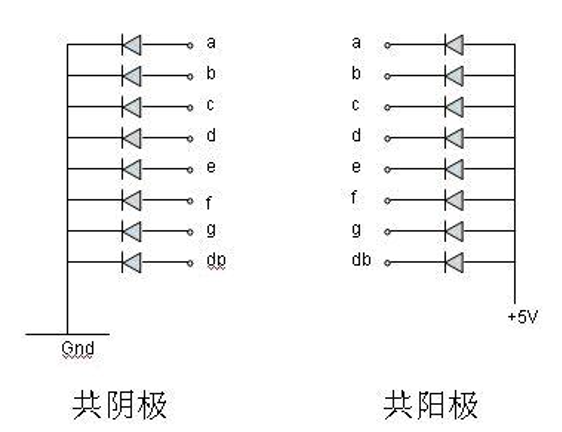{ width="33%" }

- 因此，可以类比的认为，共阴极数码管的相应边在高电平的时候会“点亮”；共阳极数码管的相应边在低电平的时候会“点亮”，如 Figure 2.1.2。
    - 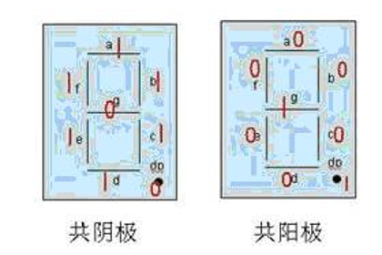{ width="33%"}

- 在上方的案例中，假设要让数码管显示数字 0：共阴数码管的字符编码：00111111，即 0x3F；共阳数码管的字符编码：11000000，即 0xC0。

#### 2.2 数码管的动态显示

- 在实现数码管的显示以后，需要进一步让它“动”起来。这需要利用人眼的视觉暂留和二极管发光的余辉效应。

- 只要将需要显示的数码管的选通控制打开，该位就显示出字形，没有选通的数码管就不会亮。通过分时轮流控制各个数码管的 COM 端，就使各个数码管轮流受控显示，这就是动态驱动。在轮流显示过程中，每位数码管的点亮时间为 1~2ms，由于人的视觉暂留现象及发光二极管的余辉效应，尽管实际上各位数码管并非同时点亮，但只要扫描的速度足够快，给人的印象就是一组稳定的显示数据，不会有闪烁感，动态显示的效果和静态显示是一样的，能够节省大量的 I/O 端口，而且功耗更低。

#### 2.3 延时的原理

- 在实现动态显示的过程中，需要延时，以便让人眼能够看到数码管的显示。延时的原理是通过循环计数的方式，让程序在一定时间内不断循环，从而实现延时的效果。

- 在单片机中，延时的实现方式有多种，其中最常见的是利用循环计数的方式。在单片机中，每个指令的执行时间是固定的，因此可以通过循环执行一定的指令次数来实现延时。例如，如果单片机的主频是 12MHz，那么每个指令的执行时间是 1/12MHz = 83.3ns。如果要实现 1ms 的延时，那么需要循环执行 1ms/83.3ns = 12000 次指令。在实际的程序中，可以通过编写一个延时函数，让程序在需要延时的地方调用该函数，从而实现延时的效果。例如：

    - ```
        DELAY_100MS:
                MOV     R5, #25
        DL3:    LCALL   DELAY_4MS
                DJNZ    R5, DL3  ; 25×4ms = 100ms
                RET
        END
        ```

### 三、实现思路

#### 3.1 设计 Keil 的工程程序

- 该程序的核心目标是实现双数码管从 00 到 99 的循环动态显示，模拟秒表功能。硬件方面选用了 AT89C52 单片机作为主控芯片，通过 P0 口输出段选信号驱动共阴极数码管，同时利用 P2.2 - P2.4 引脚连接 74HC138 译码器来控制位选信号。这种设计能有效减少 IO 口占用，开发板已集成必要的上拉电阻，确保了信号稳定性。

- 程序运行的关键在于动态显示机制。通过分时复用技术，单片机以约4ms的周期快速切换显示十位和个位。每次显示时，先通过查表指令从预定义的段码表 NUMTAB 中获取当前数字对应的编码（例如数字0对应3FH），然后将段码输出到 P0 口。接着通过74HC138译码器选通对应的数码管位——十位选通时设置 P2.4 = 0、P2.3 = 1、P2.2 = 1，个位选通则调整为 P2.2 = 0。每次切换位选前会执行 MOV P0, \#00H 进行消影处理，避免因信号切换延迟产生的残影，这是保证显示清晰度的重要细节。

-  计数器更新逻辑与延时程序紧密配合。主循环中每完成一次双位数码管的显示后，会调用 100ms 的延时子程序，随后对个位计数器 COUNT_L进行累加。当个位计数值达到 10 时，通过条件跳转指令 CJNE 触发进位操作，将十位计数器 COUNT_H 加 1，同时将个位归零。若十位也达到 10，则整体复位为 00 重新开始循环。这种设计模拟了真实秒表从 0.0 秒到 9.9 秒的计时过程。

- 延时精度是程序稳定运行的基础。针对 12MHz 晶振的特性， DELAY_2MS 子程序采用双重循环结构：内层循环 250 次消耗 500μs，外层循环 8 次累计达到 4ms。而 DELAY_100MS 通过重复调用 25 次 4ms 延时实现近似 100ms 的定时。在实际开发中，需要通过Keil调试工具的寄存器窗口监测sec值，微调循环次数以补偿指令执行时间的微小误差。

- 程序的优化体现在多个层面。段码表采用预存储的静态数据，避免了运行时动态计算的开销；位选信号的控制严格遵循 74HC138 的真值表，确保译码器输出精确对应目标数码管；消影处理与延时参数配合，可以实现显示稳定性和功耗的平衡。这些设计细节在 Proteus 仿真中可通过逻辑分析仪观察 P0 口波形验证。

#### 3.2 设计 Proteus 仿真电路
- 仿真电路的核心是 AT89C52 单片机、共阴极数码管、74HC138 译码器和外部晶振电路。在 Proteus 中，可以通过添加这些元件并连接正确的引脚，实现对程序的仿真验证。

- 仿真电路的设计需要注意的是，需要将 AT89C52 的晶振频率设置为 12MHz，以保证仿真的准确性。此外，需要将程序烧录到 AT89C52 中，然后通过 Proteus 的仿真功能进行验证。在仿真过程中，可以通过运行模拟观察 P0 口的波形，以验证程序的正确性。

### 四、代码与结果展示

#### 4.1 实验代码与注释

```
;======================================================
; 项目名称：双数码管动态显示00-99循环计数
; 硬件配置：
;   - 主控芯片：STC89C52RC
;   - 显示模块：2位共阴极数码管（74HC138译码器驱动）
;   - 段选接口：P0口（需外接470Ω限流电阻）
;   - 位选控制：P2.2-P2.4 -> 74HC138译码器输入端
;   - 时钟频率：12MHz
;======================================================

;---------------- 程序入口 ----------------------------
        ORG     0000H           ; 程序起始地址
        LJMP    MAIN            ; 跳转至主程序

;=============== 数码管编码表（共阴极） ================
; 编码顺序：0-9
; 位对应关系：DP g f e d c b a
NUMTAB:
        DB      3FH    ; 0 (00111111)
        DB      06H    ; 1 (00000110)
        DB      5BH    ; 2 (01011011)
        DB      4FH    ; 3 (01001111)
        DB      66H    ; 4 (01100110)
        DB      6DH    ; 5 (01101101)
        DB      7DH    ; 6 (01111101)
        DB      07H    ; 7 (00000111)
        DB      7FH    ; 8 (01111111)
        DB      6FH    ; 9 (01101111)

;=============== 全局变量定义 ========================
COUNT_L EQU     30H     ; 个位计数器（0-9）
COUNT_H EQU     31H     ; 十位计数器（0-9）

;================ 主程序流程 ========================
MAIN:
        MOV     COUNT_L, #0     ; 初始化个位计数器
        MOV     COUNT_H, #0     ; 初始化十位计数器

;--------------- 主显示循环 --------------------------
LOOP:
;>>>>> 十位显示 <<<<<<<<<<<<<<<<<<<<<<<<<<<<<<<<<<<<<
        MOV     DPTR, #NUMTAB   ; 加载段码表首地址
        MOV     A, COUNT_H      ; 获取当前十位值
        MOVC    A, @A+DPTR      ; 查表获取对应段码
        MOV     P0, A           ; 段码输出到P0口

        ; 74HC138位选设置（Y5通道：A2=0, A1=1, A0=1）
        CLR     P2.4            ; A2=0（P2.4对应译码器最高位）
        SETB    P2.3            ; A1=1
        SETB    P2.2            ; A0=1
        LCALL   DELAY_2MS       ; 保持显示2ms
        MOV     P0, #00H        ; 消隐处理（消除残影）
        SETB    P2.4            ; 关闭十位选通

;>>>>> 个位显示 <<<<<<<<<<<<<<<<<<<<<<<<<<<<<<<<<<<<<
        MOV     A, COUNT_L      ; 获取当前个位值
        MOVC    A, @A+DPTR      ; 查表获取对应段码
        MOV     P0, A           ; 段码输出到P0口

        ; 74HC138位选设置（Y4通道：A2=0, A1=1, A0=0）
        CLR     P2.4            ; A2=0
        SETB    P2.3            ; A1=1
        CLR     P2.2            ; A0=0
        LCALL   DELAY_2MS       ; 保持显示2ms
        MOV     P0, #00H        ; 消隐处理（消除残影）
        SETB    P2.4            ; 关闭个位选通

;>>>>> 计数器更新逻辑 <<<<<<<<<<<<<<<<<<<<<<<<<<<<<<<
        LCALL   DELAY_100MS     ; 系统刷新周期100ms
        INC     COUNT_L         ; 个位计数器递增
        MOV     A, COUNT_L      
        CJNE    A, #10, NO_CARRY; 检测个位是否满10
        
        MOV     COUNT_L, #0     ; 个位归零
        INC     COUNT_H         ; 十位计数器递增
        MOV     A, COUNT_H
        CJNE    A, #10, NO_CARRY; 检测十位是否满10
        MOV     COUNT_H, #0     ; 十位归零

NO_CARRY:
        SJMP    LOOP            ; 循环执行显示流程

;=============== 延时子程序 ==========================
; 延时子程序说明：
;  - 12MHz时钟下，1个机器周期=1μs
;  - 使用DJNZ指令（2周期指令）

;---------------- 2ms延时子程序 ----------------------
DELAY_2MS:
        MOV     R6, #8          ; 外层循环次数
DL1:    MOV     R7, #250        ; 内层循环次数
DL2:    DJNZ    R7, DL2         ; 250×2μs = 500μs
        DJNZ    R6, DL1         ; 8×500μs = 4000μs (4ms)
        RET                     ; 包含调用开销≈2ms

;---------------- 100ms延时子程序 --------------------
DELAY_100MS:
        MOV     R5, #50         ; 外层循环次数
DL3:    LCALL   DELAY_2MS       ; 2ms延时
        DJNZ    R5, DL3         ; 50×2ms = 100ms
        RET

        END                     ; 程序结束
```

#### 4.2 Keil 编译结果显示

- 对程序进行编译，Keil 提示没有产生错误，如 Figure 4.2.1 所示。

    - 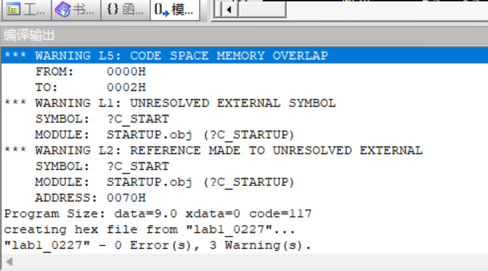{ width="50%" }

- 在编译后，我们可以得到如下的 .hex 文件，用于开发板的烧录。

    - ```
        :0300000002006695
        :0C006600787FE4F6D8FD758107020000E9
        :1000000002000D3F065B4F666D7D077F6F75300008
        :10001000753100900003E53193F580C2A4D2A3D2DC
        :10002000A2120055758000D2A4E53093F580C2A4D9
        :10003000D2A3C2A2120055758000D2A412005E05A0
        :1000400030E530B40A0D7530000531E531B40A03EE
        :1000500075310080BE7E087FFADFFEDEFA227D0564
        :06006000120055DDFB2239
        :00000001FF
        ```

#### 4.3 Proteus 仿真结果

- 在 Proteus 中，我们可以通过仿真验证程序的正确性。在仿真过程中，我们可以观察到数码管的显示效果。受篇幅所限，在此仅展示部分仿真结果图，如 Figure 4.3.1 和 Figure 4.3.2 所示。

	- - 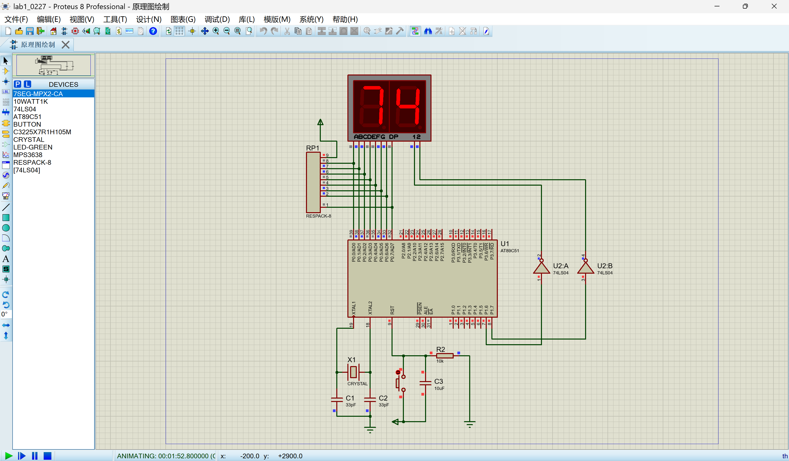{ width="50%" }
	- - 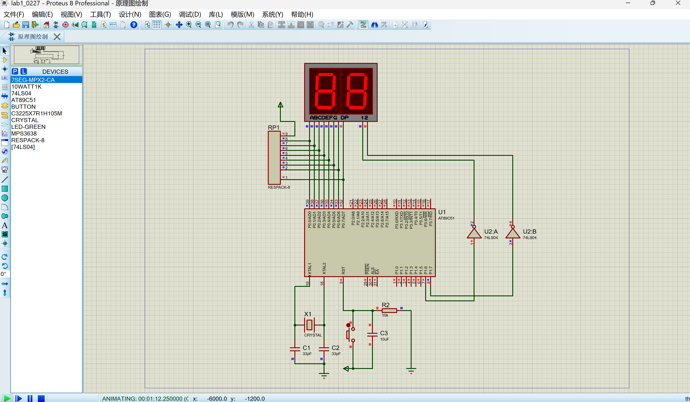{ width="50%" }

- 结合仿真结果和烧录后开发板的输出可以认为，实验设计是符合预期的。

!!! warning "注意"
	这个实验里我的数码管会有明显的跳动，并没有实现平滑的效果。后期的实验中对此进行了优化，但是这里的代码没有进行修改。如果对显示质量有更高要求可以参考别的代码或后续实验的代码~（可以通过验收所以我没有进行修改）

## Lab2 乘除法程序编写验证：超声波测距

### 一、实验任务

#### 1.1 乘除法的计算

- 超声测距电路中，距离由时间、速度来决定，有：$S = T * V$。其中，速度 $V$ 与环境温度有关。假定 $V = 34 + 3 * C / 200$ (C 为环境温度)，速度单位为 cm/ms。代入得：$S = 34 * T + 3 * C * T/200$。

- 因此，在实验中，通过温度传感器测到的温度值存放于 RAM 中 30H 处。根据计数器的计数值算出的时间值 T 存放于 RAM 中 31H, 32H处（高位存 31H，低位存 32H）。

	- 要求1：算出此时的距离值S，结果存放于 RAM 中 50H，51H，52H 处(高位存 50H，低位存 52H)。
	- 要求2：自行设计几组输入验证程序的正确性。

### 二、实验原理

#### 2.1 乘法原理

- “世界上并不存在乘法，只存在加法。”所有的整数乘法本质上是多次加法的运算，即将一个数分解为若干个数的和，然后再将这些数分别乘以另一个数，最后将这些乘积相加。因此，使用单片机实现乘法的过程可以简化为，将乘数作为循环的次数，每次循环将被乘数加到结果（初始化置为 0）上。

#### 2.2 除法原理
- 和乘法类似的，整数的除法本质上是减法的运算，如果考虑到减法本质上也是一种加法，那么除法本质上也是一种加法的计算。因此，在实现除法的过程中，可以通过循环减法的方式，将被除数减去除数，直到被除数小于除数为止，这样就得到了商和余数。在这里的计算过程中，由于计算结果的需要，所以我们可以不保留余数，只保留商即可。

- 受 PPT 启发，还有一种实现方式，是：通过连续的左移操作，把 24 位被除数逐步扩展并形成“第 9 位”，再利用移位后产生的进位信息和比较减法判断当前被除数是否足以减去除数 200，从而在商的对应位上设置 1 或是 0，更新被除数并重复操作，最终形成 24 位的商。

### 三、实现思路

#### 3.1 实现乘法子程序

- 该程序的核心目标是实现一些多项式的计算，在里面有一个核心的组件即乘法的运算。在程序中重复的代码是对资源的浪费。因此，我在这次实验中的核心思路就是将乘法的运算单独提取出来，作为一个子程序，这样可以减少代码的重复性，并且大幅减少程序占用空间。

- 乘法子程序的实现思路是，在子程序进行前将数据放置于一个“传参寄存器”中，充当类似“全局变量”的作用，可以让子程序可以用类似 C++ 引用的方式，使用传参计数器将有关数据传入子程序中。接着，使用 LCALL 函数调用子程序（这样可以方便 return），在子程序将乘数和被乘数分别转移至运算寄存器，然后按照第二章所讨论的计算原理实现计算，并返回原函数。由于在单片机系统寄存器的“全局变量”类似的性质，所以在执行完毕后可以使用 MOV 指令将计算过程的寄存器中的值转移至存储结果的目标寄存器，结束子程序。流程图如 Figure 3.1.1 所示。
    - 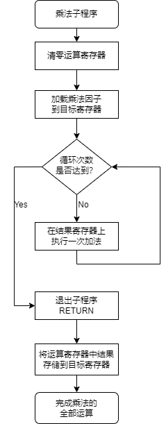

- 下面展示的内容为乘法子函数与调用示例（以 f1 的调用为例）。

```
; =================================================
; use f1 as an example
    ; set the loop counter(multiplier2) for this time
    MOV MULN, DAT34 
    ; use DAT34, so that we can change teh value easily and corrrectly if needed
    MOV MULL, TL
    MOV MULH, TH
    LCALL MUL_EXE   ; use LCALL rather than SJMP to enable using RET later

    ; store the data of formula1
    MOV RCF1, OMULC
    MOV RLF1, OMULL
    MOV RHF1, OMULH

; =================================================
MUL_EXE:
    CLR C
    ; set the loop counter as the multiplier2
    MOV LC, MULN

    ; reset the multiplication result
    MOV OMULC, #0
    MOV OMULH, #0
    MOV OMULL, #0

    SJMP MUL_LOOP

MUL_LOOP:
    ; add T low
    MOV A, OMULL
    ADD A, MULL
    MOV OMULL, A

    ; add T high and carry
    MOV A, OMULH
    ADDC A, MULH
    MOV OMULH, A

    ; add the carry to the MULcarry
    MOV A, OMULC
    ADDC A, #0
    MOV OMULC, A

    ; break from the loop when loops are enough (R2 = 0)
    DJNZ LC, MUL_LOOP
    SJMP MUL_DONE

MUL_DONE:
    RET
```

- 如此编写，可以使子函数可以变得更加通用，对于本题即意味着 3 次乘法操作都可以直接调用这段函数处理，而不用使用重复、累赘的代码。并且，这样也可以使函数可以具有较强的迁移性，可以有较高的复用率。

#### 3.2 实现除法子程序

- 除法子程序的调用思路与乘法子程序类似，核心运算逻辑参见第二章所述。为了提升运算效率，可以直接使用循环减法的方式对除法进行处理。每次对被除数进行一次减法，就在商上加 1， 直到被除数的剩余部分小于除数。

- 下面展示的内容为除法子函数与调用示例（以 f4 的调用为例）。

```
; ========================================
    ; do the division for f4 = (3 * C) * T / 200
    ; set the divisor as 200d
    MOV DIVL, RLF3
    MOV DIVH, RHF3
    MOV DIVN, DAT200
    LCALL DIV_EXE

    ; store the data of formula4
    MOV RCF4, OQC
    MOV RLF4, OQL
    MOV RHF4, OQH

; ========================================
DIV_EXE:
    CLR C
    ; reset the division result
    MOV OQC, #0
    MOV OQH, #0
    MOV OQL, #0

DIV_LOOP:
    ; compare [DIVC, DIVH, DIVL] with 200d (11001000b)
    MOV A, DIVC         ; check the C
    JNZ DIV_SUB

    MOV A, DIVH         ; check the H
    JNZ DIV_SUB         ; if H is not 0, then the remainder is larger than 200

    CLR C
    MOV A, DIVL         ; check the L
    SUBB A, DIVN        ; DIVN = 200
    JC DIV_DONE         ; if remainder is less than 200, break
    SJMP DIV_SUB

DIV_SUB:
    CLR C
    ; execute the sub.
    MOV A, DIVL
    SUBB A, DIVN
    MOV DIVL, A

    MOV A, DIVH
    SUBB A, #0
    MOV DIVH, A

    ; if sub., add 1 at the quotient
    CLR C
    MOV A, OQL
    ADD A, #1
    MOV OQL, A

    MOV A, OQH
    ADDC A, #0
    MOV OQH, A

    MOV A, OQC
    ADDC A, #0
    MOV OQC, A

    SJMP DIV_LOOP

DIV_DONE:
    RET
```

- 和乘法一样的，这样的编写方式可以使函数具有较高的复用性，可以在其他地方直接调用，而不用重复编写代码。尽管在这次实验中仅出现了一次调用，但是这样的处理也可以让程序架构更加清晰。

- 针对 PPT 所提及的设计思路，下面这段子程序代码的操作方式是：先将被除数搬到可进行多字节移位的区域，初始化商为零，然后进行 24 次循环，每次先左移商，再整体左移被除数，判断移位后是否足够大（通过比较进位或最高字节），若满足条件则对被除数减去 200 并置当前商位为 1，否则保持为 0，直至循环结束，从而得到最终的除法结果。此处理方法的设计流程图如 Figure 3.2.1 所示。
    - 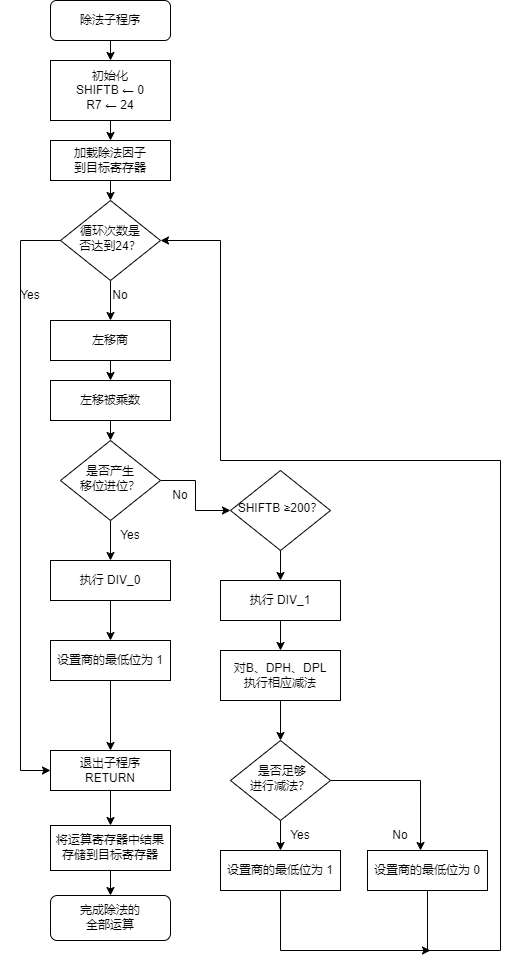{ width="80%" }

-  以此设计程序片段如下：

```
; =========================================================
; Shift-Subtract Division Subroutine (for division by 200)
; 24-bit dividend: DIVC (high), DIVH (mid), DIVL (low)
; 8-bit divisor: DIVN (fixed = 200)
; Result: 24-bit quotient -> OQC (high), OQH (mid), OQL (low)
; =========================================================
    SHIFTB  EQU 4FH
; =========================================================
DIV_EXE_SHIFT:
    ; Initialize: SHIFTB is an extra byte for handling the "9th bit" during shifting
    MOV   SHIFTB, #0
    MOV   R7, #24          ; Loop counter for 24 shifts(24 bits in total)

    ; Move DIVC:DIVH:DIVL to (B, DPH, DPL, SHIFTB) for shifting
    MOV   DPL, DIVL
    MOV   DPH, DIVH
    MOV   B,   DIVC

    ; Clear quotient (24-bit)
    CLR   OQL
    CLR   OQH
    CLR   OQC

DIV_LOOP:
    ; 1) Left shift quotient (OQC:OQH:OQL)
    CLR   C
    MOV   A, OQL
    RLC   A
    MOV   OQL, A
    MOV   A, OQH
    RLC   A
    MOV   OQH, A
    MOV   A, OQC
    RLC   A
    MOV   OQC, A

    ; 2) Left shift dividend (SHIFTB, B, DPH, DPL)
    CLR   C
    MOV   A, DPL
    RLC   A
    MOV   DPL, A
    MOV   A, DPH
    RLC   A
    MOV   DPH, A
    MOV   A, B
    RLC   A
    MOV   B, A
    MOV   A, SHIFTB
    RLC   A
    MOV   SHIFTB, A

    ; If carry is 1, the shifted number is 9-bit (≥ 256)
    ; In this case, directly subtract 200 by adding (256 - 200) = 56
    JNC   DIV_1
DIV_0:
    ; subtract 200
    CLR   C
    MOV   A, SHIFTB
    SUBB  A, DAT200
    MOV   SHIFTB, A

    ; Set the least significant bit of quotient to 1
    ORL   OQL, #1
    SJMP  END_LOOP

DIV_1:
    ; Check if SHIFTB (highest byte) is greater than or equal to the divisor (200)
    MOV   A, SHIFTB
    CLR   C
    SUBB  A, DIVN
    JC    NO_SUB          ; If borrow occurs, do not subtract

    ; If subtraction is possible, set the least significant bit of quotient to 1
    ORL   OQL, #1

    ; Store the result of SHIFTB - 200
    MOV   SHIFTB, A
    ; Also subtract carry from B, DPH, DPL (effectively subtracting 200)
    MOV   A, B
    SUBB  A, #0
    MOV   B, A
    MOV   A, DPH
    SUBB  A, #0
    MOV   DPH, A
    MOV   A, DPL
    SUBB  A, #0
    MOV   DPL, A

NO_SUB:
    ; If borrow occurred above, do not set quotient bit
    ; Otherwise, ORL 3BH, #01H has already set the bit

END_LOOP:
    DJNZ  R7, DIV_LOOP
    ; Now the quotient is stored in OQC:OQH:OQL
    ; If remainder is needed, it is stored in (SHIFTB, B, DPH, DPL)
    RET
```

- 第二种处理方式需要进行大于等于 24 次移位，并且每次位移等处理步骤比较繁琐，在本题数据背景下进行粗浅的比较，它相对于第一种方法在时间复杂度上有一些微弱优势；但是，它的代码占用空间更大，且会需要使用一个额外寄存器，空间复杂度更高。在本题的数据背景下，两种处理方法各有优势。但是倘若处理的数据中被除数远远大于除数的性质，第二种方式将会体现出非常大的优势。

#### 3.3 实现主程序

- 整个主程序的思路是先初始化温度和时间的原始值以及各个常量，然后依次计算公式中各部分的中间结果：先利用乘法子程序算出 $34T$ 的 24 位结果，再计算出 $3C$ 的结果并用乘法子程序将其与 T 相乘得到 $3C \times T$，接着调用除法子程序将 $3C \times T$ 除以 200 得到对应的商，最后将 $34T$ 和 $3C \times T \div 200$ 的结果相加，形成最终的距离 S，并将 S 存放在规定的内存地址中。主程序的简要流程图如 Figure 3.3.1 所示。
    - 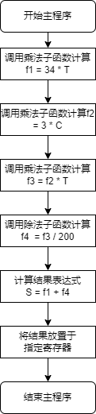


- 主程序的具体实现代码见第四章内容。

### 四、代码与结果展示

#### 4.1 实验代码与注释

```
; S = 34 * T + 3 * C * T / 200
; SUPPOSE f1 = 34 * T, f2 = 3 * C, f3 = f2 * T, f4  = f3 / 200, S = f1 + f4
; ========================================
    ORG 0000H
; ========================================
    ; decalre the EQUs(the use of REGS)
    ; ========================================
    ; use regs 30H, 31H, 32H to store the original values
    ORIC EQU 30H    ; Original C
    TH EQU 31H      ; T High
    TL EQU 32H      ; T Low
    ; ========================================
    ; use regs 34H, 35H, 36H to store the multiplication result
    ; Operating Mul. Carry
    OMULC EQU 33H
    ; Operating Mul. High part
    OMULH EQU 34H
    ; Operating Mul. Low part
    OMULL EQU 35H
    ; set R2 to be the loop counter
    LC EQU R2
    ; ========================================
    ; set the regs that store the multiplier
    ; Multiplier1 high part
    MULH EQU 36H
    ; Multiplier1 low part
    MULL EQU 37H
    ; Multiplier2 num.
    MULN EQU 38H
    ; ========================================
    ; set the regs that store the formula1 result
    ; result carry of f1
    RCF1 EQU 39H
    ; result high part of f1
    RHF1 EQU 3AH
    ; result low part of f1
    RLF1 EQU 3BH
    ; ========================================
    ; set the regs that store the formula2 result
    ; result carry of f2
    RCF2 EQU 3CH
    ; result high part of f2
    RHF2 EQU 3DH
    ; result low part of f2
    RLF2 EQU 3EH
    ; ========================================
    ; set the regs that store the formula3 result
    ; NOTES: to make the full use of REGS, it is possible to reuse f2's REGS to store f3's data
    ; result carry of f3
    RCF3 EQU 3FH
    ; result high part of f3
    RHF3 EQU 40H
    ; result low part of f3
    RLF3 EQU 41H
    ; ========================================
    ; set the regs that store the formula4 result
    ; result carry of f3
    RCF4 EQU 42H
    ; result high part of f3
    RHF4 EQU 43H
    ; result low part of f3
    RLF4 EQU 44H
    ; ========================================
    ; set the regs that store the FINAL result
    ; result carry of final
    RCF EQU 50H
    ; result high part of final
    RHF EQU 51H
    ; result low part of final
    RLF EQU 52H
    ; ========================================
    ; CONSTANTS
    ; set the regs that store the 200
    DAT200 EQU 45H
    ; set the regs that store the 34
    DAT34 EQU 46H
    ; set the regs that store the 3
    DAT3 EQU 47H
    ; ========================================
    ; use regs 48H, 49H, 4AH to store the quotient result
    ; Operating quotient Carry
    OQC EQU 48H
    ; Operating quotient High part
    OQH EQU 49H
    ; Operating quotient Low part
    OQL EQU 4AH
    ; ========================================
    ; set the regs that store the multiplier
    ; Dividend carry part
    DIVC EQU 4BH
    ; Dividend high part
    DIVH EQU 4CH
    ; Divendend low part
    DIVL EQU 4DH
    ; Divisor num.
    DIVN EQU 4EH

; ========================================
    SJMP MAIN
MAIN:  
    ; ========================================
    ; set the ORIGINAL VALUES
    ; you CAN change the value here to set the program
    MOV ORIC, #14H  ; C, 20d
    MOV TH, #01H    ; T high, T = 400ms
    MOV TL, #90H    ; T low

    ; ; another example:
    ; MOV ORIC, #15  ; C, 15d
    ; MOV TH, #01H    ; T high, T = 258ms
    ; MOV TL, #02H    ; T low
    ; ; the answer should be 8830d = 227EH

    ; below are the constant values that CANNOT be changed
    MOV DAT200, #200
    MOV DAT34, #34
    MOV DAT3, #3

    ; ========================================
    ; do the multiplication for 34 * T

    ; set the loop counter(multiplier2) for this time
    MOV MULN, DAT34
    MOV MULL, TL
    MOV MULH, TH
    LCALL MUL_EXE   ; use LCALL rather than SJMP to enable using RET later

    ; store the data of formula1
    MOV RCF1, OMULC
    MOV RLF1, OMULL
    MOV RHF1, OMULH

    ; ========================================
    ; do the multiplication for 3 * C
    MOV MULN, DAT3
    MOV MULL, ORIC
    MOV MULH, #0
    LCALL MUL_EXE

    ; store the data of formula2
    MOV RCF2, OMULC     ; it should always be 0
    MOV RLF2, OMULL     
    MOV RHF2, OMULH     ; it should always be 0

    ; ========================================
    ; do the multiplication for (3 * C) * T
    MOV MULN, RLF2
    MOV MULL, TL
    MOV MULH, TH
    LCALL MUL_EXE

    ; store the data of formula3
    MOV RCF3, OMULC
    MOV RLF3, OMULL
    MOV RHF3, OMULH

    ; ========================================
    ; do the division for (3 * C) * T / 200
    ; set the divisor as 200d

    MOV DIVL, RLF3
    MOV DIVH, RHF3
    MOV DIVN, DAT200
    LCALL DIV_EXE

    ; store the data of formula4
    MOV RCF4, OQC
    MOV RLF4, OQL
    MOV RHF4, OQH

    ; ========================================
    ; do the final adding
    CLR C
    MOV A, RLF1
    ADD A, RLF4
    MOV RLF, A

    MOV A, RHF1
    ADDC A, RHF4
    MOV RHF, A

    MOV A, RCF1
    ADDC A, RCF4
    MOV RCF, A

    SJMP WAIT

; ========================================
MUL_EXE:
    CLR C
    ; set the loop counter as the multiplier2
    MOV LC, MULN

    ; reset the multiplication result
    MOV OMULC, #0
    MOV OMULH, #0
    MOV OMULL, #0

    SJMP MUL_LOOP

MUL_LOOP:
    ; add T low
    MOV A, OMULL
    ADD A, MULL
    MOV OMULL, A

    ; add T high and carry
    MOV A, OMULH
    ADDC A, MULH
    MOV OMULH, A

    ; add the carry to the MULcarry
    MOV A, OMULC
    ADDC A, #0
    MOV OMULC, A

    ; break from the loop when loops are enough (R2 = 0)
    DJNZ LC, MUL_LOOP
    SJMP MUL_DONE

MUL_DONE:
    RET

; ========================================
DIV_EXE:
    CLR C
    ; reset the division result
    MOV OQC, #0
    MOV OQH, #0
    MOV OQL, #0

DIV_LOOP:
    ; compare [DIVC, DIVH, DIVL] with 200d (11001000b)
    MOV A, DIVC         ; check the C
    JNZ DIV_SUB

    MOV A, DIVH         ; check the H
    JNZ DIV_SUB         ; if H is not 0, then the remainder is larger than 200

    CLR C
    MOV A, DIVL         ; check the L
    SUBB A, DIVN        ; DIVN = 200
    JC DIV_DONE         ; if remainder is less than 200, break
    SJMP DIV_SUB

DIV_SUB:
    CLR C
    ; execute the sub.
    MOV A, DIVL
    SUBB A, DIVN
    MOV DIVL, A

    MOV A, DIVH
    SUBB A, #0
    MOV DIVH, A

    ; if sub., add 1 at the quotient
    CLR C
    MOV A, OQL
    ADD A, #1
    MOV OQL, A

    MOV A, OQH
    ADDC A, #0
    MOV OQH, A

    MOV A, OQC
    ADDC A, #0
    MOV OQC, A

    SJMP DIV_LOOP

DIV_DONE:
    RET

; ========================================
    ; end of the program
WAIT:
    SJMP $
    END
```

- 在代码中，为了程序更好的可读性，我在程序开头处使用 EQU 伪指令对寄存器进行了分配。寄存器的别名含义在注释中有说明。

#### 4.2 Keil 编译结果显示

- 对程序进行编译，Keil 提示没有产生错误。进行初始设定值测试，结果如 Figure 4.2.1 所示，符合实验预期（0x50 - 0x52 分别对应00H 35H 98H）。
	- 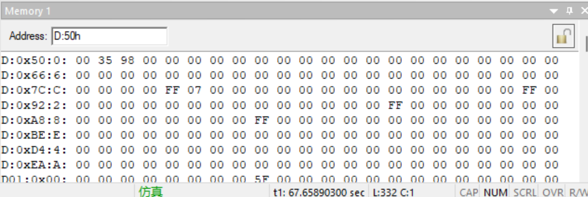

- 同时，可以检查中间寄存器的值。由于篇幅限制，仅展示在单步调试时截取的一张图片。
    - 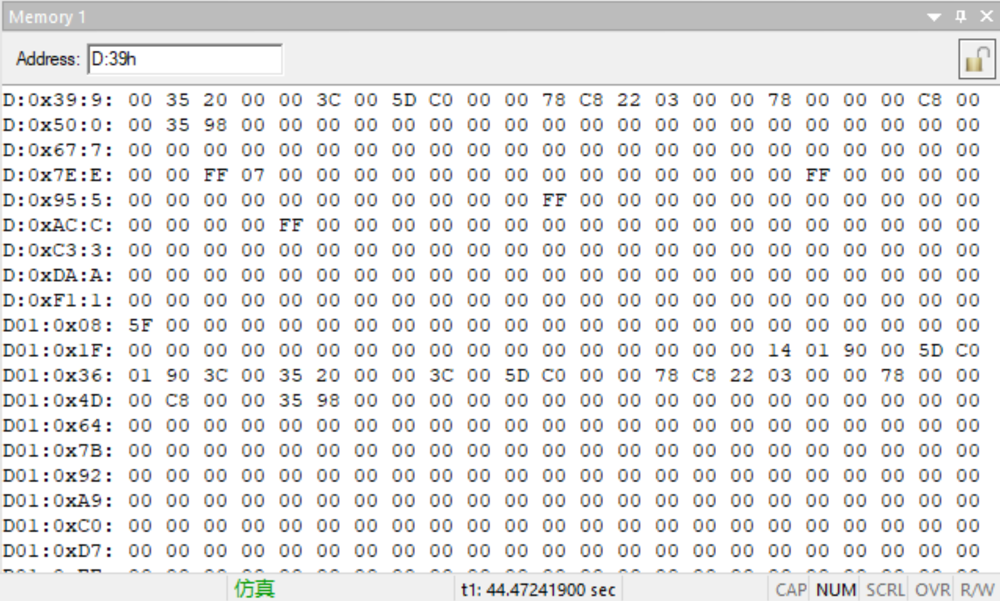
    - 在这里，0x39 - 0x3B 分别对应 00H 35H 20H，是 f1 的对应三位运算结果，符合实验预期。

- 更换一组实验数据，即代码中注释掉的“another example”，将其取消注释并替换原有数据输入，进行重新编译并 debug，结果如 Figure 4.2.3 所示，0x50 - 0x52 分别对应 00H 22H 7EH。又因为替换的代码内容即计算：$S = 34 * T + 3 * C * T / 200 = 34 * 258 + (3 * 15 * 258) / 200 = (8830)_10 = (00227E)_16$，故可认为输出结果符合实验预期。
	- 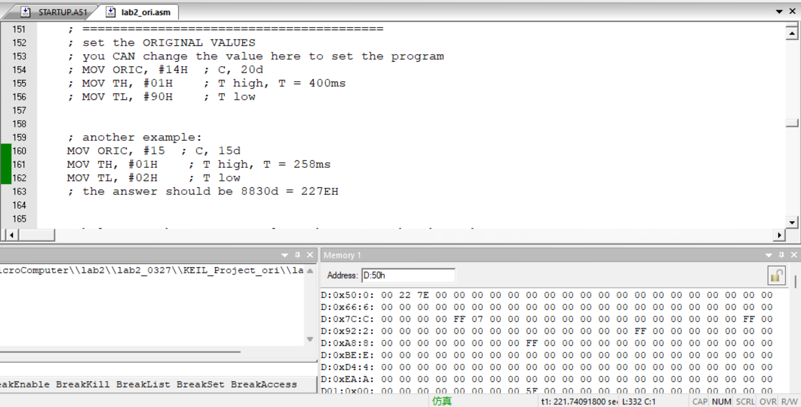

- 结合多次输入测试检验，可以得出实验设计符合预期的结论。

## Lab3 流水灯与蜂鸣器

### 一、实验任务

#### 1.1 用延时方式编写流水灯程序
#### 1.2 用中断方式编写蜂鸣器程序

### 二、实验原理

#### 2.1 流水灯与移位

- 流水灯是一种通过控制多个 LED 依次点亮和熄灭形成动态视觉效果的基础电子实验。其核心原理在于利用循环移位与延时函数结合实现 LED 的状态切换。具体而言，单片机通过 I/O 端口输出特定电平信号驱动 LED。实验中，8 位 LED 连接至单片机的 P2 端口，初始状态下仅最低位 LED 点亮（对应 P2 初始值为 0xFE）。通过循环左移指令（RL A）改变 P2 的输出状态，使得 LED 的亮灭位置依次向左移动。延时函数通过多层嵌套循环消耗机器周期，模拟 500ms 的时间间隔，从而实现 LED 流动速度的控制。延时精度取决于晶振频率与循环次数的设定，需通过调整循环参数确保实际延时接近目标值。

#### 2.2 蜂鸣器与中断
- 蜂鸣器的发声原理基于单片机引脚输出波形的频率与占空比。实验中采用定时器中断技术生成特定频率的方波信号，通过 ULN2003 驱动蜂鸣器。定时器 1 设置为模式 1（16 位定时模式），其初值决定中断周期，进而控制输出方波的频率。例如，中八度 C4（261.63Hz）对应的定时器初值为 0xFF5F，通过定时器中断服务程序（ISR）周期性翻转 P1.5 引脚电平，生成占空比 50% 的方波。此外，程序通过查表法读取预设旋律编码（包含音符与休止符），结合延时函数控制音符持续时间，实现旋律的连续播放。中断方式的核心优势在于避免主程序阻塞，确保音频信号与延时控制的高效协同。

### 三、实现思路

#### 3.1 流水灯与移位

- 流水灯程序的核心逻辑为循环移位与延时控制。程序初始化时，将 P2 端口置为 0xFE（二进制11111110），使最右侧 LED 点亮。主程序进入无限循环后，每次调用延时函数约 500ms，随后对 P2 当前值执行循环左移操作（RL A），更新 LED 显示状态。例如，初始状态 0xFE 左移后变为 0xFD（11111101），实现 LED 自右向左流动。延时函数通过三层嵌套循环消耗机器周期，结合晶振频率得出预期的总延时时间。程序的总流程图如 Figure 3.1.1 所示。
	- 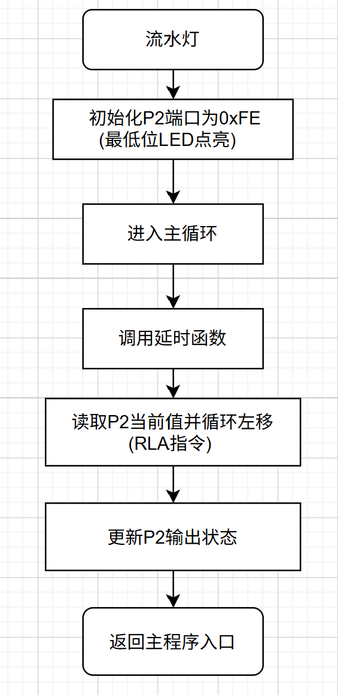{width = "33%"}

#### 3.2 蜂鸣器与中断

- 蜂鸣器程序采用中断驱动与查表法结合的设计方案。主程序初始化定时器 1 为模式 1，并允许定时器 1 中断（IE寄存器设置为 0x88）。旋律数据存储于 MELODY_TABLE，每个音符编码包含八度（高4位）与音阶（低4位）。程序通过 DPTR 指针遍历旋律表，调用 GET_FREQ 子程序解析当前音符，从 LOW_TABLE、MID_TABLE 或 HIGH_TABLE 中获取对应定时器初值（R4、R5）。定时器1中断服务程序中，翻转 P1.5 引脚并重载初值，生成指定频率的方波。音符播放期间启动定时器 1，延时 200ms 后关闭蜂鸣器并插入 50ms 间隔；若遇到休止符（编码 0x00），则关闭定时器并延时 250ms。该设计通过分离音频生成与时间控制逻辑，实现了多音符旋律的流畅播放与资源高效利用。程序的的总流程图如 Figure 3.2.1 所示。
	- 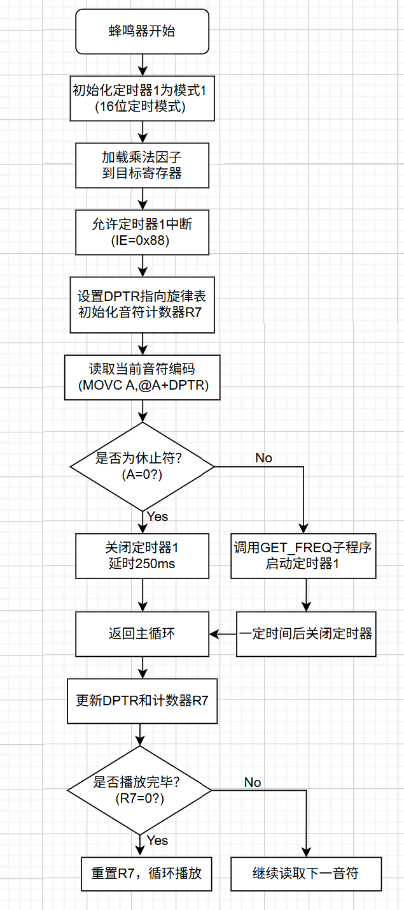{width = "50%"}

- 另外补充中断的执行流程如 Figure 3.2.2 所示。
	- 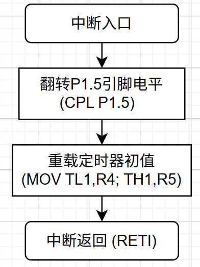{width = "33%"}

###  四、代码与结果展示

#### 4.1  实验代码与注释
- 以下为“用延时方式编写流水灯程序”相关代码。

```
            ORG 0000H
MAIN:       
; 初始化：将 P2 置为 0xFE，表示最低位 LED 亮（假设 LED 与 P2 连接，低电平有效）
            MOV P2, #0FEH    

LOOP:       CALL DELAY      ; 延时约 500ms
            MOV A, P2
            RL A           ; 逻辑左移 1 位（将最高位移出后，结果为 0，则后续复位）
            MOV P2, A      ; 更新 LED 显示
            SJMP LOOP      ; 无限循环

;---------------------------------------------------------
; 延时子程序
;---------------------------------------------------------
DELAY:      MOV R2, #20H   ; 外层循环计数器（32 次）
DELAY1:     MOV R1, #20H   ; 中层循环计数器（32 次）
DELAY2:     MOV R0, #0FFH  ; 内层循环计数器（255 次）
DELAY_INNER:
            DJNZ R0, DELAY_INNER
            DJNZ R1, DELAY2
            DJNZ R2, DELAY1
            RET

            END

```

- 以下为“用中断方式编写蜂鸣器程序”相关代码。
```
; 寄存器分配：
; R4/R5: 定时器重载值低/高字节
; R7: 旋律计数器
; R1: 当前音符编码
; 晶振频率：12MHz

ORG 0000H
LJMP MAIN

ORG 001BH                ; Timer1中断入口
LJMP TIMER1_ISR

TIMER1_ISR:              ; 中断服务程序：每次中断翻转蜂鸣器输出
    CPL P1.5            ; 翻转P1.5，产生方波
    ; 重新加载定时器1寄存器
    MOV TL1, R4         ; 装载低字节
    MOV TH1, R5         ; 装载高字节
    RETI

;-------------------------------
; 主程序入口
MAIN:
    MOV SP, #70H
    MOV TMOD, #11H      ; 设置定时器0为模式1，定时器1为模式1
    MOV IE, #88H        ; 使能定时器1中断
    CLR P1.5            ; 关闭蜂鸣器
    MOV DPTR, #MELODY_TABLE
    MOV R7, #MNOTES

PLAY_LOOP:
    ; 检查是否已经播放完整个旋律
    CJNE R7, #00, READ_NOTE
    MOV R7, #MNOTES     ; 重置音符计数器
    MOV DPTR, #MELODY_TABLE  ; 重置旋律指针
    
READ_NOTE:
    ; 读取当前音符
    CLR A
    MOVC A, @A+DPTR     ; 从表中读取音符编码
    INC DPTR            ; 指针移至下一音符
    MOV R1, A           ; 保存当前音符编码
    
    ; 无论R7是否为0，都处理当前音符
    DEC R7              ; 递减计数器
    
    ; 判断是休止符还是正常音符
    MOV A, R1
    JZ NOTE_SILENCE     ; 如果是0，表示休止符

    ; 处理音符
    ACALL GET_FREQ
    SETB TR1            ; 启动定时器1产生音频
    MOV R2, #200        ; 音符持续200ms
    ACALL DELAY_MS
    CLR TR1    ;         ; 停止定时器1
    CLR P1.5            ; 关闭蜂鸣器
    MOV R2, #50         ; 间隔50ms
    ACALL DELAY_MS
    SJMP PLAY_LOOP

NOTE_SILENCE:
    CLR TR1             ; 确保定时器停止
    CLR P1.5            ; 确保蜂鸣器关闭
    MOV R2, #250        ; 休止符持续250ms
    ACALL DELAY_MS
    SJMP PLAY_LOOP

;-------------------------------
; 子程序：GET_FREQ（根据音符获取定时器重载值）
GET_FREQ:
    MOV A, R1
    ANL A, #0F0H        ; 提取高4位（八度）
    SWAP A
    MOV R6, A           ; R6 = 八度号（1~3）

    MOV A, R1
    ANL A, #0FH         ; 提取低4位（音阶）
    DEC A               ; 调整为0~6的索引
    MOV B, #2
    MUL AB              ; 计算查表偏移（音阶×2）
    MOV R0, A

    ; 根据八度选择查表
    CJNE R6, #00, CHECK_MID
    MOV DPTR, #LOW_TABLE
    SJMP LOAD_FREQ
CHECK_MID:
    CJNE R6, #01, CHECK_HIGH
    MOV DPTR, #MID_TABLE
    SJMP LOAD_FREQ
CHECK_HIGH:
    MOV DPTR, #HIGH_TABLE

LOAD_FREQ:
    CLR A
    MOV A, R0
    MOVC A, @A+DPTR     ; 读取低字节
    MOV R4, A           ; TL1
    INC DPTR
    CLR A
    MOVC A, @A+DPTR     ; 读取高字节
    MOV R5, A           ; TH1
    RET

;-------------------------------
; 定时器函数
DELAY_MS:
    ; 保存当前TMOD的定时器1设置
    MOV A, TMOD
    ANL A, #0F0H        ; 保留高4位(定时器1的设置)
    ORL A, #01H         ; 设置低4位为模式1(定时器0)
    MOV TMOD, A

DELAY_LOOP:
    MOV TH0, #0FCh      ; 1ms初值（11.0592MHz）
    MOV TL0, #018H
    SETB TR0
    JNB TF0, $
    CLR TR0
    CLR TF0
    DJNZ R2, DELAY_LOOP
    RET

;-------------------------------
; 频率查表数据
LOW_TABLE:  ; 低八度 C3-B3
    DW 0FC5FH, 0FD48H  ; C3(130.81Hz), D3(146.83Hz)
    DW 0FDC4H, 0FE05H  ; E3(164.81Hz), F3(174.61Hz)
    DW 0FE73H, 0FED4H  ; G3(196.00Hz), A3(220.00Hz)
    DW 0FF26H          ; B3(246.94Hz)

MID_TABLE:  ; 中八度 C4-B4
    DW 0FF5FH, 0FFA4H  ; C4(261.63Hz), D4(293.66Hz)
    DW 0FFE2H, 0FFF3H  ; E4(329.63Hz), F4(349.23Hz)
    DW 0FFFAH, 0FFFCH  ; G4(392.00Hz), A4(440.00Hz)
    DW 0FFFEH          ; B4(493.88Hz)

HIGH_TABLE: ; 高八度 C5-B5
    DW 0FFFFH, 0FFFFH  ; C5(523.25Hz), D5(587.33Hz)
    DW 0FFFFH, 0FFFFH  ; E5(659.25Hz), F5(698.46Hz)
    DW 0FFFFH, 0FFFFH  ; G5(783.99Hz), A5(880.00Hz)
    DW 0FFFFH          ; B5(987.77Hz)

MELODY_TABLE:
    DB 11H, 31H, 25H, 15H, 16H, 11H, 25H, 00H
    DB 24H, 24H, 23H, 23H, 22H, 22H, 21H, 00H

MNOTES EQU 16  ; 音符总数（含休止符）
SJMP $

END
```

- 在代码中，为了程序更好的复用性，大部分功能已经实现封装，在修改播放音乐的时候只需要更改最后用于编曲的 MELODY_TABLE 和音符总数 MNOTES EQU N 的值即可。
- 由于蜂鸣器的音调是通过定时器中断来实现的，所以实验中最后播放的音乐频率比较难高精度体现。

!!! tip "说明"
	我非常怀疑是程序哪一部分出现了错误，或者我选用中断的方式不可以实现音调控制，因为我的程序最后实际上没办法体现音调的高低（代码只能通过实验验收频率、节奏变化部分的要求，但是没有达到我最初设计的预期）。<br>在验收的时候看见有别的同学实现了编曲的功能，所以应该是我写的哪里出错了。学期中有点忙没时间仔细钻研，现在又忘了不少，只能留给后人研究了（）

#### 4.2 Keil 编译结果显示

- 对程序进行编译，Keil 提示没有产生错误。由于第一个实验内容比较简单，所以不进行过多测试。对于蜂鸣器进行测试调试，可以发现在该断点处寄存器 R4 和 R5 已经被更新上了 LOW_TABLE 的 FC5F 值，可以证明程序设计与运行的正确性。

	- 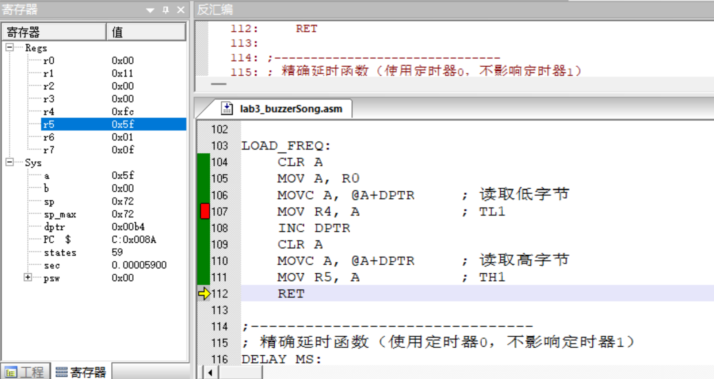

- 经过 Proteus 仿真得到的波形全局图和局部图如下所示。
	- 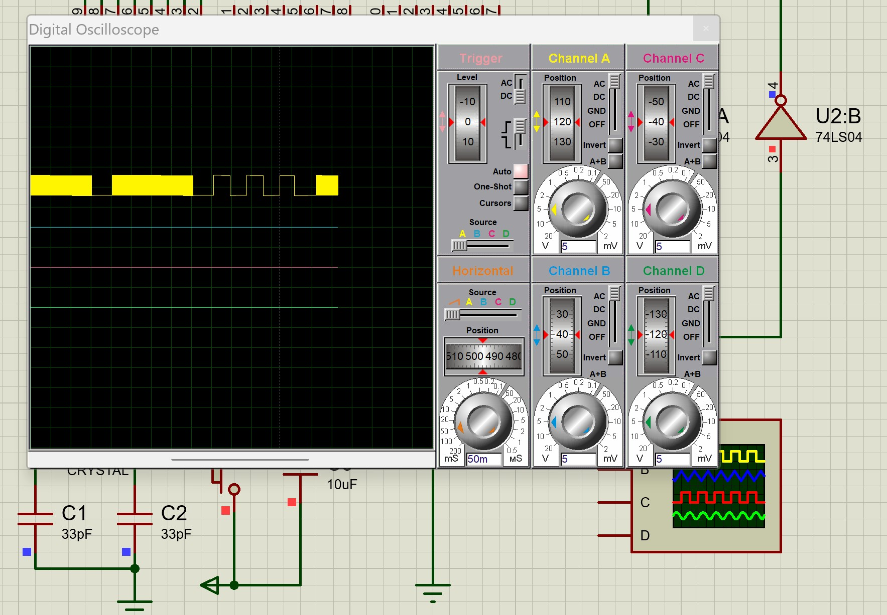
	- 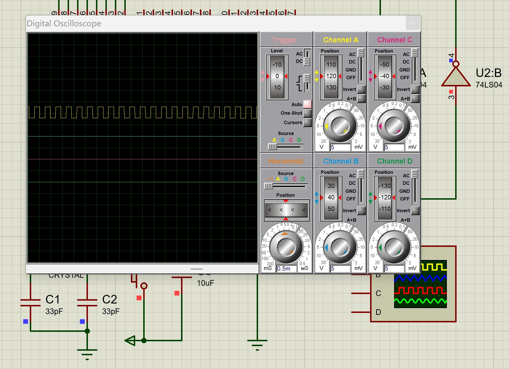

- 由于篇幅限制，不再展示其他调试界面。其余内容已于验收时说明。

## Lab4 16键矩阵键盘

### 一、实验任务

#### 1.1 实现 16 键矩阵键盘

- 编写 16 键矩阵键盘显示程序，实现按键与数码管显示的对应关系，其中数字 10 至 15 分别用字母 A、b、C、d、E、F 代替，并支持同一按键的连续操作（显示后再次按下可清屏）。实验需在开发板上直接实现，无需仿真工具，重点处理按键响应与显示逻辑。

### 二、实验原理

#### 2.1 实现 16 键矩阵键盘

- 通过行列扫描法检测 4×4 矩阵键盘按键，即交替输出高低电平至行列线，根据电平变化定位按键行列位置，结合编码转换为对应键值。按键消抖采用软件延时法消除机械开关抖动干扰，确保信号稳定后读取键值，最终将结果映射至数码管显示。


### 三、实现思路

#### 3.1 实现 16 键矩阵键盘
- 程序采用行列扫描法检测 4×4 矩阵键盘的按键状态，通过交替设置行线和列线的高低电平定位按键位置。
- 首先进行列扫描，若检测到低四位电平变化则确认有按键按下，随后调用消抖延时子程序消除机械抖动干扰；再次验证后识别具体列号，再切换为行扫描模式确定行号，结合行列偏移值计算键值（如每一行加上不同基值）。通过查表将键值转换为数码管段码，并判断是否为重复按键：若当前键值与上次相同则清屏显示空白，否则更新显示内容。代码通过循环检测按键释放并二次消抖，确保每次触发仅响应一次有效操作。
- 本程序的总流程图如下。

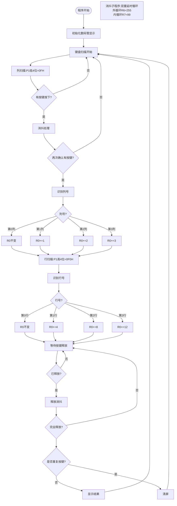
```mermaid
graph TD
    %% 主程序流程
    START([程序开始]) --> INIT[初始化数码管显示]
    INIT --> SCAN[键盘扫描开始]
    SCAN --> COL_SCAN[列扫描:P1低4位=0FH]
    COL_SCAN --> COL_CHK{有按键按下?}
    COL_CHK -- 否 --> SCAN
    COL_CHK -- 是 --> DEBOUNCE1[消抖处理]
    DEBOUNCE1 --> COL_CHK2{再次确认有按键?}
    COL_CHK2 -- 否 --> SCAN
    COL_CHK2 -- 是 --> ID_COL[识别列号]
    
    ID_COL --> COL_PROC{列号?}
    COL_PROC -- 第0列 --> COL0[R0不变]
    COL_PROC -- 第1列 --> COL1[R0+=1]
    COL_PROC -- 第2列 --> COL2[R0+=2]
    COL_PROC -- 第3列 --> COL3[R0+=3]
    
    COL0 --> ROW_SCAN
    COL1 --> ROW_SCAN
    COL2 --> ROW_SCAN
    COL3 --> ROW_SCAN
    
    ROW_SCAN[行扫描:P1高4位=0F0H] --> ID_ROW[识别行号]
    
    ID_ROW --> ROW_PROC{行号?}
    ROW_PROC -- 第0行 --> ROW0[R0不变]
    ROW_PROC -- 第1行 --> ROW1[R0+=4]
    ROW_PROC -- 第2行 --> ROW2[R0+=8]
    ROW_PROC -- 第3行 --> ROW3[R0+=12]
    
    ROW0 --> WAIT
    ROW1 --> WAIT
    ROW2 --> WAIT
    ROW3 --> WAIT
    
    WAIT[等待按键释放] --> WAIT_CHK{已释放?}
    WAIT_CHK -- 否 --> WAIT
    WAIT_CHK -- 是 --> DEBOUNCE2[释放消抖]
    DEBOUNCE2 --> WAIT_CHK2{完全释放?}
    WAIT_CHK2 -- 否 --> WAIT
    WAIT_CHK3 -- 否 --> DISP[显示结果]
    WAIT_CHK2 --> WAIT_CHK3{是否重复按键?}
    WAIT_CHK3 -- 是 --> DISP2[清屏]
    DISP --> SCAN
    DISP2 --> SCAN
    
    %% 消抖子程序简化表示
    DEBOUNCE_SUB[消抖子程序:双重延时循环<br>外循环R6=255<br>内循环R7=99]
```

### 四、代码与结果展示

#### 4.1 实验代码与注释

- 以下为“矩阵键盘”实现的相关代码。

```
; 键盘矩阵扫描及数码管显示程序
; 功能：通过4x4矩阵键盘输入数字并在数码管上显示
        ORG     0000H
        LJMP    START

        ORG     0030H
START:
        MOV     DPTR, #DISP_CODES   ; 初始化数码管显示代码表指针
        MOV     A, #16              ; 索引16对应空白显示（加16对应00H）
        MOVC    A, @A+DPTR
        MOV     P0, A               ; 初始状态数码管不显示
        MOV     R1, #255            ; 检测是否重复按

SCAN_KEYPAD:
        MOV     R0, #0              ; R0用于存储最终输出的数值
        
        ; 扫描列
        MOV     A, #0FH             ; 低4位设置为高电平(列扫描)
        MOV     P1, A
        MOV     A, P1
        CPL     A                   ; 取反
        ANL     A, #0FH             ; 保留低4位
        JZ      SCAN_KEYPAD         ; 无按键按下，继续扫描

        ; 按键消抖
        CALL    DEBOUNCE
        
        ; 再次检查按键状态
        MOV     A, P1
        CPL     A
        ANL     A, #0FH
        JZ      SCAN_KEYPAD         ; 如果是抖动，继续扫描
        
        ; 确认有按键，识别列号
        CALL    IDENTIFY_COLUMN
        
        ; 进行行扫描
        MOV     A, #0F0H            ; 高4位设置为高电平(行扫描)
        MOV     P1, A
        MOV     A, P1
        CPL     A                   ; 取反
        ANL     A, #0F0H            ; 保留高4位
        
        ; 识别行号并计算按键值
        CALL    IDENTIFY_ROW
        
        ; 等待按键释放
WAIT_RELEASE:
        MOV     A, #0FH             ; 检查是否有按键仍被按下
        MOV     P1, A
        MOV     A, P1
        CPL     A
        ANL     A, #0FH
        JNZ     WAIT_RELEASE        ; 有按键仍被按下，继续等待
        
        ; 释放消抖
        CALL    DEBOUNCE
        
        ; 确认完全释放
        MOV     A, #0FH
        MOV     P1, A
        MOV     A, P1
        CPL     A
        ANL     A, #0FH
        JNZ     WAIT_RELEASE        ; 如有按键，继续等待释放
        
        ; 显示结果
        MOV     A, R0               ; 获取计算好的键值
        MOVC    A, @A+DPTR          ; 查表获取显示代码
        PUSH    ACC

        CLR     C
        SUBB    A, R1
        JNZ     NOCLEAR  

        MOV     A, #16
        MOVC    A, @A+DPTR
        LJMP    CLEAR

NOCLEAR:
        POP     ACC
        MOV     R1, A
        MOV     P0, A               ; 输出到数码管
        LJMP    SCAN_KEYPAD         ; 循环扫描

CLEAR:      
        MOV     P0, A               ; 输出到数码管
        POP     ACC
        MOV     R1, #255            ; 恢复至无读入记录状态
        LJMP    SCAN_KEYPAD
SHOW:

; 子程序: 按键消抖

; 原先设置了100，效果不是很好，直接加到255
DEBOUNCE:
        MOV     R6, #255
DLY_LOOP:
        MOV     R7, #99
        DJNZ    R7, $               ; 延时循环
        DJNZ    R6, DLY_LOOP
        RET

; 子程序: 识别列号
IDENTIFY_COLUMN:
        MOV     R4, A               ; 保存列状态
        
        ; 检查第3列，若在第3列，那么就会是0000 0001，
        ; 0000 0001 XOR 0000 0001 = 0000 0000，即被检测到
        MOV     A, R4
        XRL     A, #01H             ; 检查是否是第3列(0001)
        JZ      SET_COL3
        
        ; 检查第2列
        MOV     A, R4
        XRL     A, #02H             ; 检查是否是第2列(0010)
        JZ      SET_COL2
        
        ; 检查第1列
        MOV     A, R4
        XRL     A, #04H             ; 检查是否是第1列(0100)
        JZ      SET_COL1
        
        ; 检查第0列
        MOV     A, R4
        XRL     A, #08H             ; 检查是否是第0列(1000)
        JZ      SET_COL0
        
        ; 在多键同时按下时直接返回扫描，而非继续判断
        ; 将原来的 LJMP IDENTIFY_COLUMN 改为:
        LJMP    SCAN_KEYPAD

; 分别 +3/2/1/0   
SET_COL3:
        INC     R0                  ; +3
SET_COL2:
        INC     R0                  ; +2
SET_COL1:
        INC     R0                  ; +1
SET_COL0:
        RET

; 子程序: 识别行号并计算按键值
IDENTIFY_ROW:
        MOV     R5, A               ; 保存行状态
        
        ; 检查第3行
        MOV     A, R5
        XRL     A, #10H             ; 检查是否是第3行(0001 0000)
        JZ      SET_ROW3
        
        ; 检查第2行
        MOV     A, R5
        XRL     A, #20H             ; 检查是否是第2行(0010 0000)
        JZ      SET_ROW2
        
        ; 检查第1行
        MOV     A, R5
        XRL     A, #40H             ; 检查是否是第1行(0100 0000)
        JZ      SET_ROW1
        
        ; 检查第0行
        MOV     A, R5
        XRL     A, #80H             ; 检查是否是第0行(1000 0000)
        JZ      SET_ROW0
        
        ; 未识别到有效行，重新检测
        LJMP    IDENTIFY_COLUMN
        
SET_ROW3:
        MOV     A, R0
        ADD     A, #12              ; 第3行: 基值+12
        MOV     R0, A
        RET
        
SET_ROW2:
        MOV     A, R0
        ADD     A, #8               ; 第2行: 基值+8
        MOV     R0, A
        RET
        
SET_ROW1:
        MOV     A, R0
        ADD     A, #4               ; 第1行: 基值+4
        MOV     R0, A
        
SET_ROW0:                           ; 第0行: 保持基值
        RET

; 数码管显示代码表
        ORG     0600H
DISP_CODES:
        DB      3FH, 06H, 5BH, 4FH  ; 0-3
        DB      66H, 6DH, 7DH, 07H  ; 4-7
        DB      7FH, 6FH, 77H, 7CH  ; 8-B
        DB      39H, 5EH, 79H, 71H  ; C-F
        DB      00H                 ; 空白显示

        END
```

#### 4.2 Keil 编译结果显示

- 对程序进行编译，Keil 提示没有产生错误。
	- 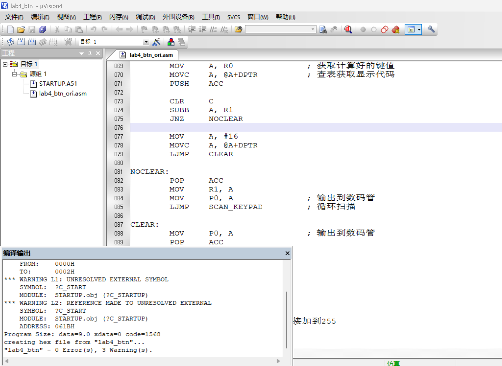 {width = "100%""}

#### 4.3 开发板调试图像
- 生成程序，并在开发板上操作。
	- 开机界面
		- 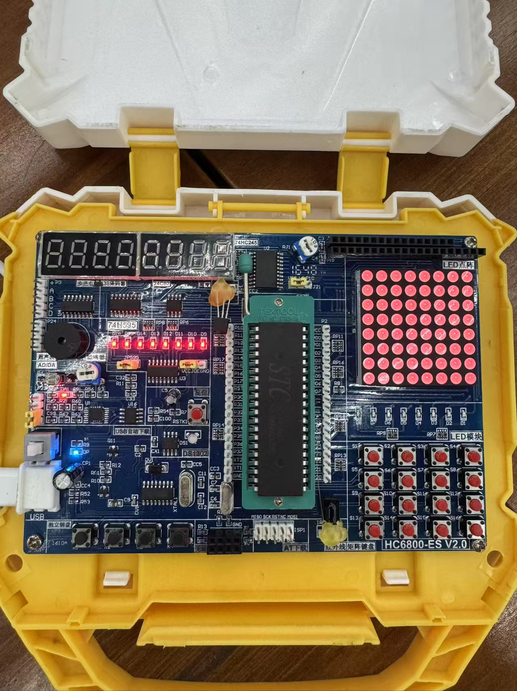 {width = "33%""}
    - 按 1 一次显示
    	- 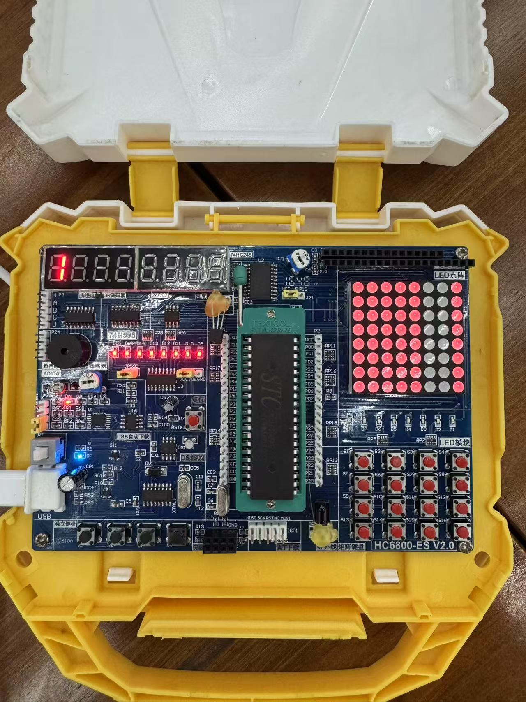 {width = "33%""}
	- 按 1 两次清屏
    	- 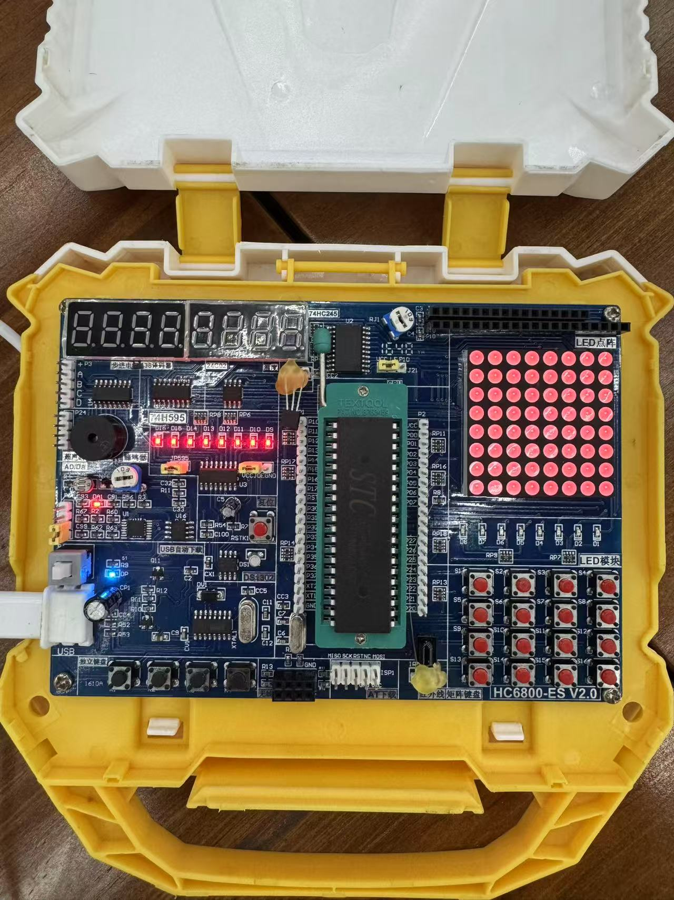 {width = "33%""}
	- 按 1 三次恢复
    	- 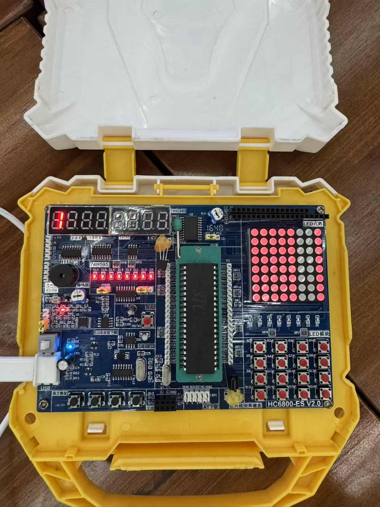 {width = "33%""}
    
    - 其余按键也可以正常显示。下面四图依次展示按 4、6、C、E 按键的显示值。
    	- 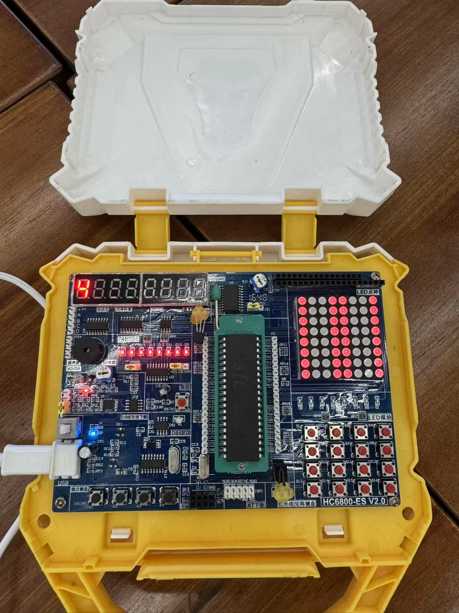 {width = "33%""}
    	- 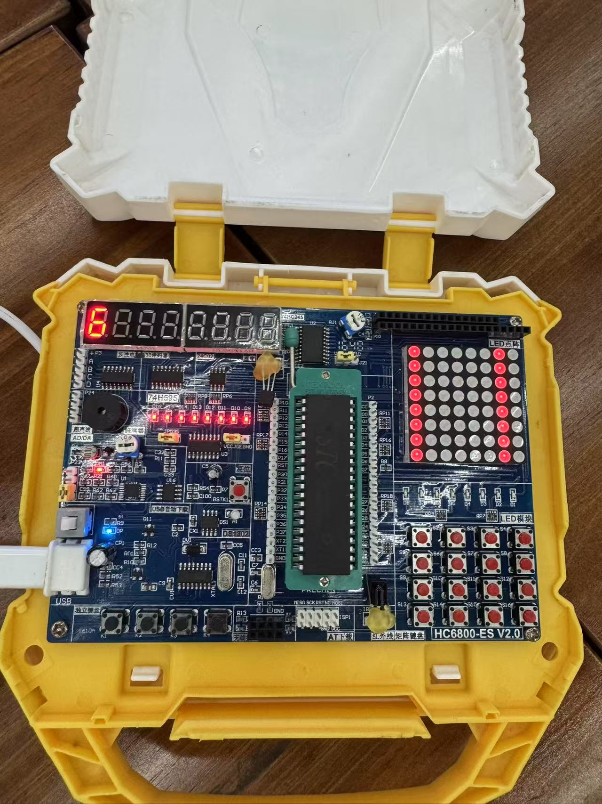 {width = "33%""}
    	- 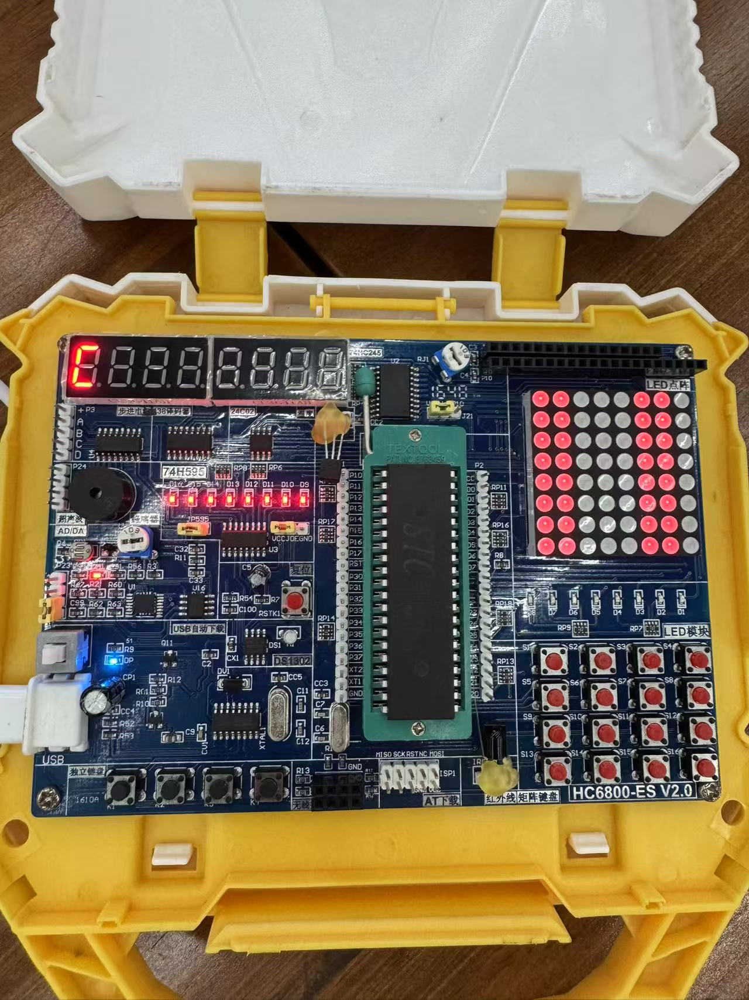 {width = "33%""}
	  	- 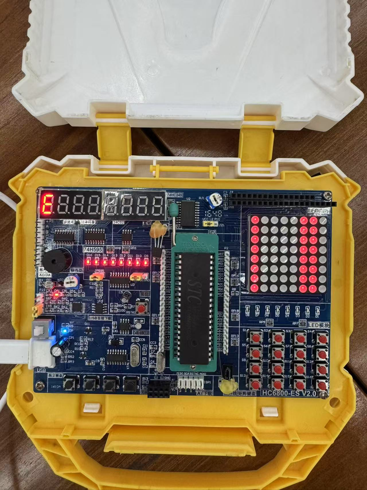 {width = "33%""}
	
- 由于篇幅限制，不再展示其他图像。其余内容已于验收时说明。

## Lab5 基于 DS18B20 的测温实验

### 一、实验任务

#### 1.1 基于 DS18B20 的测温实验

- 本次实验要求先深入研读 DS18B20 数据手册，熟悉其单线总线的工作原理与时序结构；然后在开发板上通过单线初始化、Skip ROM、Convert T 和 Read Scratchpad 等命令，实现温度数据的采集和处理，将测得的温度（整数部分）以“123 ℃”的形式动态扫描显示在四位共阴极数码管上。

###  二、实验原理

#### 2.1 总线初始化与存在响应

- 主控单片机首先向 DS18B20 拉低单线总线至少 480 μs，发出复位脉冲；随后释放总线，由上拉电阻将线拉高，DS18B20 在检测到这个上升沿后等待约 15–60 μs，再通过拉低总线 60–240 μs 发出“存在脉冲”，告知主机传感器在线并已准备好通信。
	- 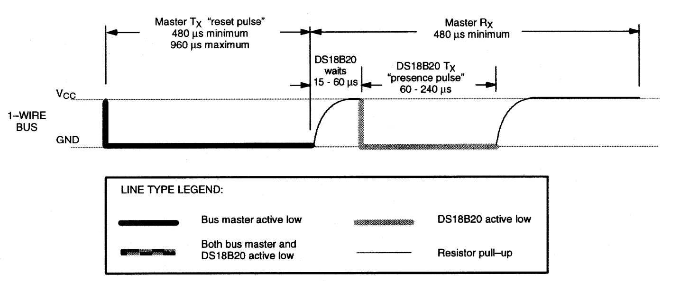 {width = "100%""}

#### 2.2 写入与读取时隙时序

- 在一个写时隙中，主机也拉低总线开始计时：若需写入“1”，则在拉低后约 1–15 μs 内释放总线；若写入“0”，则持续拉低 60–120 μs；每个写时隙总长需 ≥ 60 μs，且时隙间要留 ≥ 1 μs 恢复时间。读时隙同样由主机先拉低 ≥ 1 μs 再释放，总长 ≥ 60 μs；DS18B20 在拉低后约 15 μs 内把当前位电平（拉高为 “1”，拉低为 “0”）驱动到总线上，主机需在此窗口内采样。

- 以下展示的依次是向测温模块写和读的时序图。
	- 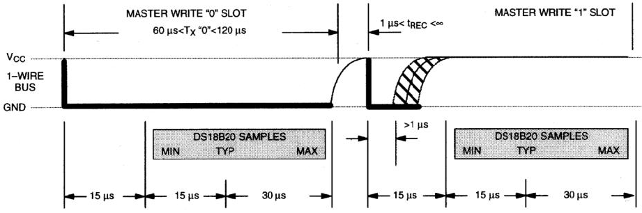 {width = "100%""}
	- 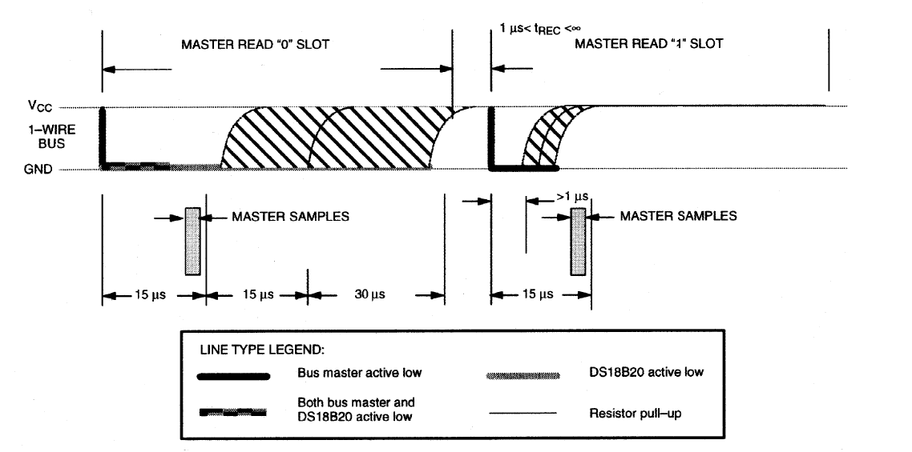 {width = "100%""}

### 2.3  温度转换与数据框架

- 主机通过 Skip ROM 命令跳过寻址后，发送 Convert T（0x44）指令启动温度转换，该过程约需 100 ms；转换完成后，再初始化并用 Skip ROM + Read Scratchpad（0xBE）命令组合，逐位读出存储温度的低、高两个字节。DS18B20 将温度值按 1/16 ℃ 分辨率存储于这两个字节中，高位含符号，低位四位为小数部分。

### 2.4 温度数据解析与数码管显示

- 读回两字节后，先剥离高字节的符号和整值位，再提取低字节的高四位合成整数温度；将低字节的低四位乘以 0.0625（即 6.25%）得到小数部分。处理后得到的整数和小数值分别映射到数码管的各位，通过动态扫描方式在四位共阴极管上显示“XXX℃”，实现实时温度读数的可视化。

### 三、实现思路

- 程序从复位向量进入主入口，在这一模块里，首先通过 MOV 41H, #0 将温度单位标志清零，默认选用摄氏度；接着执行 LJMP MainLoop 进入无限循环，保证系统在通电后能持续运行并准备好后续各项任务。

- 在主循环开头，ReadTemperature 模块负责与 DS18B20 完成单线总线通信：先调用初始化和延时函数产生复位脉冲，然后通过 Skip ROM 和 Convert T 命令启动温度转换；待转换完成后，再次初始化并依次发送 Read Scratchpad 命令，通过字节写入与读出时隙，读取到传感器返回的两字节原始温度数据，存入 32H、33H。

- 键盘扫描模块 ScanKeypad 紧随其后，通过先列后行的矩阵扫描法检测按键状态，包括消抖与按键值识别，若探测到第 0 号键按下，则切换寄存器 41H 中的标志位，实现摄氏度与华氏度的交替显示，同时确保按键释放后不重复触发。
- ProcessTemperature 模块将传感器的 12 位原始温度值拆分：首先分别提取高字节和低字节的有效位合并成整数部分，再根据低字节低四位乘以 6.25% 得到小数部分；接着对整数和小数各自做除法将其分解为百、十、个位和十分、百分位数字，并在需要时按 °F = °C×9/5 + 32 的公式完成华氏度转换，最终把所有位值存放到不同的寄存器单元。

- 最后，DisplayDigits 模块依靠动态扫描驱动四位共阴极数码管：依次选择数码管位选引脚，将相应位的数字代码从查表区读取并输出到 P0 端口，中间加上小数点显示，并根据单位标志在最后一位显示 “C” 或 “F”，形成“XXX.XX℃/℉”的实时温度读数。

!!! tip "说明"
	此处出现的华氏度转化是我额外扩展的功能。

- 实现流程图如下。
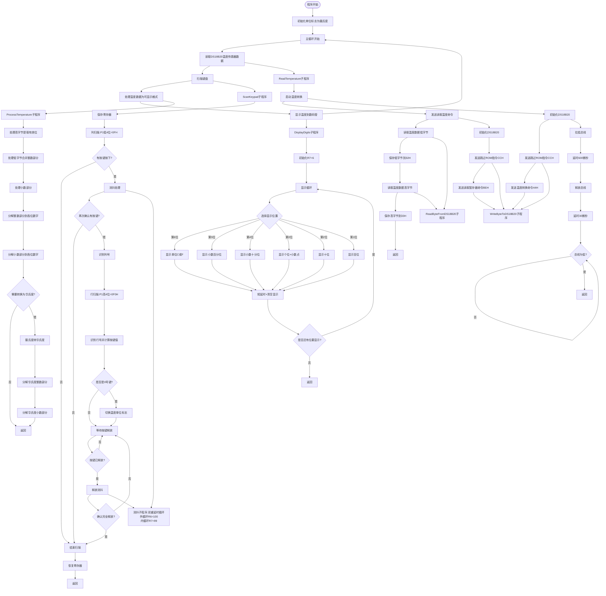
```mermaid
graph TD
    %% 主程序流程
    START([程序开始]) --> MAIN[初始化单位标志为摄氏度]
    MAIN --> MAIN_LOOP[主循环开始]
    MAIN_LOOP --> READ_TEMP[读取DS18B20温度传感器数据]
    READ_TEMP --> SCAN_KEY[扫描键盘]
    SCAN_KEY --> PROCESS_TEMP[处理温度数据为可显示格式]
    PROCESS_TEMP --> DISPLAY[显示温度到数码管]
    DISPLAY --> MAIN_LOOP

    %% 读取温度子流程
    READ_TEMP --> READ_SUB[ReadTemperature子程序]
    READ_SUB --> START_CONV[启动温度转换]
    START_CONV --> READ_CMD[发送读取温度命令]
    READ_CMD --> READ_LOW_BYTE[读取温度数据低字节]
    READ_LOW_BYTE --> SAVE_LOW[保存低字节到32H]
    SAVE_LOW --> READ_HIGH_BYTE[读取温度数据高字节]
    READ_HIGH_BYTE --> SAVE_HIGH[保存高字节到33H]
    SAVE_HIGH --> READ_RET[返回]

    %% 温度数据处理子流程
    PROCESS_TEMP --> PROCESS_SUB[ProcessTemperature子程序]
    PROCESS_SUB --> PROC_HIGH[处理高字节提取有效位]
    PROC_HIGH --> PROC_LOW[处理低字节合并整数部分]
    PROC_LOW --> PROC_DECIMAL[处理小数部分]
    PROC_DECIMAL --> SPLIT_INT[分解整数部分到各位数字]
    SPLIT_INT --> SPLIT_DEC[分解小数部分到各位数字]
    SPLIT_DEC --> CHECK_UNIT{需要转换为华氏度?}
    CHECK_UNIT -- 否 --> PROC_RET[返回]
    CHECK_UNIT -- 是 --> CONVERT_F[摄氏度转华氏度]
    CONVERT_F --> SPLIT_F_INT[分解华氏度整数部分]
    SPLIT_F_INT --> SPLIT_F_DEC[分解华氏度小数部分]
    SPLIT_F_DEC --> PROC_RET

    %% 显示温度子流程
    DISPLAY --> DISPLAY_SUB[DisplayDigits子程序]
    DISPLAY_SUB --> INIT_LOOP[初始化R7=6]
    INIT_LOOP --> DISP_LOOP[显示循环]
    DISP_LOOP --> SELECT_POS{选择显示位置}
    SELECT_POS -- 第6位 --> POS6[显示单位C或F]
    SELECT_POS -- 第5位 --> POS5[显示小数百分位]
    SELECT_POS -- 第4位 --> POS4[显示小数十分位]
    SELECT_POS -- 第3位 --> POS3[显示个位+小数点]
    SELECT_POS -- 第2位 --> POS2[显示十位]
    SELECT_POS -- 第1位 --> POS1[显示百位]
    POS6 --> DISP_DONE
    POS5 --> DISP_DONE
    POS4 --> DISP_DONE
    POS3 --> DISP_DONE
    POS2 --> DISP_DONE
    POS1 --> DISP_DONE
    DISP_DONE[短延时+清空显示] --> CHECK_NEXT{是否还有位要显示?}
    CHECK_NEXT -- 是 --> DISP_LOOP
    CHECK_NEXT -- 否 --> DISPLAY_RET[返回]

    %% 键盘扫描子流程
    SCAN_KEY --> SCAN_SUB[ScanKeypad子程序]
    SCAN_SUB --> SAVE_REG[保存寄存器]
    SAVE_REG --> COL_SCAN[列扫描:P1低4位=0FH]
    COL_SCAN --> COL_CHK{有按键按下?}
    COL_CHK -- 否 --> SCAN_END[结束扫描]
    COL_CHK -- 是 --> DEBOUNCE1[消抖处理]
    DEBOUNCE1 --> COL_CHK2{再次确认有按键?}
    COL_CHK2 -- 否 --> SCAN_END
    COL_CHK2 -- 是 --> ID_COL[识别列号]
    ID_COL --> ROW_SCAN[行扫描:P1高4位=0F0H]
    ROW_SCAN --> ID_ROW[识别行号并计算按键值]
    ID_ROW --> CHECK_KEY{是否是0号键?}
    CHECK_KEY -- 否 --> WAIT_RELEASE[等待按键释放]
    CHECK_KEY -- 是 --> TOGGLE_UNIT[切换温度单位标志]
    TOGGLE_UNIT --> WAIT_RELEASE
    WAIT_RELEASE --> RELEASE_CHK{按键已释放?}
    RELEASE_CHK -- 否 --> WAIT_RELEASE
    RELEASE_CHK -- 是 --> DEBOUNCE2[释放消抖]
    DEBOUNCE2 --> CONFIRM_REL{确认完全释放?}
    CONFIRM_REL -- 否 --> WAIT_RELEASE
    CONFIRM_REL -- 是 --> SCAN_END
    SCAN_END --> RESTORE_REG[恢复寄存器]
    RESTORE_REG --> SCAN_RET[返回]

    %% DS18B20通信相关子流程 
    START_CONV --> INIT_DS18B20[初始化DS18B20]
    INIT_DS18B20 --> SEND_SKIP[发送跳过ROM指令CCH]
    SEND_SKIP --> SEND_CONV[发送温度转换命令44H]
    
    READ_CMD --> INIT_DS18B20_2[初始化DS18B20]
    INIT_DS18B20_2 --> SEND_SKIP2[发送跳过ROM指令CCH]
    SEND_SKIP2 --> SEND_READ[发送读取暂存器命令BEH]
    
    INIT_DS18B20 --> BUS_LOW[拉低总线]
    BUS_LOW --> DELAY_600[延时600微秒]
    DELAY_600 --> BUS_HIGH[释放总线]
    BUS_HIGH --> DELAY_30[延时30微秒]
    DELAY_30 --> WAIT_LOW{总线为低?}
    WAIT_LOW -- 否 --> WAIT_LOW
    WAIT_LOW -- 是 --> INIT_RET[返回]
    
    %% 读写字节子流程简化表示
    READ_LOW_BYTE --> READ_BYTE_SUB[ReadByteFromDS18B20子程序]
    READ_HIGH_BYTE --> READ_BYTE_SUB
    
    SEND_SKIP --> WRITE_BYTE_SUB[WriteByteToDS18B20子程序]
    SEND_CONV --> WRITE_BYTE_SUB
    SEND_SKIP2 --> WRITE_BYTE_SUB
    SEND_READ --> WRITE_BYTE_SUB

    %% 消抖子程序简化表示
    DEBOUNCE1 --> DEBOUNCE_SUB[消抖子程序:双重延时循环<br>外循环R6=100<br>内循环R7=99]
    DEBOUNCE2 --> DEBOUNCE_SUB
```


### 四、代码与结果展示

#### 4.1 实验代码与注释
- 以下为测温实现和数码管显示的实现代码。

```
ORG 0000H				; 程序入口点
	LJMP Main
; 变量与内存定义
; 30H - 发送缓冲区
; 31H - 接收缓冲区
; 32H - 温度数据低字节
; 33H - 温度数据高字节
; 34H - 温度整数部分
; 35H - 温度小数部分
; 36H-40H - 分解后的各位数字
; 41H - 温度单位标志(0=摄氏度，1=华氏度)
; 42H - 上次按键值记录
; 46H-50H - 分解后的各位数字（华氏度）

; 主循环，持续检测温度并显示
Main:
	; 初始化单位显示标志为摄氏度
	MOV 41H, #0

MainLoop:
	LCALL ReadTemperature		; 读取DS18B20温度传感器数据
	LCALL ScanKeypad			; 扫描键盘
	LCALL ProcessTemperature	; 处理温度数据为可显示格式
	LCALL DisplayDigits			; 调用数码管显示函数

	LJMP MainLoop				; 无限循环回到开始

;-------------------------------------------------------------------------------
; 函数名: ReadTemperature
; 功能: 读取DS18B20温度数据，低位存储在32H，高位存储在33H
;-------------------------------------------------------------------------------
ReadTemperature:
	LCALL StartTempConversion	; 启动温度转换
	LCALL ReadTempCommand		; 发送读取温度命令

	LCALL ReadByteFromDS18B20	; 读取温度数据低字节
	MOV A, 31H					; 将读取的字节存入A
	MOV 32H, A					; 保存到32H位置

	LCALL ReadByteFromDS18B20	; 读取温度数据高字节
	MOV A, 31H					; 将读取的字节存入A
	MOV 33H, A					; 保存到33H位置
	RET

;-------------------------------------------------------------------------------
; 函数名: StartTempConversion
; 功能: 启动DS18B20温度转换
;-------------------------------------------------------------------------------
StartTempConversion:
	LCALL InitializeDS18B20		; 初始化DS18B20
	LCALL Delay_1ms				; 稳定延时

	; 发送跳过ROM指令(CCH)
	MOV A, #0CCH				; 将跳过ROM命令代码加载到A（#CCH不可以，一定要#0CCH）
	MOV 30H, A					; 存储到发送缓冲区
	LCALL WriteByteToDS18B20	; 发送命令

	; 发送温度转换命令(44H)
	MOV A, #44H					; 将温度转换命令代码加载到A
	MOV 30H, A					; 存储到发送缓冲区
	LCALL WriteByteToDS18B20	; 发送命令
	RET

;-------------------------------------------------------------------------------
; 函数名: InitializeDS18B20
; 功能: 初始化DS18B20温度传感器
;-------------------------------------------------------------------------------
InitializeDS18B20:
	CLR P3.7					; 拉低总线启动通讯
	LCALL Delay_600us			; 延时700微秒(480-960us)
	SETB P3.7					; 释放总线
	LCALL Delay_30us			; 延时等待DS18B20响应(15-60us)
Wait:
	JB P3.7, Wait				; 如果总线为高，继续等待
	RET

;-------------------------------------------------------------------------------
; 函数名: WriteByteToDS18B20
; 功能: 向DS18B20写入一个字节的数据(存储在30H)
;-------------------------------------------------------------------------------
WriteByteToDS18B20:
	MOV R0, #8					; 初始化循环计数器，准备写入8位数据
	MOV A, 30H					; 将要发送的数据加载到累加器A

WriteLoop:
	CLR C						; 清除进位标志
	RRC A						; 右移A，将最低位移到进位标志位C
	CLR P3.7					; 拉低总线，开始写入时序
	LCALL Delay_5us				; 短延时（15us前）
	MOV P3.7, C					; 将要写入的位值放到总线上
	LCALL Delay_70us			; 保持时序的延时（60-120us）
	SETB P3.7					; 释放总线
	NOP							; 1us延时等待恢复

	DJNZ R0, WriteLoop			; 循环写入8位数据
	RET

;-------------------------------------------------------------------------------
; 函数名: ReadTempCommand
; 功能: 发送读取温度命令
;-------------------------------------------------------------------------------
ReadTempCommand:
	LCALL InitializeDS18B20		; 初始化DS18B20
	LCALL Delay_1ms				; 稳定延时

	; 发送跳过ROM指令(CCH)
	MOV A, #0CCH				; 将跳过ROM命令代码加载到A
	MOV 30H, A					; 存储到发送缓冲区
	LCALL WriteByteToDS18B20	; 发送命令

	; 发送读取暂存器命令(BEH)
	MOV A, #0BEH				; 将读取暂存器命令代码加载到A
	MOV 30H, A					; 存储到发送缓冲区
	LCALL WriteByteToDS18B20	; 发送命令
	RET

;-------------------------------------------------------------------------------
; 函数名: ReadByteFromDS18B20
; 功能: 从DS18B20读取一个字节的数据(存储到31H)
;-------------------------------------------------------------------------------
ReadByteFromDS18B20:
	MOV R0, #8					; 初始化循环计数器，准备读取8位数据
	CLR A						; 清除A寄存器，准备存储读取的数据

ReadLoop:
	CLR P3.7					; 拉低总线启动读取时序
	LCALL Delay_5us				; 短延时
	; 每读出一位前需要拉低总线启动，至少持续1us，之后释放总线（拉高）让DS18B20控制电平
	SETB P3.7					; 释放总线
	LCALL Delay_5us				; 短延时（释放电平后、15us前）
	MOV C, P3.7					; 读取总线状态到进位标志位
	RRC A						; 右移A，将进位标志位移入A的最高位
	LCALL Delay_60us			; 延时等待下一位（写入时间至少需要持续60us）

	DJNZ R0, ReadLoop			; 循环读取8位数据
	MOV 31H, A					; 将读取的字节保存到31H
	RET

;-------------------------------------------------------------------------------
; 函数名: ProcessTemperature
; 功能: 处理温度数据，分解为整数和小数部分
;       整数部分存储在34H，小数部分存储在35H
;       同时将各位数字分别存储在36H-40H（摄氏度）和46H-50H（华氏度）
;-------------------------------------------------------------------------------
ProcessTemperature:
	; 处理高字节，提取有效位
	MOV A, 33H					; 加载高字节
	ANL A, #07H					; 保留低3位有效数据（2^6、2^5、2^4）
	SWAP A						; 交换高低四位
	ANL A, #0F0H				; 清除低四位
	MOV R0, A					; 暂存到R0

	; 处理低字节高4位，合并整数部分
	MOV A, 32H					; 加载低字节
	ANL A, #0F0H				; 提取高四位（2^3 ~ 2^0）
	SWAP A						; 交换高低四位
	ORL A, R0					; 合并数据
	MOV 34H, A					; 保存整数部分到34H

	; 处理小数部分（低字节的低四位）
	MOV A, 32H					; 加载低字节
	ANL A, #0FH					; 提取低四位
	MOV R0, A					; 暂存原始值到R0
	
	; 计算小数 = 原始值 * 6.25 (分步计算优化)
	MOV R6, A					; 保存原始值到R6
	ADD A, R6					; A = A * 2
	MOV R5, A					; 保存A * 2在R5
	ADD A, R5					; A = A * 4
	MOV R6, A					; 保存A*4到R6
	ADD A, R5					; A = A * 6
	MOV R6, A					; 保存A*6到R6

	MOV A, R0 
	CLR C						; 清除进位标志
	RRC A						; A = A / 2 
	CLR C
	RRC A						; A = A / 4 
	CLR C

	ADD A, R6					; A = A*6 + A*0.25 = A * 6.25
	MOV 35H, A					; 保存小数部分到35H

	; 分解整数部分的各位数字
	MOV A, 34H					; 加载整数部分
	MOV B, #100					; 准备除以100
	DIV AB						; A = 商(百位), B = 余数(十位和个位)
	MOV 36H, A					; 保存百位到36H
	
	MOV A, B					; 加载余数(十位和个位)
	MOV B, #10					; 准备除以10
	DIV AB						; A = 商(十位), B = 余数(个位)
	MOV 37H, A					; 保存十位到37H
	MOV 38H, B					; 保存个位到38H

	; 分解小数部分的各位数字
	MOV A, 35H					; 加载小数部分
	MOV B, #10					; 准备除以10
	DIV AB						; A = 商(十分位), B = 余数(百分位)
	MOV 39H, A					; 保存十分位到39H
	MOV 40H, B					; 保存百分位到40H

	; 检查是否需要转换成华氏度
	MOV A, 41H					; 检查温度单位标志
	JZ SkipFConversion		    ; 如果是0，则跳过华氏度转换

	; ===== 华氏度转换 =====
	; 使用公式: °F = °C * 9/5 + 32
	; 分别处理整数和小数部分，然后加上32
	
	; 1. 计算整数部分的华氏度: 整数°C * 9/5
	MOV A, 34H                  ; 获取摄氏度整数部分
	MOV B, #9                   
	MUL AB                      ; 整数°C * 9
	
	MOV 53H, C

	MOV R6, A                   ; 保存低字节到R6
	MOV R7, B                   ; 保存高字节到R7
	
	; 除以5 (使用循环减法实现除法)
	MOV R2, #0                  ; 初始化商为0
DivideBy5Loop1:
	CLR C
	MOV A, R6
	SUBB A, #5                  ; 减5
	MOV R6, A
	MOV A, R7
	SUBB A, #0                  ; 处理借位
	MOV R7, A
	JC DivideBy5End1            ; 如果有借位(结果小于0)，结束除法
	INC R2                      ; 商加1
	SJMP DivideBy5Loop1         ; 继续循环
DivideBy5End1:
	; 此时R2中存放整数结果，R6中含有余数*5
	MOV A, R2
	MOV 51H, A                  ; 临时存储整数部分结果
	
	; 2. 计算小数部分的华氏度: 小数°C * 9/5
	MOV A, 35H                  ; 获取摄氏度小数部分
	MOV B, #9
	MUL AB                      ; 小数°C * 9
	; 结果在A和B中，由于小数部分不会很大，结果不会超过一个字节
	
	; 将之前的余数添加到小数部分
	MOV R6, #5                  ; 重新加载5
	MOV R5, A                   ; 保存小数*9
	
	; 计算余数对应的小数贡献: 余数*2 表示余数/5*10
	MOV A, #0                   ; 初始化小数部分结果
	MOV R3, #0                  ; 初始化余数*2
	
	; 现在加上整数部分对应的小数贡献
	CLR C
	MOV A, R6
	RLC A                       ; 余数*2 (相当于余数/5*10)
	MOV R3, A
	
	; 合并所有小数部分: (小数*9 + 余数*2)/5
	ADD A, R5                   ; A = 余数*2 + 小数*9
	
	; 除以5 (使用循环减法)
	MOV R5, A                   ; 保存结果到R5
	MOV R2, #0                  ; 初始化商为0
DivideBy5Loop2:
	CLR C
	MOV A, R5
	SUBB A, #5                  ; 减5
	JC DivideBy5End2            ; 如果有借位，结束除法
	MOV R5, A
	INC R2                      ; 商加1
	SJMP DivideBy5Loop2         ; 继续循环
DivideBy5End2:
	; 此时R2中存放小数结果，R5中含有余数
	MOV A, R2
	MOV 52H, A                  ; 临时存储小数部分结果
	
	; 3. 加上32°F
	MOV A, 51H                  ; 加载华氏度整数部分
	ADD A, #32                  ; 加上32
	
	MOV C, 53H
	JNC NoOverflow 
	ADD A, #20

NoOverflow:
	MOV 51H, A                  ; 保存回临时变量
	
	; 4. 分解华氏度到各个位数字
	MOV A, 51H                  ; 加载华氏度整数部分
	MOV B, #100                 ; 准备除以100
	DIV AB                      ; A = 商(百位), B = 余数(十位和个位)
	MOV 46H, A                  ; 保存百位到46H
	
	MOV A, B                    ; 加载余数(十位和个位)
	MOV B, #10                  ; 准备除以10
	DIV AB                      ; A = 商(十位), B = 余数(个位)
	MOV 47H, A                  ; 保存十位到47H
	MOV 48H, B                  ; 保存个位到48H
	
	; 分解华氏度小数部分的各位数字
	MOV A, 52H                  ; 加载华氏度小数部分
	MOV B, #10                  ; 准备除以10
	DIV AB                      ; A = 商(十分位), B = 余数(百分位)
	MOV 49H, A                  ; 保存十分位到49H
	MOV 50H, B                  ; 保存百分位到50H

SkipFConversion:
	RET

;-------------------------------------------------------------------------------
; 函数名: DisplayDigits
; 功能: 将温度数据显示到数码管
;-------------------------------------------------------------------------------
DisplayDigits:
	MOV R7, #6					; 设置显示6个数码管

DisplayLoop:
	MOV DPTR, #DigitTable		; 指向七段码查找表
	
	; 基于R7选择要显示的位和值
	MOV A, R7
	CJNE A, #6, D5				; 判断是否为第6位
	CLR P2.2					; 选择第6位数码管
	CLR P2.3
	CLR P2.4
	
	; 根据温度单位标志选择显示C或F
	MOV A, 41H					; 加载温度单位标志
	JZ DisplayC					; 如果是0，显示C
	
	MOV A, #15					; 加载符号"F"
	SJMP GetCodeAndDisplay
	
DisplayC:
	MOV A, #12					; 加载符号"C"

GetCodeAndDisplay:
	MOVC A, @A+DPTR				; 查找七段码值
	MOV P0, A					; 输出到数码管
	LJMP DigitDisplayed

D5:
	CJNE A, #5, D4				; 判断是否为第5位
	SETB P2.2					; 选择第5位数码管
	CLR P2.3
	CLR P2.4

	; 检查是否需要转换成华氏度
	MOV A, 41H					; 检查温度单位标志
	JNZ F5						; 如果是1，则使用华氏度

	MOV A, 40H					; 加载小数百分位的值
	SJMP C5
F5:
	MOV A, 50H					; 加载小数百分位的值
C5:
	MOVC A, @A+DPTR				; 查找七段码值
	MOV P0, A					; 输出到数码管
	LJMP DigitDisplayed

D4:
	CJNE A, #4, D3				; 判断是否为第4位
	CLR P2.2					; 选择第4位数码管
	SETB P2.3
	CLR P2.4

	; 检查是否需要转换成华氏度
	MOV A, 41H					; 检查温度单位标志
	JNZ F4						; 如果是1，则使用华氏度
	
	MOV A, 39H					; 加载小数十分位的值
	SJMP C4
F4:
	MOV A, 49H					; 加载小数十分位的值
C4:
	MOVC A, @A+DPTR				; 查找七段码值
	MOV P0, A					; 输出到数码管
	LJMP DigitDisplayed

D3:
	CJNE A, #3, D2				; 判断是否为第3位
	SETB P2.2					; 选择第3位数码管
	SETB P2.3
	CLR P2.4
	
	; 检查是否需要转换成华氏度
	MOV A, 41H					; 检查温度单位标志
	JNZ F3						; 如果是1，则使用华氏度
	
	MOV A, 38H					; 加载个位的值
	SJMP C3
F3:
	MOV A, 48H					; 加载个位的值
C3:
	MOVC A, @A+DPTR				; 查找七段码值
	MOV P0, A					; 输出到数码管
	LCALL Delay_100us			; 短延时
	MOV P0, #0H					; 清空显示
	MOV A, #80H					; 设置小数点
	MOV P0, A					; 输出到数码管
	LJMP DigitDisplayed

D2:
	CJNE A, #2, D1				; 判断是否为第2位
	CLR P2.2					; 选择第2位数码管
	CLR P2.3
	SETB P2.4
	
	; 检查是否需要转换成华氏度
	MOV A, 41H					; 检查温度单位标志
	JNZ F2						; 如果是1，则使用华氏度
	
	MOV A, 37H					; 加载十位的值
	SJMP C2
F2:
	MOV A, 47H					; 加载十位的值
C2:
	MOVC A, @A+DPTR				; 查找七段码值
	MOV P0, A					; 输出到数码管
	LJMP DigitDisplayed

D1:
	CJNE A, #1, DigitDisplayed	; 判断是否为第1位
	SETB P2.2					; 选择第1位数码管
	CLR P2.3
	SETB P2.4
	
	; 检查是否需要转换成华氏度
	MOV A, 41H					; 检查温度单位标志
	JNZ F1						; 如果是1，则使用华氏度
	
	MOV A, 36H					; 加载百位的值
	SJMP C1
F1:
	MOV A, 46H					; 加载百分的值
C1:
	JZ D0
	MOVC A, @A+DPTR				; 查找七段码值
	MOV P0, A					; 输出到数码管
	SJMP DigitDisplayed

D0:
	MOV P0, #0					; 如果首位无数字，不显示

DigitDisplayed:
	LCALL Delay_100us			; 短延时
	MOV P0, #0H					; 清空显示以避免余辉效应
	DJNZ R7, GoLoop				; 显示下一位（短跳转，竟然会接近range?!）
	RET
GoLoop:
	LJMP DisplayLoop			; 没办法，只能LJMP

;-------------------------------------------------------------------------------
; 函数名: ScanKeypad
; 功能: 扫描键盘，检测是否有按键按下，并处理摄氏度/华氏度切换
;       使用第一行第一列的按键（按键值0）作为切换按键
;-------------------------------------------------------------------------------
ScanKeypad:
    ; 保存寄存器
    PUSH ACC
    PUSH B
    PUSH PSW
    
    ; 扫描列
    MOV A, #0FH             	; 低4位设置为高电平(列扫描)
    MOV P1, A
    MOV A, P1
    CPL A                   	; 取反
    ANL A, #0FH             	; 保留低4位
    JZ ScanKeypadEnd        	; 无按键按下，退出扫描
    
    ; 按键消抖
    LCALL Debounce
    
    ; 再次检查按键状态
    MOV A, P1
    CPL A
    ANL A, #0FH
    JZ ScanKeypadEnd        	; 如果是抖动，退出扫描
    
    ; 确认有按键，识别列号
    LCALL IdentifyColumn
    
    ; 进行行扫描
    MOV A, #0F0H            	; 高4位设置为高电平(行扫描)
    MOV P1, A
    MOV A, P1
    CPL A                   	; 取反
    ANL A, #0F0H            	; 保留高4位
    
    ; 识别行号并计算按键值
    LCALL IdentifyRow
    
    ; 检查是否是指定切换按键(0号键)
    MOV A, R0               	; 获取按键值
    JNZ ScanKeypadWaitRelease  	; 非0号键，等待释放
    
    ; 切换温度单位
    MOV A, 41H
    CPL A                   	; 切换标志位(0->1 或 1->0)
    MOV 41H, A
    
ScanKeypadWaitRelease:
    ; 等待按键释放
    MOV A, #0FH             	; 检查是否有按键仍被按下
    MOV P1, A
    MOV A, P1
    CPL A
    ANL A, #0FH
    JNZ ScanKeypadWaitRelease  	; 有按键仍被按下，继续等待
    
    ; 释放消抖
    LCALL Debounce
    
    ; 确认完全释放
    MOV A, #0FH
    MOV P1, A
    MOV A, P1
    CPL A
    ANL A, #0FH
    JNZ ScanKeypadWaitRelease  	; 如有按键，继续等待释放
    
ScanKeypadEnd:
    ; 恢复寄存器
    POP PSW
    POP B
    POP ACC
    RET

;-------------------------------------------------------------------------------
; 函数名: IdentifyColumn
; 功能: 识别按下按键的列号
;-------------------------------------------------------------------------------
IdentifyColumn:
    MOV R4, A               	; 保存列状态
    
    ; 检查第3列
    MOV A, R4
    XRL A, #01H             	; 检查是否是第3列(0001)
    JZ SET_COL3
    
    ; 检查第2列
    MOV A, R4
    XRL A, #02H             	; 检查是否是第2列(0010)
    JZ SET_COL2
    
    ; 检查第1列
    MOV A, R4
    XRL A, #04H             	; 检查是否是第1列(0100)
    JZ SET_COL1
    
    ; 检查第0列
    MOV A, R4
    XRL A, #08H             	; 检查是否是第0列(1000)
    JZ SET_COL0
    
    ; 在多键同时按下时直接返回
    RET

SET_COL3:
    MOV R0, #3              	; 列号3
    RET
    
SET_COL2:
    MOV R0, #2              	; 列号2
    RET
    
SET_COL1:
    MOV R0, #1              	; 列号1
    RET
    
SET_COL0:
    MOV R0, #0              	; 列号0
    RET

;-------------------------------------------------------------------------------
; 函数名: IdentifyRow
; 功能: 识别按下按键的行号并计算按键值
;-------------------------------------------------------------------------------
IdentifyRow:
    MOV R5, A               	; 保存行状态
    
    ; 检查第3行
    MOV A, R5
    XRL A, #10H             	; 检查是否是第3行(0001 0000)
    JZ SET_ROW3
    
    ; 检查第2行
    MOV A, R5
    XRL A, #20H             	; 检查是否是第2行(0010 0000)
    JZ SET_ROW2
    
    ; 检查第1行
    MOV A, R5
    XRL A, #40H             	; 检查是否是第1行(0100 0000)
    JZ SET_ROW1
    
    ; 检查第0行
    MOV A, R5
    XRL A, #80H             	; 检查是否是第0行(1000 0000)
    JZ SET_ROW0
    
    ; 未识别到有效行
    RET
    
SET_ROW3:
    MOV A, R0
    ADD A, #12              	; 第3行: 基值+12
    MOV R0, A
    RET
    
SET_ROW2:
    MOV A, R0
    ADD A, #8               	; 第2行: 基值+8
    MOV R0, A
    RET
    
SET_ROW1:
    MOV A, R0
    ADD A, #4               	; 第1行: 基值+4
    MOV R0, A
    RET
    
SET_ROW0:                   	; 第0行: 保持基值
    RET

;-------------------------------------------------------------------------------
; 函数名: Debounce
; 功能: 按键消抖延时
;-------------------------------------------------------------------------------
Debounce:
    MOV R6, #100
DbounceLoop:
    MOV R7, #99
    DJNZ R7, $              	; 延时循环
    DJNZ R6, DbounceLoop
    RET

;-------------------------------------------------------------------------------
; 延时函数，提供不同时长的延时
;-------------------------------------------------------------------------------
; 基础延时（约5微秒）
Delay_5us:
	RET

; 10微秒延时
Delay_10us:
	MOV R2, #2 
Delay10usLoop:
	LCALL Delay_5us
	DJNZ R2, Delay10usLoop
	RET

; 15微秒延时
Delay_15us:
	MOV R2, #3
Delay15usLoop:
	LCALL Delay_5us
	DJNZ R2, Delay15usLoop
	RET

; 30微秒延时
Delay_30us:
	MOV R3, #2
Delay30usLoop:
	LCALL Delay_15us
	DJNZ R3, Delay30usLoop
	RET

; 60微秒延时
Delay_60us:
	MOV R2, #12
Delay60usLoop:
	LCALL Delay_5us
	DJNZ R2, Delay60usLoop
	RET

; 70微秒延时
Delay_70us:
	MOV R2, #14
Delay70usLoop:
	LCALL Delay_5us
	DJNZ R2, Delay70usLoop
	RET

; 100微秒延时
Delay_100us:
	MOV R2, #20
Delay100usLoop:
	LCALL Delay_5us
	DJNZ R2, Delay100usLoop
	RET

; 600微秒延时
Delay_600us:
    MOV R3, #60
Delay600usLoop:
    LCALL Delay_10us
    DJNZ R3, Delay600usLoop
    RET

; 1毫秒延时
Delay_1ms:
    MOV R3, #10
Delay1msLoop:
    LCALL Delay_100us
    DJNZ R3, Delay1msLoop
    RET

;-------------------------------------------------------------------------------
; 七段数码管显示字符查找表
;-------------------------------------------------------------------------------
DigitTable:
    DB 0x3F, 0x06, 0x5B, 0x4F, 0x66, 0x6D, 0x7D, 0x07      ; "0"…"7"
    DB 0x7F, 0x6F, 0x77, 0x7C, 0x39, 0x5E, 0x79, 0x71      ; "8"…"F"
END
```


#### 4.2 Keil 编译结果显示

- 对程序进行编译，Keil 提示没有产生错误。
	- 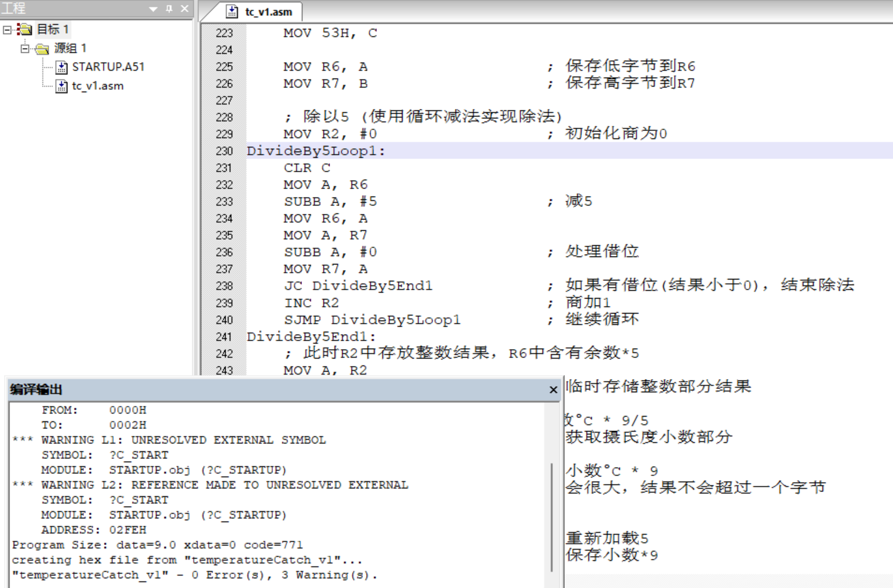 {width = "100%""}

#### 4.3 开发板调试图像

- 生成程序，并在开发板上操作。
	- 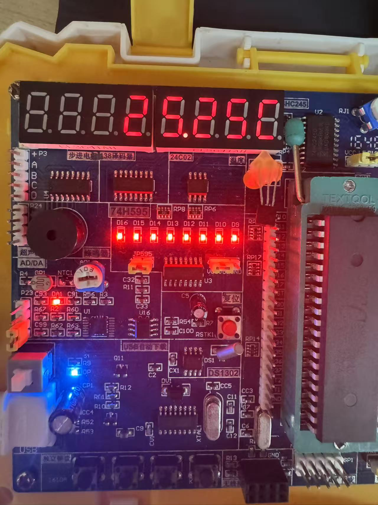 {width = "33%""}
	
- 按压输出切换按钮，可以获取换算好的华氏度。
	- 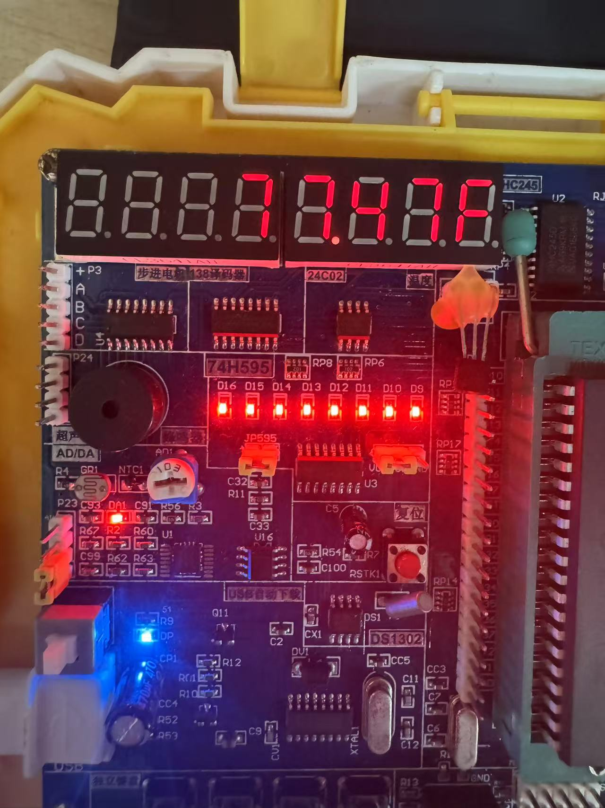 {width = "33%""}

- 触摸传感器使其升温，可以发现示数实时改变。
	- 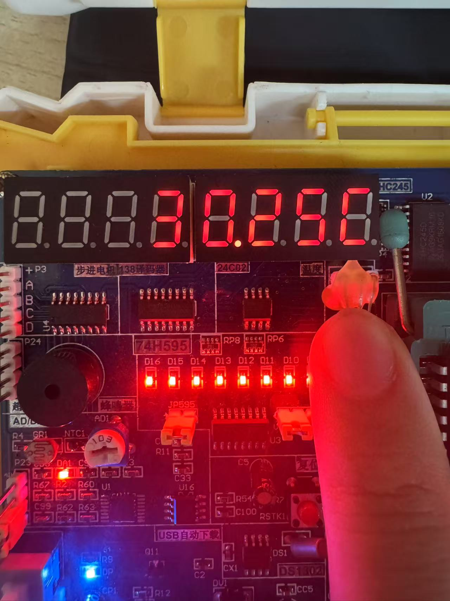 {width = "33%""}
	- 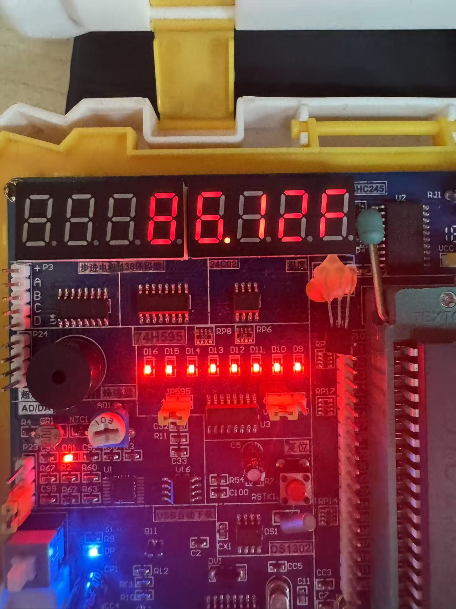 {width = "33%""}

- 综上，可以认为编程实现了预期的功能。

## L6 10秒倒计时实验（Exam）

!!! success "成功的失败"
	原本某位老师说最后一个实验测试可以用 C 实现，结果我用 C 实现以后不给予我应得的分数，着实是十分遗憾惋惜。除了测试要求项目，我还加入了用按键对“启动/暂停/继续”的控制，在代码中有体现。


```
/**************************************************************************************
*		              10秒倒计时实验												  *
实现现象：按键启动10秒倒计时，数码管显示剩余时间，时间到蜂鸣器发声
功能：1. 10秒精确倒计时（误差<0.1s）
      2. 按键控制启动/暂停/继续
      3. 倒计时结束蜂鸣器发声
***************************************************************************************/

#include "reg52.h"
#include <intrins.h>

typedef unsigned int u16;
typedef unsigned char u8;

// 硬件引脚定义
sbit beep = P1^5;      // 蜂鸣器
sbit key = P3^2;       // 按键
sbit reset_key = P3^3; // 复位按键
sbit add_key = P3^1;   // 增加时间按键
sbit LSA = P2^2;       // 数码管位选
sbit LSB = P2^3;
sbit LSC = P2^4;

// 全局变量
u8 code smgduan[17] = {0x3f,0x06,0x5b,0x4f,0x66,0x6d,0x7d,0x07,
                       0x7f,0x6f,0x77,0x7c,0x39,0x5e,0x79,0x71}; // 0-F段码

u8 countdown = 10;     // 倒计时秒数
u8 timer_count = 0;    // 定时器计数
u8 system_state = 0;   // 系统状态：0-停止，1-运行，2-暂停，3-结束
u8 key_flag = 0;       // 按键标志
u8 reset_flag = 0;     // 复位按键标志
u8 add_flag = 0;       // 增加时间按键标志
u8 beep_count = 0;     // 蜂鸣器计数


void delay(u16 i)
{
    while(i--);
}


/* 定时器0初始化，定时50ms */
void Timer0Init()
{
    TMOD |= 0x01;      // 定时器0工作模式1
    TH0 = 0x3C;        // 50ms定时初值
    TL0 = 0xB0;
    ET0 = 1;           // 开定时器0中断
    EA = 1;            // 开总中断
    TR0 = 1;           // 启动定时器0
}


/* 数码管显示函数 */
void DigDisplay()
{
    u8 i;
    u8 display_data[8] = {0};
    
    // 准备显示数据
    if(system_state == 3) // 结束状态显示00
    {
        display_data[6] = 0;  // 个位
        display_data[7] = 0;  // 十位
    }
    else
    {
        display_data[6] = countdown % 10;  // 个位
        display_data[7] = countdown / 10;  // 十位
    }
    
    // 扫描显示
    for(i = 6; i < 8; i++)  // 只显示最右边两位
    {
        switch(i)
        {
            case(6):
                LSA=0;LSB=1;LSC=1; break; // 显示第6位(个位)
            case(7):
                LSA=1;LSB=1;LSC=1; break; // 显示第7位(十位)
        }
        P0 = smgduan[display_data[i]]; // 发送段码
        delay(200);   // 显示延时
        P0 = 0x00;    // 消隐
    }
}

/* 按键扫描函数 */
void KeyScan()
{
    static u8 key_state = 1;
    static u8 reset_key_state = 1;
    static u8 add_key_state = 1;
    
    // 扫描控制按键
    if(key != key_state)  // 按键状态改变
    {
        delay(1000);      // 消抖延时
        if(key == 0 && key_state == 1)  // 按键按下
        {
            key_flag = 1;
        }
        key_state = key;
    }
    
    // 扫描复位按键
    if(reset_key != reset_key_state)  // 复位按键状态改变
    {
        delay(1000);      // 消抖延时
        if(reset_key == 0 && reset_key_state == 1)  // 复位按键按下
        {
            reset_flag = 1;
        }
        reset_key_state = reset_key;
    }
    
    // 扫描增加时间按键
    if(add_key != add_key_state)  // 增加时间按键状态改变
    {
        delay(1000);      // 消抖延时
        if(add_key == 0 && add_key_state == 1)  // 增加时间按键按下
        {
            add_flag = 1;
        }
        add_key_state = add_key;
    }
}

/* 按键处理函数 */
void KeyProcess()
{
    // 处理复位按键
    if(reset_flag)
    {
        reset_flag = 0;
        // 复位到初始状态
        system_state = 0;
        countdown = 10;
        timer_count = 0;
        beep_count = 0;
        return;  // 复位后直接返回，不处理其他按键
    }
    
    // 处理增加时间按键
    if(add_flag)
    {
        add_flag = 0;
        // 在当前倒计时基础上增加10秒，最大不超过99秒
        if(countdown <= 89)  // 防止超过99秒（数码管显示限制）
        {
            countdown += 10;
        }
        else
        {
            countdown = 99;  // 设置为最大值99秒
        }
        // 如果系统处于结束状态，增加时间后回到停止状态
        if(system_state == 3)
        {
            system_state = 0;
            beep_count = 0;
        }
    }
    
    // 处理控制按键
    if(key_flag)
    {
        key_flag = 0;
        
        switch(system_state)
        {
            case 0:  // 停止状态 -> 启动
                system_state = 1;
                timer_count = 0;
                break;
            case 1:  // 运行状态 -> 暂停
                system_state = 2;
                break;
            case 2:  // 暂停状态 -> 继续
                system_state = 1;
                break;
            case 3:  // 结束状态 -> 重新开始
                system_state = 1;
                countdown = 10;
                timer_count = 0;
                beep_count = 0;
                break;
        }
    }
}

/* 蜂鸣器控制函数 */
void BeepControl()
{
    if(system_state == 3 && beep_count < 100)  // 结束状态且蜂鸣器未结束
    {
        beep = ~beep;       // 蜂鸣器发声
        beep_count++;
    }
    else if(beep_count >= 100)
    {
        beep = 1;           // 停止蜂鸣器
    }
    else
    {
        beep = 1;           // 其他状态不发声
    }
}

/*定时器0中断服务函数，每50ms执行一次 */
void Timer0_ISR() interrupt 1
{
    TH0 = 0x3C;        // 重新装载定时初值
    TL0 = 0xB0;
    
    if(system_state == 1)  // 运行状态才计时
    {
        timer_count++;
        if(timer_count >= 20)  // 20*50ms = 1s
        {
            timer_count = 0;
            if(countdown > 0)
            {
                countdown--;
            }
            if(countdown == 0)
            {
                system_state = 3;  // 倒计时结束
            }
        }
    }
}


void main()
{
    Timer0Init();    // 初始化定时器
    beep = 1;        // 初始化蜂鸣器为静音
    
    while(1)
    {
        KeyScan();       // 按键扫描
        KeyProcess();    // 按键处理
        DigDisplay();    // 数码管显示
        BeepControl();   // 蜂鸣器控制
    }
}
```