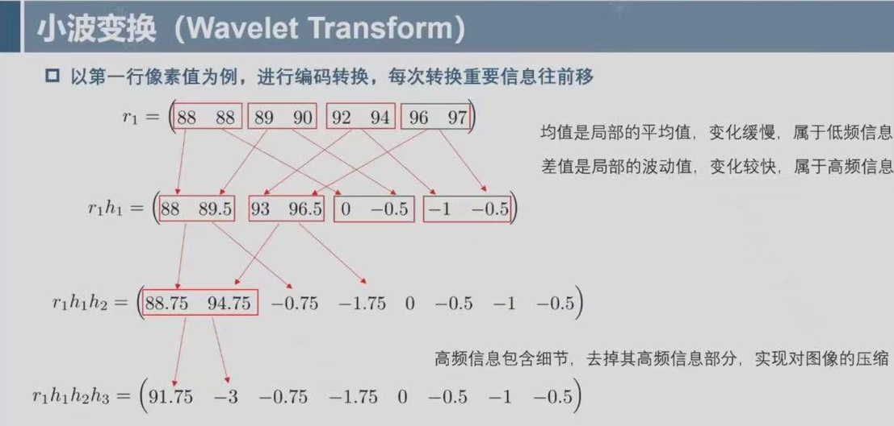
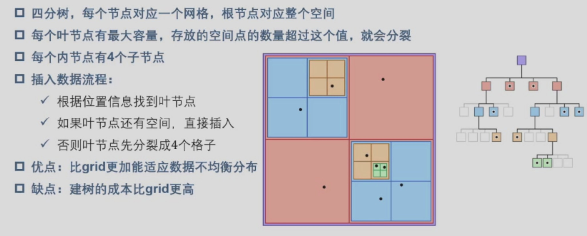
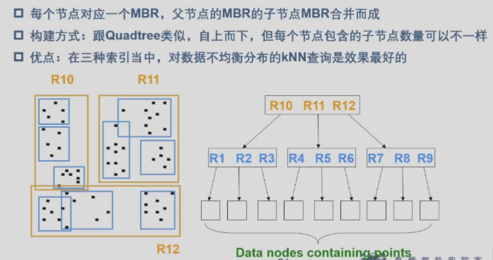
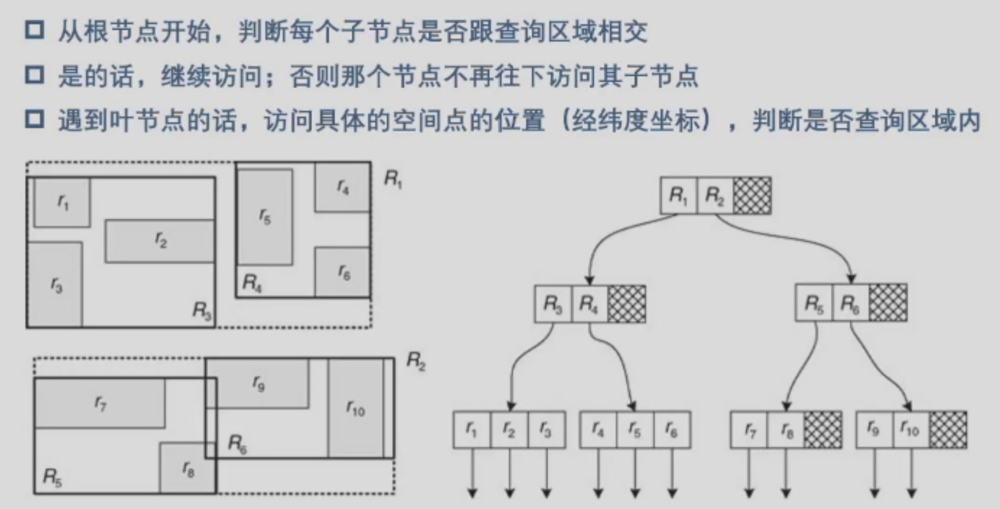
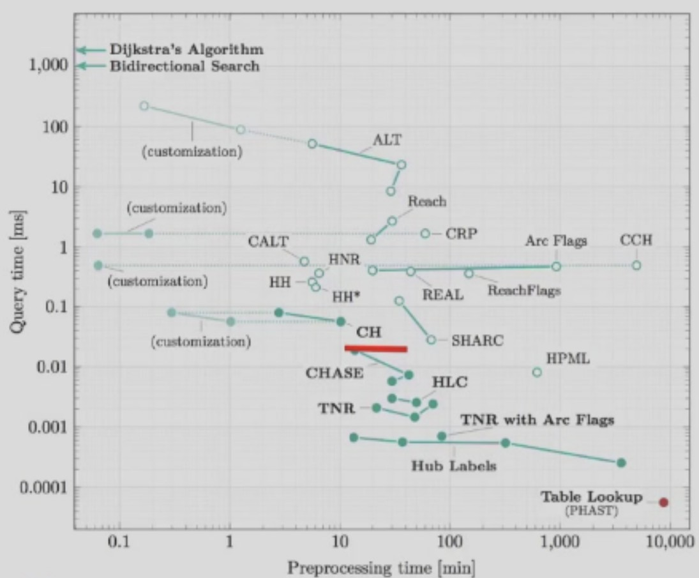
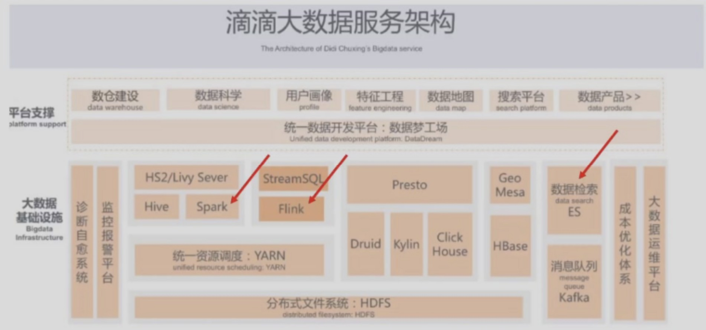
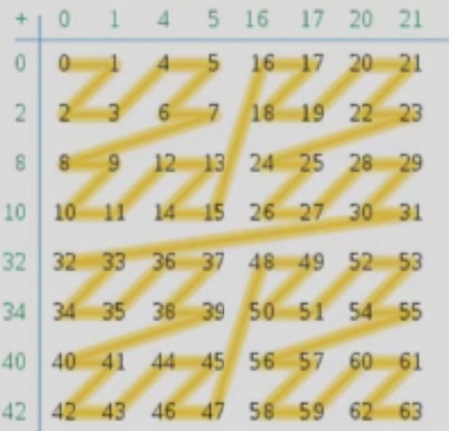
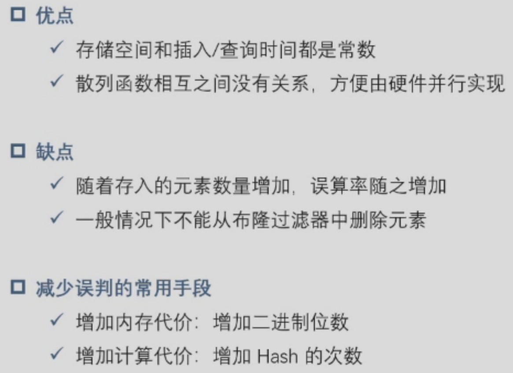

# 1 导论

- **Spark**, **Flink**, **ES** 大数据系统
- 大数据特征：**V**s（核心 **3V**）
    - **volume**
    - **velocity** 速度
    - **variety**
    - ***veracity*** 可信度
    - ***value***
    - ***variability***

- B KB(kilobyte) MB(megabyte) GB(gigabyte) TB(terabyte) PB(petabyte) EB(exabyte) ZB(zettabyte) YB(yottabyte)
- **高维大数据**
    - 图片、基因表达数据、化学/生物特征数据
    - 高维可视化、图片压缩、推荐系统（矩阵分解）
- **多媒体大数据**
    - 数据视频
    - 图片搜索引擎、跨模态搜索、城市监控视频
- **时空大数据**
    - uber打车、时空伴随者筛查
- **流式大数据**
    - 流立方、时空连续查询
- **图大数据**
    - 社交网络、知识图谱
    - 搜索引擎排序、社区/群组发现
- **大数据系统**
    - hadoop 计算引擎
    - spark 计算引擎
    - hive 使 hadoop 支持 SQL
    - mahout 基于 hadoop 的机器学习和数据挖掘算法库
    - flink 流数据处理引擎（状态语言抽象到框架中，本地状态读取，避免大量 I/O；高伸缩性）
    - yarn 集群资源管理
    - kafka 分布式消息队列系统
    - sqoop 数据迁移
    - zookeeper 管理服务封装

# 2 分布式计算与经典计算系统

## 2.1 分布式计算

- **分布式计算**：一个问题分成几个部分，分配给多台计算机进行**并发处理**
    - 一般采用**一主多从**结构
    - 最大挑战：数据一致性、负载均衡、安全与容灾

- **模型分布式训练**
    - **数据并行**（数据切割）
        - 数据集被分割到几个碎片
        - 每个设备持有完整的模型副本，在分配的数据集碎片上训练
        - 沿 batch 维度进行合并
    - **张量并行**（模型切割）
        - 将一个张良沿特定维度分为 N 块，每个设备只持有 1/N
        - 设备计算后持有一部分结果后续进一步合并
    - **流水线并行**（模型按层分割）
- **分布式计算案例**
    - **网格计算** Grid computing
        - 利用大量异构（*硬件结构不一致*）计算机**未用资源**，为其作为嵌入式分布式电信基础设施中的一个计算机集群
        - 众包思想
    - **云计算** Cloud computing
        - 通过网络按需提供可动态伸缩的廉价计算资源
        - 规模大、虚拟化、高可用、按需服务、安全
    - **边缘计算** Edge compuing
        - 在用户或数据源的**物理位置**或附近进行计算
        - 降低延迟、节省带宽
        - 应用：智能摄像头、智能仓储、无人驾驶
    - **透明计算**
        - 用户无需感知计算操作系统、中间件、应用程序、通信网络
        - 以用户体验为中心

## 2.2 Hadoop 系统

- 背景：数据处理需要；Doug Cutting
- **优势**：大量数据处理（拆分并行小任务）；灵活性与可扩展性；将**大量便宜机器**打造成一个高处理能力的计算集群；HDFS 数据冗余存储有效避免数据丢失；能处理多种类型的数据，支持复杂的处理流程；底层实现细节透明
- **分布式文件系统**（如云盘）HDFS(hadoop distributed file system)
    - 连接大量物理节点，将各类存储组织在一起，提供海量数据存储
    - 透明、持久化、伸缩性、一致性

- **HDFS** 架构

    - **NameNode** 文件系统总管
        - 管理 HDFS 目录树和相关源文件信息
            - fsimage 元数据镜像文件
            - editlog 改动日志
            - 上两者需要定期合并
    - **Secondary NameNode**
        - 减轻 NameNode 压力，帮助 fsimage 和 editlog 数据整合（NameNode 不自己做）
    - **DataNode** 干活小弟
        - 负责实际数据存储
        - 数据信息定期汇报给 NameNode

- **MapReduce 模型**

    - 一主多从结构

    - 用 map 和 reduce 组合表达复杂数据处理流程

    - 把一个大的计算任务划分为多个小的计算任务，然后把它们分配给集群的每个计算节点

    - example：**word count 任务**

        -  **Map 阶段**

            - 输入：一行文本（例如 `"hello world hello"`）

            - 处理：把这一行切分成单词

            - 输出：键值对 `(word, 1)`

                ```
                ("hello", 1)
                ("world", 1)
                ("hello", 1)
                ```

        -  **Shuffle 阶段**

            - 系统自动把相同 `key` 的记录收集到一起

                ```
                hello → [1, 1]
                world → [1]
                ```

        -  **Reduce 阶段**

            - 输入：每个单词及它对应的所有 `1`

            - 处理：把这些 `1` 相加

            - 输出：

                ```
                ("hello", 2)
                ("world", 1)
                ```

- **缺点**
    - 适合离线分析任务、不适合实时性要求高的在线任务（流数据）
    - 适合处理大文件，但不适合处理大量小文件
    - 大量的磁盘和网络 I/O，严重制约处理性能

## 2.3 Spark 系统

- 最大优化：简易、高性能
- DataBricks：All in cloud，不做定制化

- **数据模型 RDD**：resilient distributed dataset 弹性分布式数据集
    - **In-memory computation** 为内存计算而设计，提升处理速度
    - **Lazy evaluation** 先把操作保存在 log 里面，对不需要立刻输出的 output 指令 lazy；非执行不可时再执行
    - **Fault Tolerant**
    - **Immutability** 数据不可变利于高并发、缓存、共享、复制
    - **Partitioning** 分区策略多
    - **Persistence** 使 RDD 可持久化到内存或磁盘
    - **Coarse-Grained Operation** 在 RDD 只支持粗粒度的变换，简化容错支持（粗粒度：对整个数据集转化操作；细粒度：对数据集某个元素进行转化操作）

- **RDD 数据操作**
    - **Transformation**：对 RDD 进行一系列数据操作，输出还是一个 RDD
    - **Action**：数据执行部分（count reduce collect 等）；都是 **lazy** 模式，只有当结果要求返回结果的 Action，才会执行 Transformation

## 2.4 NoSQL 数据库

- **Not Only SQL**：不是为了取代数据库，与之互补
- NoSQL 的特点
    - Schema 比较灵活
    - 分布式、容错的系统架构
    - 可扩展性强
    - 常见四类：Key-value、Document、Column、Graph

- **CAP 理论**
    - **consistency**：是否实现了同一时刻所有数据备份一样值，**同时更新**
    - **availability**：在部分节点故障后，集群是否可以**相应客户端**
    - **partition tolerant**：分区容错性，当出现故障后，系统仍然可以**继续工作**
    - 三者**不可同时满足**，其中对于分布式系统 **P** 最为重要（分布式基本要求），所以必须要在 **A** 和 **C** 中做取舍（根据系统需求）；*传统数据库一般采用 CA（可扩展性差），注意不满足 P，非分布式*

# 3 高维大数据

## 3.1 **常见高维大数据**

- **图片数据**
    - 图片特征提取**传统方法**
        - **SIFT** 特征提取：定位关键点并以量化信息呈现，128 维特征（每个 match 点，是两个集合的匹配；对哈希需求大）；对图片旋转、缩放的鲁棒性高
    
    - 图片特征提取**深度学习方法**
        - **CNN**：无需手动标注
    
    - **文本**
        - Skip-gram 词向量模型（文本映射为向量）
    
    - **用户画像**
        - 如体检报告等
        - 精准度和维度相关
    
- **基因表达数据**

- **推荐系统评分矩阵**
    - 大型的稀疏矩阵

## 3.2 **高维数据降维**：聚类可视化

- 基于 **PCA** 的降维（主成分分析）：**Principle Component Analysis**
    - 核心：找到斜向上的一条线，让数据有所**区分**
    - 操作：
        - **1** **中心化**数据，求 x 和 y 的**均值**，取出偏差值 bias
        - **2** 计算**协方差矩阵**
        - **3** 计算协方差矩阵的**特征值**和**特征向量**
        - **4** 挑选主成分，即**特征值较大**的特征向量
        - **5** 所有数据点可以**映射**到这个特征向量上，实现降维
        - *在数据降维时，会丢失信息（只保留主要数据）；这样的操作同时也可以使噪声消除，降维再还原以后可以消噪*

- **t-SNE 降维可视化**
    - 核心：
        - 保留高维空间中数据的**局部相似性**（邻居关系）
        - 把高维数据映射到低维空间（通常 2D 或 3D）进行可视化
        - 强调同类数据在低维空间中靠得近，便于聚类或可视化分析
    - 操作：
        - **1** 计算所有点的**两两相似性**（正态分布曲线），并进行标准化
        - **2** 得到**高维空间矩阵**（相似性矩阵）
        - **3** 计算**低维空间距离矩阵**，分布从正态分布变成 **t-分布**（为了缓解“拥挤问题”，防止高维直接降维导致有些原本空间距离远的点无法在低维被区分）
        - **4** 优化映射
        - **5** 可视化结果

- 对于一些数据集，PCA + t-SNE 可以达到比单独使用更好的效果

## 3.3 **高维数据压缩**：图片压缩

- 核心：利用**像素的冗余性**

- **JPEG 小波变换**

    - 

    - 可先水平方向再垂直方向分别做 Transform

    - 重要信息再矩阵左上角

    - 压缩可以将 **ε** 设置为 0，增加冗余，**控制 ε 调节压缩率**

- **基于深度学习的图片压缩**

## 3.4 **大数据分解**：推荐系统

- **基于 Item 的协同过滤**
    - 构建用户-物品矩阵
    - 物品计算相似度（如余弦相似度或皮尔逊相关系数）；eg. 其他电影和电影 1 的相似性,空白的格子填入 0
    - 预测用户对未评分物品的评分
        - 使用物品相似度加权平均
        - $N(i)$：与物品 i 相似的物品集合
    - 生成推荐列表
- **矩阵分解**
    - 把一个维度很高的矩阵拆分成小的矩阵；得到拆分的矩阵 P 和 Q 后，直接行列相乘，就可以实现评分预测
    - 确定 P 和 Q：
        - 用 **SVD** 初始化 P 和 Q
        - 用 **SGD** 来迭代优化

- | 特性             | Item-based 协同过滤                  | 矩阵分解 (Matrix Factorization)                              |
    | ---------------- | ------------------------------------ | ------------------------------------------------------------ |
    | **核心思想**     | 基于物品相似度推荐（显式或隐式评分） | 将用户-物品评分矩阵分解为两个低秩矩阵（用户特征 × 物品特征） |
    | **矩阵处理方式** | 保持原矩阵，计算相似度               | 分解矩阵，得到潜在因子表示                                   |
    | **缺失值处理**   | 未评分可填 0 或忽略                  | 矩阵分解算法（如 SVD）可直接对缺失值优化损失函数             |
    | **优点**         | 简单直观，计算物品相似度稳定         | 能捕捉潜在兴趣，适合稀疏矩阵                                 |
    | **缺点**         | 难处理稀疏矩阵和冷启动               | 训练过程需要迭代优化，计算复杂度高                           |

## 3.5 **高维数据聚类**：蛋白质聚类

- **问题背景**
    - 数据：N 条蛋白质序列
    - 目标：按照相似性阈值（如 90%、70% 等）将蛋白质序列划分为若干类（clusters）
    - 挑战：序列数量可能达到 **百万级甚至上亿条**，需要高效算法

- **Linclust 算法**
    - **1** 选取 $m \times N$ 个 K-mer
        - K-mer 使长度为 K 的子串，类似 n-gram
        - 利用哈希值来映射选取
        - *m 越大，越不容易漏掉相似蛋白质序列，但是计算代价大*
    - **2** 按照 K-mer 生成初始聚类
        - 含有同一个 K-mer 的蛋白质序列为一组
        - 一个 K-mer 对应一个聚类
    - **3** 合并初始聚类
        - 中心序列相同的聚类进行合并
        - 合并后，计算每个序列的中心点相似性的一个 upper bound（计算代价小，避免直接计算真实距离的代价）
    - **4** 删掉相似性比较低的边
        - 如果 upper bound 低于某个阈值，直接删掉；否则进行 gapped alignment 验证

# 4 多媒体大数据

##  4.1 **常见多媒体大数据**

- 文本大数据
- 图片大数据
- 视频大数据

## 4.2 **Min-Hash 算法**：文档去重

- **目的**：快速判断两个文档是否相似（去重、查重）

- **核心思想**：

    - 将文档表示为**集合**（例如分词后的词集合）

    - 对集合进行**哈希映射**，生成签名（signature）

    - **相似度近似计算**：利用 Jaccard 相似度

        $$J(A,B) = \frac{|A \cap B|}{|A \cup B|}$$

        Min-Hash 可以在不直接比较完整集合的情况下快速近似计算

- **基本步骤**：
    - 文档分词 → 集合表示
    - 使用多组哈希函数对集合进行映射
    - 对每个集合生成最小哈希值（Min-Hash 值）序列 → 签名
    - 比较签名的相似度 → 近似文档相似度

- **优点**：

    - 内存占用小

    - 计算效率高

    - 适合大规模文档去重

- **应用场景**：

    - 搜索引擎去重网页

    - 社交平台去重帖子

    - 学术论文相似度检测

## 4.3 **ElasticSearch**：文本搜索

- 支持丰富的搜索场景

- 优势：高性能、强相关（意图匹配）、高可用

- 核心技术：

    - **倒排索引**

        - 记录**每个词出现在哪些文档中**

            结构类似：

            ```
            词 → 文档ID列表
            ```

            例如：

            ```
            hello → [doc1, doc3, doc5]
            world → [doc2, doc3]
            ```

    - **分段存储**
        - 在 Elasticsearch / Lucene 中，索引不会一次性写入整个文件，而是分成**多个不可变的小索引块**，叫 **Segment**
        - 每个 Segment 都是一个小型倒排索引

## 4.4 **PQ 算法图片+向量数据库**：搜索引擎

- **PQ 算法**（Product Quantization，产品量化）
  
    - **目的**：在海量向量中快速找到最近邻（Nearest Neighbor）
    - **核心思想**：
        1. 把高维向量划分为若干个低维子向量
        2. 对每个子向量做 **K-Means 聚类**，用聚类中心索引子向量
        3. 用 **量化后的索引值代替原始向量** → 大幅减少存储和计算量
    - **流程示意**：
    
    ```
    原始向量 x (D 维)
           │
       切分为 M 个子向量
           │
    每个子向量聚类 → 编码索引
           │
    组合成 PQ 编码
    ```
    
    - **优点**：
        - 大幅减少内存占用
        - 支持快速近似搜索（Approximate Nearest Neighbor, ANN）
        - 常用于图片/视频检索、推荐系统

- **向量数据库**（Vector Database）

    - 专门存储和搜索向量数据的数据库
    - 特点：
        - 支持高维向量存储
        - 提供 ANN（近似最近邻）搜索
        - 集成 PQ、HNSW、IVF 等算法优化搜索速度
    - **典型应用**：
        - 图片搜索：给定一张图片 → 找最相似图片
        - 文本搜索：文本 embedding → 找语义相似文本
        - 推荐系统：用户向量 → 找最相似物品
    - **典型向量数据库**：
        - FAISS（Facebook AI）
        - Milvus
        - Weaviate

- PQ + 向量数据库在搜索引擎中的作用

    - **向量化多媒体数据**（CNN 特征、Transformer embedding）
    - **PQ 压缩向量** → 减少存储和加速搜索
    - **向量数据库存储向量**
    - **用户查询向量 → ANN 搜索** → 返回最相似结果

## 4.5 跨模态搜索

- 案例：拍照搜题

# 5 时空大数据

## 5.1 时空索引

- **Range Query**：查询输入是一个区域；输出是落在区域里的所有物体
- **kNN Query**：查询输入是查询点和参数 k；输出是 k 个距离最近的物体

- **网格索引**：将时空切成 N*N 的格子，每个格子维护落在其中的数据点
    - Range query：搜索空间和查询框相交的格子
    - kNN query：先查询点所在格子，再向外拓展格子

- 优化：**四分树**（加入权重避免分布不均造成影响）
    - 

- **R 树**
    - 最经典的、应用最广泛的时空数据索引
    - 
    - 

## 5.2 智能交通平台

- 地图映射
    - 将一个 GPS 轨迹序列映射到地图路网上，转化成路段序列
    - **隐马尔可夫模型**
        - 不仅观察当前点，也关注前几个点的映射结果

- 路径规划
    - 最短路径查询
    - 挑战：路网大、查询速度要求快
    - *算法选用（横坐标表示预处理时间，纵坐标表示应用中查询时间）*
        - 

- 通行时间预估
    - **Simple Additive Model**：容易造成误差累加
    - **基于各种信息的深度学习模型**

- 

## 5.3 时空伴随筛查

- 核心问题：数据存储 & 查询方式
- 基于空间填充曲线 Z-order 对同一时间段进行空间分区，*捕捉相似信息*
    - 

- **压缩存储**

## 5.4 智慧城市大脑

- **NoScope 系统**
    - Difference Detector：二分类器，若当前帧和上一帧相似，就不处理
    - Specialized Model：轻量级模型，粗略判断是否包含目标物体，不确定再跑原始模型

# 6 流式大数据

## 6.1 流数据的特点

- 数据不断进来，无法事先知道完整的数据集

- 数据流产生速度可能是外部因素控制
- 数据流的状态是动态变化的

- **挑战**：用**有限的硬件**资源处理**无限的数据**（存储、计算、内存）

## 6.2 **Spark streaming**

- 切割窗口，把流数据变成分割的小“批数据”

## 6.3 Flink 系统

- **Flink 系统**：以**流数据为核心**的处理系统（后来发展同样也有批数据梳理）
- 基于批处理框架的近实时处理
    - 有状态并且容错，实现分布式一致性快照
    - 实现了 Watermark 机制，定义了何时不再等待更早的数据（有一定的等待机制）

## 6.4 Bloom filter

- 查询元素是否存在
- 
