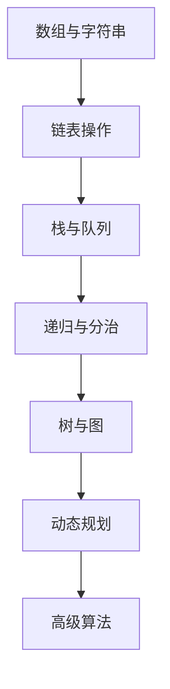

# 算法与数据结构 📊

计算机科学的理论基础，培养逻辑思维和问题解决能力。

## 🎯 学习目标

- 掌握基础数据结构的概念和实现
- 理解常用算法的思路和复杂度
- 培养分析问题和优化代码的能力
- 为面试和实际开发打下坚实基础

## 📚 学习内容概览

### 🗃️ 数据结构
- **线性结构**: 数组、链表、栈、队列
- **非线性结构**: 树、图、散列表
- **高级结构**: 堆、并查集、字典树

### ⚡ 算法设计
- **基础算法**: 排序、搜索、递归
- **算法技巧**: 双指针、滑动窗口、分治
- **经典算法**: 动态规划、贪心算法、回溯

## 🛣️ 学习路径



## 📈 复杂度分析

### 时间复杂度对比
```python
def complexity_examples():
    # O(1) - 常数时间
    def get_first(arr):
        return arr[0] if arr else None
    
    # O(log n) - 对数时间
    def binary_search(arr, target):
        left, right = 0, len(arr) - 1
        while left <= right:
            mid = (left + right) // 2
            if arr[mid] == target:
                return mid
            elif arr[mid] < target:
                left = mid + 1
            else:
                right = mid - 1
        return -1
    
    # O(n) - 线性时间
    def find_max(arr):
        max_val = arr[0]
        for num in arr[1:]:
            if num > max_val:
                max_val = num
        return max_val
    
    # O(n log n) - 线性对数时间
    def merge_sort(arr):
        if len(arr) <= 1:
            return arr
        
        mid = len(arr) // 2
        left = merge_sort(arr[:mid])
        right = merge_sort(arr[mid:])
        
        return merge(left, right)
    
    # O(n²) - 平方时间
    def bubble_sort(arr):
        n = len(arr)
        for i in range(n):
            for j in range(0, n - i - 1):
                if arr[j] > arr[j + 1]:
                    arr[j], arr[j + 1] = arr[j + 1], arr[j]
        return arr
```

## 🎲 实战练习

### 简单题目
1. **两数之和** - 数组中找到和为目标值的两个数
2. **反转字符串** - 递归和迭代两种方法
3. **有效括号** - 使用栈检查括号匹配

### 中等题目
1. **二叉树遍历** - 前序、中序、后序遍历
2. **最长回文子串** - 动态规划或中心扩展
3. **岛屿数量** - DFS/BFS图遍历

### 困难题目
1. **最短路径问题** - Dijkstra算法
2. **背包问题** - 经典动态规划
3. **字符串匹配** - KMP算法

## 📊 学习进度

| 主题 | 状态 | 难度 | 重要性 |
|------|------|------|--------|
| 数组与字符串 | 学习中 | ⭐⭐ | ⭐⭐⭐⭐⭐ |
| 链表 | 计划中 | ⭐⭐⭐ | ⭐⭐⭐⭐ |
| 栈与队列 | 计划中 | ⭐⭐⭐ | ⭐⭐⭐⭐ |
| 树 | 计划中 | ⭐⭐⭐⭐ | ⭐⭐⭐⭐⭐ |
| 图 | 规划中 | ⭐⭐⭐⭐⭐ | ⭐⭐⭐⭐ |
| 动态规划 | 规划中 | ⭐⭐⭐⭐⭐ | ⭐⭐⭐⭐⭐ |

## 🛠️ 练习平台

### 在线刷题
- **[LeetCode](https://leetcode.cn/)** - 最流行的算法题库
- **[牛客网](https://www.nowcoder.com/)** - 面试题集合
- **[洛谷](https://www.luogu.com.cn/)** - 算法竞赛题目

### 可视化工具
- **[VisuAlgo](https://visualgo.net/)** - 算法动画演示
- **[Algorithm Visualizer](https://algorithm-visualizer.org/)** - 交互式算法可视化

## 💡 学习方法

### 理论与实践结合
1. **理解原理** - 先理解算法的核心思想
2. **手工模拟** - 在纸上模拟算法执行过程
3. **编码实现** - 将算法转化为代码
4. **测试验证** - 用不同测试用例验证正确性
5. **复杂度分析** - 分析时间和空间复杂度

### 刷题策略
```python
# 刷题模板
def solve_problem():
    """
    解题步骤：
    1. 理解题意 - 仔细读题，理解输入输出
    2. 思考算法 - 考虑可能的解决方案
    3. 编写代码 - 实现最优解
    4. 测试调试 - 验证边界情况
    5. 复杂度分析 - 时间空间复杂度
    """
    pass

# 常用技巧总结
techniques = {
    "双指针": "处理数组、字符串问题",
    "滑动窗口": "子数组/子字符串问题", 
    "递归": "树、分治问题",
    "动态规划": "最优化问题",
    "贪心": "局部最优解问题",
    "回溯": "搜索所有可能解"
}
```

## 🎯 面试准备

### 常考算法类型
1. **数组操作** (40%) - 排序、搜索、双指针
2. **字符串处理** (20%) - 模式匹配、回文
3. **树结构** (20%) - 二叉树遍历、平衡树
4. **动态规划** (15%) - 经典DP问题
5. **图算法** (5%) - BFS、DFS、最短路径

### 面试技巧
- **思路清晰** - 说出解题思路再编码
- **代码规范** - 变量命名、代码结构清晰
- **考虑边界** - 空输入、极值情况
- **复杂度分析** - 主动分析时间空间复杂度
- **优化思考** - 讨论可能的优化方案

---

*算法与数据结构是程序员的内功，需要持续练习和思考！*
