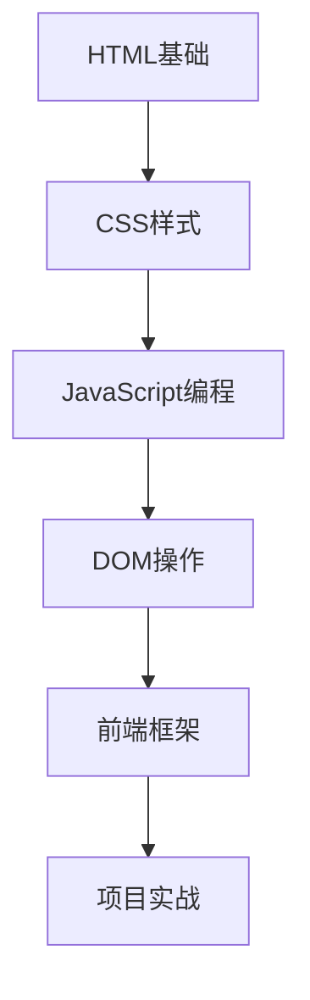

# Web开发 🌐

学习现代Web开发技术，从基础的HTML/CSS到JavaScript动态编程，再到流行的前端框架。

## 🎯 学习目标

- 掌握Web开发的基础技术栈
- 理解前端开发的核心概念
- 学会创建响应式网页
- 了解现代前端开发工作流程

## 🛣️ 学习路径

## 📚 技术栈概览

### 🏗️ 基础技术
- **HTML5** - 网页结构和语义
- **CSS3** - 样式设计和布局
- **JavaScript** - 动态交互和逻辑

### 🎨 进阶技能
- **响应式设计** - 移动端适配
- **CSS预处理器** - Sass/Less
- **构建工具** - Webpack/Vite

### 🚀 现代框架
- **React** - 组件化开发
- **Vue.js** - 渐进式框架
- **Angular** - 企业级应用

## 📊 学习进度

| 技术 | 状态 | 重要性 | 难度 |
|------|------|--------|------|
| HTML/CSS | 学习中 | ⭐⭐⭐⭐⭐ | ⭐⭐ |
| JavaScript | 计划中 | ⭐⭐⭐⭐⭐ | ⭐⭐⭐⭐ |
| 前端框架 | 规划中 | ⭐⭐⭐⭐ | ⭐⭐⭐⭐⭐ |

## 🛠️ 开发工具

### 编辑器推荐
- **VS Code** - 丰富的插件生态
- **WebStorm** - 强大的IDE功能

### 必备插件
- Live Server - 实时预览
- Prettier - 代码格式化
- Auto Rename Tag - 标签重命名
- CSS Peek - CSS定义跳转

### 浏览器工具
- Chrome DevTools - 调试利器
- Firefox Developer Tools - 布局调试

## 🎨 设计原则

### 用户体验 (UX)
- 直观的导航设计
- 快速的加载速度
- 良好的可访问性
- 一致的交互体验

### 响应式设计
- 移动优先策略
- 弹性网格布局
- 媒体查询优化
- 图片自适应

## 💼 实战项目

### 基础项目
- 个人作品集网站
- 响应式导航栏
- 图片画廊展示

### 进阶项目
- 单页应用 (SPA)
- 任务管理应用
- 天气查询应用

## 🌟 学习资源

### 官方文档
- [MDN Web Docs](https://developer.mozilla.org/) - 权威参考
- [W3C Standards](https://www.w3.org/) - Web标准

### 在线教程
- freeCodeCamp - 免费编程课程
- Codecademy - 交互式学习
- The Odin Project - 全栈路径

---

*Web开发是一个不断evolving的领域，保持学习热情很重要！*
